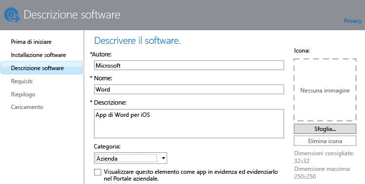

---
# required metadata

title: Aggiungere app per dispositivi mobili | Microsoft Intune
description:
keywords:
author: robstackmsft
manager: jeffgilb
ms.date: 04/28/2016
ms.topic: article
ms.prod:
ms.service: microsoft-intune
ms.technology:
ms.assetid: f5b1f1ae-f177-450a-9af9-936a02d052e3

# optional metadata

#ROBOTS:
#audience:
#ms.devlang:
ms.reviewer: jeffgilb
ms.suite: ems
#ms.tgt_pltfrm:
#ms.custom:

---

# Aggiungere app per dispositivi mobili in Microsoft Intune

Usare le informazioni in questo argomento per informazioni su come aggiungere app a Intune prima di distribuirle.

> [!IMPORTANT]
> Le informazioni in questo argomento semplificano l'aggiunta delle app che si vuole distribuire sui dispositivi registrati e sui PC Windows registrati. Per aggiungere app per PC Windows gestiti tramite il software client di Intune, vedere [Aggiungere app sui PC Windows in Microsoft Intune](add-apps-for-windows-pcs-in-microsoft-intune.md)

## Aggiungere l'app
Usare l'Autore del software Intune per configurare le proprietà dell'app e, se necessario, caricarla nello spazio di archiviazione cloud usando la procedura seguente:

1.  Nella [console di amministrazione di Microsoft Intune](https://manage.microsoft.com) fare clic su **App** &gt; **Aggiungi app** per avviare l'autore del software Intune.

    > [!TIP] Per avviare questa funzionalità, potrebbe essere necessario immettere il nome utente e la password di Intune.

2.  Nella pagina **Installazione software** dell'autore del software, scegliere una delle opzioni seguenti per **Selezionare il modo in cui questo software viene fornito ai dispositivi**:
    - **Programma di installazione software**, per le applicazioni con l'estensione **msi** o **exe** specificare:
        - **Selezionare il tipo di file del programma di installazione software**: indica il tipo di software che si vuole distribuire. Ad esempio, per installare un'app iOS scegliere **Pacchetto app iOS (file &#42;.ipa)**.
        - **Specificare il percorso dei file di installazione software**: immettere il percorso dei file di installazione o fare clic su **Sfoglia** per selezionare il percorso da un elenco.
        - **Includi sottocartelle e file aggiuntivi dalla stessa cartella**: soltanto per il tipo di file **Windows Installer**. Alcuni software che usano Windows Installer richiedono file di supporto, che in genere si trovano nella stessa cartella dei file di installazione. Selezionare questa opzione se si vogliono distribuire anche questi file. Questo tipo di installazione usa parte dello spazio di archiviazione cloud.

  -   **Collegamento esterno** per le app da creare specificando un collegamento a un app store, specificare:

        - **Specificare l'URL**: specificare l'URL in uno dei modi seguenti:
            - L'URL dell'App Store dell'app da distribuire. Ad esempio, per distribuire l'app Desktop remoto Microsoft per Android, specificare **https://play.google.com/store/apps/details?id=com.microsoft.rdc.android**. Per trovare l'URL dell'app, usare un motore di ricerca per trovare la pagina dell'App Store che contiene l'app. Ad esempio, per trovare l'app Desktop remoto, è possibile cercare **Desktop remoto Microsoft Android**.
            - Un sito Web. Intune distribuisce un'icona di collegamento al sito nel dispositivo, nota come clip Web.
            - Un'app sul Web. Intune distribuisce un'icona di collegamento all'app nel dispositivo.
        - **Richiedere un browser gestito per aprire questo collegamento (solo Android e iOS)**: quando si distribuisce un collegamento a un'app Web o a un sito Web, gli utenti potranno aprirlo solo in Intune Managed Browser installato nel dispositivo. Per informazioni dettagliate su Managed Browser, vedere [Manage Internet access using managed browser policies with Microsoft Intune](manage-internet-access-using-managed-browser-policies.md) (Gestire l'accesso a Internet usando i criteri di Managed Browser con Microsoft Intune). Questo tipo di installazione non usa lo spazio di archiviazione cloud.

  -   **App iOS gestita dall'App Store** per app gratuite dall'iTunes store che si vuole gestire con i criteri di gestione di applicazioni mobili, specificare:

        - **Specificare l'URL**: immettere l'URL dell'App Store per l'app che si vuole distribuire. Ad esempio, per distribuire l'app Cartelle di lavoro Microsoft per iOS, specificare **https://itunes.apple.com/us/app/work-folders/id950878067?mt=8**. Questo tipo di installazione non usa lo spazio di archiviazione cloud.

        Se ad esempio si vuole distribuire l'app Microsoft Word dall'iTunes store sui dispositivi, viene visualizzata una pagina simile alla seguente:
        
        

3.  Nella pagina **Descrizione software** configurare gli elementi seguenti:

    > [!TIP] In base al tipo di programma di installazione in uso, è possibile che alcuni valori siano stati immessi automaticamente.

    - **Autore**: immettere il nome dell'autore dell'app.
    - **Nome**: immettere il nome dell'app che verrà visualizzato nel portale aziendale. Assicurarsi che tutti i nomi di app usati siano univoci. Se il nome di un'app è usato due volte, solo una delle due app verrà visualizzata agli utenti nel portale aziendale.
    - **Descrizione**: immettere una descrizione per l'app. La descrizione verrà visualizzata agli utenti nel portale aziendale.
    - **URL per le informazioni software**: disponibile solo se si seleziona **Programma di installazione software**. Immettere l'URL di un sito Web che include informazioni sull'app (facoltativo). L'URL verrà visualizzato agli utenti nel portale aziendale.
    - **URL privacy**: disponibile solo se si seleziona **Programma di installazione software**. Immettere l'URL di un sito Web che include informazioni sulla privacy per l'app (facoltativo). L'URL verrà visualizzato agli utenti nel portale aziendale.
    - **Categoria**: selezionare una delle categorie predefinite dell'app (facoltativo). Ciò consentirà agli utenti di trovare più facilmente l'app nel portale aziendale.
    - **Visualizzare questo elemento come app in evidenza ed evidenziarlo nel Portale aziendale:** visualizza chiaramente l'app nella pagina principale del portale aziendale quando gli utenti sfogliano le app.
    - **Icona**: caricare un'icona che verrà associata all'app (facoltativo). Questa icona verrà visualizzata insieme all'app quando gli utenti visitano il portale aziendale.

        In questo esempio è stata configurata una descrizione per l'app di Microsoft Word per iOS:

        

4.  Nella pagina **Requisiti** selezionare i requisiti che devono essere soddisfatti prima di poter avviare l'installazione dell'app in un dispositivo. Ad esempio, per un pacchetto di app per iOS è possibile selezionare la versione minima di iOS necessaria e il tipo di dispositivo deve essere simile a un iPhone o un iPad.

    > [!TIP] La pagina **Requisiti** non viene visualizzata per tutti i tipi di app.

5.  Quando si sceglie il tipo di file **Windows Installer**, vengono visualizzate altre pagine della procedura guidata. Questo tipo di file viene usato quando si distribuisce il software a computer con Windows 10 o versioni successive registrati con Intune.

6.  Nella pagina **Riepilogo** verificare le informazioni specificate. Al termine, fare clic su **Carica**.

7.  Fare clic su **Chiudi** per completare la procedura.

L'app viene visualizzata nel nodo **App** dell'area di lavoro **App**.

## Esempi

### Distribuzione di applicazioni MSI per dispositivi Windows 10
In questo video di quattro minuti viene illustrato come distribuire le applicazioni di Microsoft Installer (con estensione msi) per i dispositivi registrati che eseguono Windows 10.  

<iframe src="https://channel9.msdn.com/Series/How-to-Control-the-Uncontrolled/6--How-to-Deploy-MSI-Applications-to-Windows-10-Using-Intune-and-Mobile-Device-Management-MDM/player" width="640" height="360" allowFullScreen frameBorder="0"></iframe>

## Passaggi successivi

Il passaggio successivo alla creazione di un'app è la sua distribuzione. Per altre informazioni, vedere [Deploy apps in Microsoft Intune](deploy-apps.md) (Distribuire app in Microsoft Intune)

<!--HONumber=May16_HO4-->

