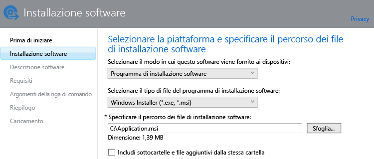

# Aggiungere app sui PC Windows in Microsoft Intune

Usare le informazioni in questo argomento per informazioni su come aggiungere app a Intune prima di distribuirle.

> [!IMPORTANT]
> Le informazioni in questo argomento semplificano l'aggiunta di app nei computer Windows gestiti mediante il software client del computer con Intune. Per aggiungere app per computer Windows e altri dispositivi mobili registrati, vedere [Aggiungere app per dispositivi mobili in Microsoft Intune](add-apps-for-mobile-devices-in-microsoft-intune.md).

## Aggiungere l'app
Usare l'Autore del software Intune per configurare le proprietà dell'app e caricarla nello spazio di archiviazione cloud usando la procedura seguente:

1.  Nella [console di amministrazione di Microsoft Intune](https://manage.microsoft.com) scegliere **App** &gt; **Aggiungi app** per avviare l'autore del software Intune.

    > [!TIP]
    > Per avviare questa funzionalità, potrebbe essere necessario immettere il nome utente e la password di Intune.

2.  Nella pagina **Installazione software** dell'autore del software configurare quanto segue:

    **Selezionare il modo in cui questo software viene fornito ai dispositivi**: scegliere **Programma di installazione software**, quindi specificare:

    - **Selezionare il tipo di file del programma di installazione software**: indica il tipo di software che si vuole distribuire. Per un PC Windows scegliere **Windows Installer**.
    - **Specificare il percorso dei file di installazione software**: immettere il percorso dei file di installazione o scegliere **Sfoglia** per selezionare il percorso da un elenco.
    - **Includi sottocartelle e file aggiuntivi dalla stessa cartella**: alcuni software che usano Windows Installer richiedono file di supporto, che in genere si trovano nella stessa cartella dei file di installazione. Selezionare questa opzione se si vogliono distribuire anche i file di supporto.

    Ad esempio, se si vuole pubblicare un'app denominata Application.msi su Intune, la pagina avrà questo aspetto: 

   Questo tipo di installazione usa parte dello spazio di archiviazione cloud.

3.  Nella pagina **Descrizione software** configurare gli elementi seguenti:

    In base al file del programma di installazione in uso, è possibile che alcuni valori siano stati immessi automaticamente o che non vengano visualizzati.

    - **Autore**: immettere il nome dell'autore dell'app.
    - **Nome**: immettere il nome dell'app che verrà visualizzato nel portale aziendale.  Assicurarsi che tutti i nomi di app usati siano univoci. Se il nome di un'app è usato due volte, solo una delle due app verrà visualizzata agli utenti nel portale aziendale.
    - **Descrizione**: immettere una descrizione per l'app. La descrizione verrà visualizzata agli utenti nel portale aziendale.
    - **URL per le informazioni software**: immettere l'URL di un sito Web che include informazioni sull'app (facoltativo). L'URL verrà visualizzato agli utenti nel portale aziendale.
    - **URL privacy**: immettere l'URL di un sito Web che include informazioni sulla privacy per l'app (facoltativo). L'URL verrà visualizzato agli utenti nel portale aziendale.
    - **Categoria**: selezionare una delle categorie predefinite dell'app (facoltativo). Ciò consentirà agli utenti di trovare più facilmente l'app nel portale aziendale.
    - **Icona**: caricare un'icona che verrà associata all'app (facoltativo). Questa icona verrà visualizzata insieme all'app quando gli utenti visitano il portale aziendale.

4.  Nella pagina **Requisiti** selezionare i requisiti che devono essere soddisfatti prima che sia possibile avviare l'installazione dell'app su un dispositivo. Da **Architettura** scegliere se l'app può essere installata su un sistema operativo a 32 bit, a 64 bit o entrambi e in **Sistema operativo** selezionare il sistema operativo minimo in cui è possibile installare l'app.

5.  Nella pagina **Regole di rilevamento** è possibile configurare le regole per rilevare se l'app in fase di configurazione è già installata in un computer oppure è possibile usare le regole di rilevamento predefinite per sovrascrivere automaticamente eventuali versioni dell'app installate in precedenza. Questa opzione è per Windows Installer (solo file con estensione exe).
6.  
    È possibile configurare le regole seguenti:
    - **File esistente**: specificare il percorso per il file da rilevare. È possibile cercare in **%ProgramFiles%** per eseguire ricerche in **Programmi**\*&lt;<percorso>&gt;* e **Programmi (x86)**\*&lt;percorso&gt;* nel computer o **%SystemDrive%** per eseguire ricerche dall'unità radice del computer, in genere C:
    - **Codice prodotto MSI esistente**: fare clic su **Sfoglia** per scegliere il file di Windows Installer (con estensione msi) da rilevare. 
    - **Chiave del Registro di sistema esistente**: specificare una chiave del Registro di sistema che inizia con **HKEY_LOCAL_MACHINE\**. Vengono eseguite ricerche nei percorso del Registro di sistema a 32 bit e a 64 bit. Se la chiave specificata esiste in uno dei due percorsi, la regola di rilevamento sarà soddisfatta.

    Se l'app soddisfa una delle regole configurate, non verrà installata.

7.  Solo per il tipo di file **Windows Installer** (con estensione msi ed exe): nella pagina **Argomenti della riga di comando** indicare se si vogliono specificare argomenti facoltativi della riga di comando per il programma di installazione. Alcuni programmi di installazione ad esempio possono supportare l'argomento **/q** per eseguire l'installazione automatica senza intervento dell'utente.

8.  Solo per il tipo di file **Windows Installer** (solo con estensione exe): nella pagina **Codici restituiti** è possibile aggiungere nuovi codici errore che vengono interpretati da Intune quando l'app viene installata in un computer Windows gestito.
    Per impostazione predefinita, Intune usa i codici restituiti standard del settore per segnalare un'installazione corretta o non riuscita di un pacchetto di app: **0** - Operazione riuscita oppure **3010** - Operazione completata con riavvio. È anche possibile aggiungere codici restituiti personalizzati all'elenco. Se si specifica un elenco di codici restituiti e l'installazione dell'app restituisce un codice non incluso nell'elenco, questa situazione verrà interpretata come un errore.

9.  Nella pagina **Riepilogo** verificare le informazioni specificate. Al termine, scegliere **Carica**.

10. Scegliere **Chiudi** per completare la procedura.

L'app viene visualizzata nel nodo **App** dell'area di lavoro **App**.

## Passaggi successivi

Il passaggio successivo alla creazione di un'app è la sua distribuzione. Per altre informazioni, vedere [Deploy apps in Microsoft Intune](deploy-apps.md) (Distribuire app in Microsoft Intune)

<!--HONumber=Jun16_HO4-->

