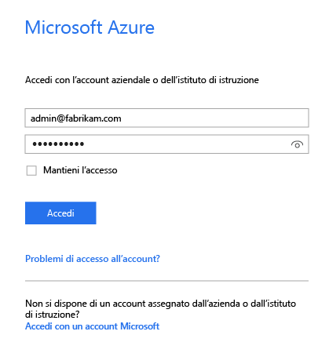
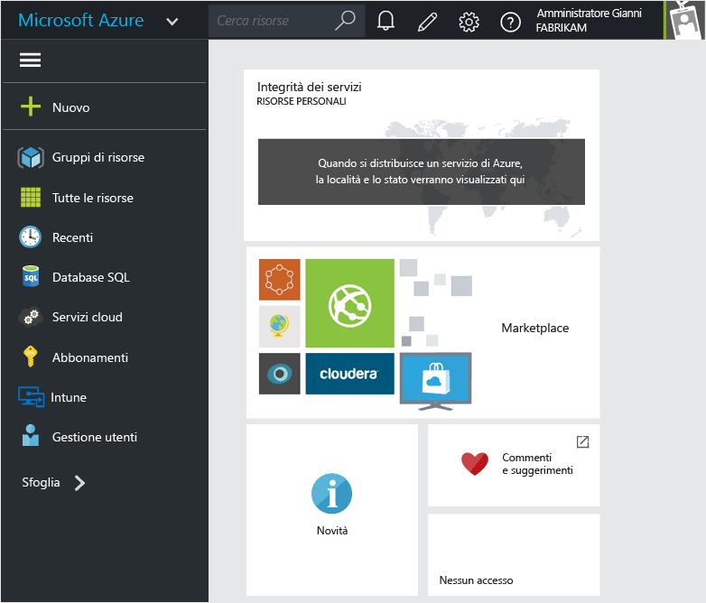
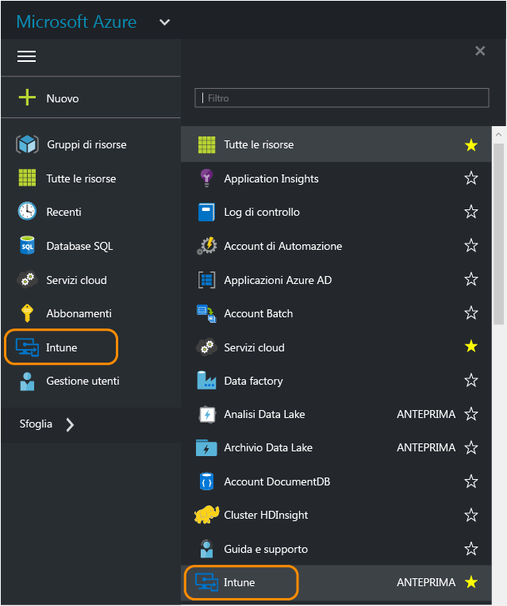
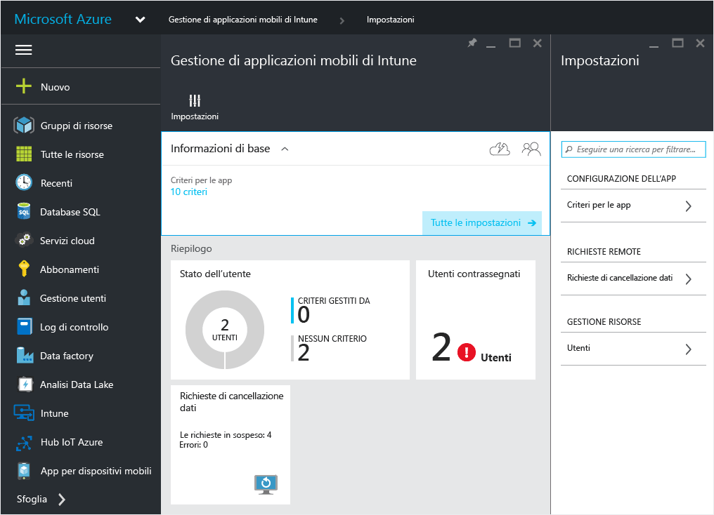
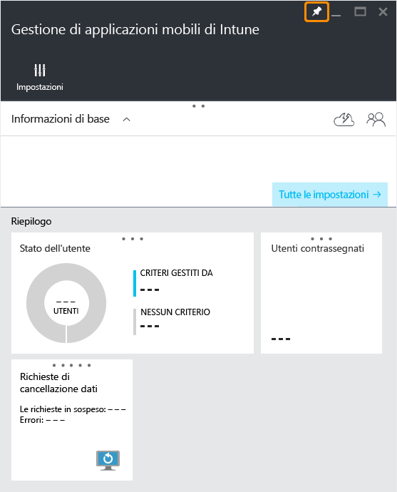
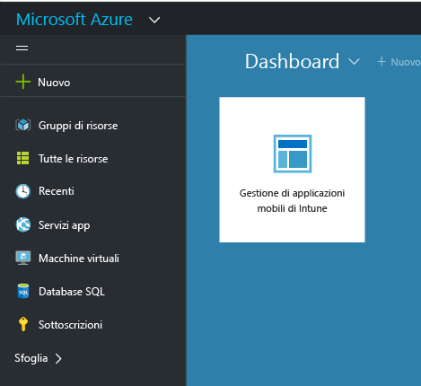

---
# required metadata

title: Portale di Azure per i criteri MAM | Microsoft Intune
description:
keywords:
author: karthikaraman
manager: jeffgilb
ms.date: 04/28/2016
ms.topic: article
ms.prod:
ms.service: microsoft-intune
ms.technology:
ms.assetid: 7d6dae94-a833-40b7-9016-14ea234bb33c

# optional metadata

#ROBOTS:
#audience:
#ms.devlang:
ms.reviewer: joglocke
ms.suite: ems
#ms.tgt_pltfrm:
#ms.custom:

---

# Portale di Azure per i criteri MAM di Microsoft Intune
## Accesso al portale di Azure
Il **portale di Azure** consente di creare e gestire i criteri di gestione delle app per dispositivi mobili.

Il portale di Azure supporta la creazione di criteri MAM per:
- App in esecuzione in dispositivi **registrati e gestiti da Intune**.
- App in esecuzione su dispositivi **non registrati** in qualsiasi soluzione MDM.
- App in esecuzione in dispositivi **registrati in una soluzione MDM di terze parti**.

Se si sta usando la **console di amministrazione di Intune** per la gestione dei dispositivi, è possibile creare un criterio MAM che supporta le app per i dispositivi registrati in Intune mediante la [console di amministrazione di Intune](configure-and-deploy-mobile-application-management-policies-in-the-microsoft-intune-console.md) stessa.
>[!IMPORTANT]
> È possibile che nella console di amministrazione di Intune non vengano visualizzate tutte le impostazioni dei criteri MAM. Il portale di Azure è la nuova console di amministrazione per la creazione di criteri MAM. Se si creano criteri MAM sia nella console di amministrazione di Intune che nel portale di Azure, i criteri di quest'ultimo vengono applicati alle app e distribuiti agli utenti.

## Accedere al portale di Azure e personalizzare la pagina iniziale

1.  Andare nel [portale di Azure](https://portal.azure.com) e accedere con le proprie credenziali di [!INCLUDE[wit_nextref](../includes/wit_nextref_md.md)].

    

2.  Dopo l'accesso verrà visualizzato il **Dashboard**. La pagina **Dashboard** viene visualizzata con un set di riquadri predefiniti che è possibile rimuovere e può essere personalizzata con nuovi riquadri.

    

3.  Nel menu **Sfoglia** individuare **Intune**

4.  Fare clic su **Intune > Gestione di applicazioni mobili di Intune > Impostazioni**.

    

    > [!TIP]
    > Per aggiungere un pannello alla pagina **iniziale** , è possibile usare l'opzione di **aggiunta** nel pannello.  Fare clic sull'icona a forma di puntina nel pannello **Gestione di applicazioni mobili di Intune**per aggiungerlo alla pagina **iniziale** .

    

    
## Passaggi successivi
[Preparazione alla configurazione dei criteri di gestione delle app per dispositivi mobili](get-ready-to-configure-mobile-app-management-policies-with-microsoft-intune.md)

<!--HONumber=Jun16_HO2-->

