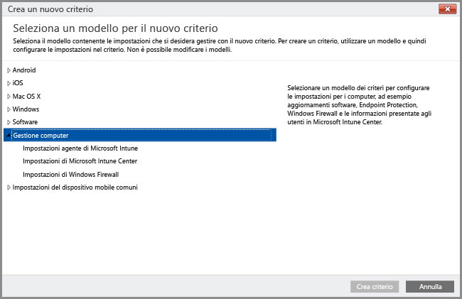
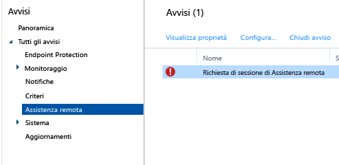

# Attività comuni di gestione di PC Windows con il client software di Intune
Per informazioni sulla gestione dei computer che eseguono il software client di Intune, leggere le attività descritte in questo argomento. Se il client non è ancora stato installato nei computer, vedere [Installare il client software di Intune](install-the-windows-pc-client-with-microsoft-intune.md).

## Usare i criteri per semplificare la gestione dei PC

I PC Windows che eseguono il client software di Intune possono essere gestiti mediante i criteri **Gestione Computer** di Intune.

### Gestire Microsoft Intune Center
Gli utenti visualizzano il client software di Intune come **Microsoft Intune Center**. Microsoft Intune Center consente agli utenti di:

-   Ottenere applicazioni dal portale aziendale.

-   Verificare la disponibilità di aggiornamenti.

-   Gestire Microsoft Intune Endpoint Protection.

-  Richiedere assistenza remota.

Microsoft Intune Center viene installato su tutti i computer gestiti. È possibile configurare le seguenti impostazioni in un criterio di Intune e visualizzarle in Microsoft Intune Center:

|Impostazione criterio|Dettagli|
|------------------|--------------------|
|**Nome**|Il nome dell'amministratore che gestisce il computer.  Lunghezza massima: 40 caratteri|
|**Numero di telefono**|Il numero di telefono dell'amministratore che gestisce il computer.  Lunghezza massima: 20 caratteri|
|**Indirizzo di posta elettronica**|L'indirizzo di posta elettronica dell'amministratore che gestisce il computer.  Lunghezza massima: 40 caratteri|
|**Nome sito Web**|Il nome del sito Web di supporto per gli utenti.  Lunghezza massima: 40 caratteri|
|**URL sito Web**|L'URL del sito Web di supporto.  Lunghezza massima: 150 caratteri|
|**Note**|Una nota che viene visualizzata agli utenti.  Lunghezza massima: 120 caratteri|

## Impostazioni degli aggiornamenti software
Usare criteri per configurare le impostazioni usate dai computer gestiti per cercare e scaricare gli aggiornamenti software di Microsoft e di terze parti. Questi aggiornamenti non includono aggiornamenti del sistema operativo (ad esempio, l'aggiornamento da Windows 7 a Windows 10 o gli aggiornamenti da una versione di Windows 10 a una versione successiva). Per altre informazioni, vedere [Mantenere i PC Windows aggiornati con gli aggiornamenti software in Microsoft Intune](keep-windows-pcs-up-to-date-with-software-updates-in-microsoft-intune.md).

### Impostazioni di Endpoint Protection
Usare criteri per configurare le impostazioni per Endpoint Protection da distribuire successivamente ai computer gestiti. I criteri includono le analisi pianificate e le azioni da intraprendere quando viene rilevato malware. Per altre informazioni, vedere [Proteggere i PC Windows con Endpoint Protection per Microsoft Intune](help-secure-windows-pcs-with-endpoint-protection-for-microsoft-intune.md).

## Impostazioni di Windows Firewall
L'utilizzo di criteri consente di semplificare l'amministrazione delle impostazioni di Windows Firewall sui computer gestiti. Per i dettagli, vedere [Proteggere i PC Windows con criteri di Windows Firewall in Microsoft Intune](help-protect-windows-pcs-using-windows-firewall-policies-in-microsoft-intune.md).

## Visualizzare l'inventario hardware e software
Intune raccoglie informazioni dettagliate sull'hardware e sul software dei computer gestiti. Le informazioni delle seguenti procedure consentono di:

-   Creare un report che elenca le informazioni sulle funzionalità hardware dei computer.

-   Creare un report che elenca il software installato in ciascun computer.

-   Aggiornare un inventario di computer per garantire che i dati nel report sia correnti.

### Visualizzare le informazioni sui computer

1.  Nella [console di amministrazione di Microsoft Intune](https://manage.microsoft.com/) scegliere **Report** &gt; **Report inventario computer**.

2.  Nella pagina **Crea nuovo report** , accettare i valori predefiniti oppure personalizzarli per filtrare i risultati che verranno restituiti nel report. Ad esempio, è possibile scegliere di visualizzare nel report solo i computer che eseguono Windows 8.1.

3.  Fare clic su **Visualizza rapporto** per aprire il **Report inventario computer** in una nuova finestra.

    È possibile ordinare il report in base a qualsiasi colonna, ad esempio **Nome**, **Tipo di chassis** o **Produttore** selezionando l'intestazione della colonna.

### Per visualizzare il software installato nei computer

1.  Nella [console di amministrazione di Microsoft Intune](https://manage.microsoft.com/) scegliere **Report** &gt; **Report software rilevato**.

2.  Nella pagina **Crea nuovo report** , accettare i valori predefiniti oppure personalizzarli per filtrare i risultati che verranno restituiti nel report. Ad esempio, è possibile scegliere di visualizzare nel report solo il software pubblicato da Microsoft.

3.  Scegliere **Visualizza rapporto** per aprire il **Report software rilevato** in una nuova finestra.

    È possibile ordinare il report in base a qualsiasi colonna, ad esempio **Nome**, **Autore** o **Categoria** selezionando ogni intestazione di colonna. È possibile espandere gli aggiornamenti nell'elenco per visualizzare maggiori dettagli, ad esempio i computer in cui gli aggiornamenti sono installati, scegliendo la freccia direzionale accanto alla voce dell'elenco.

### Per aggiornare l'inventario dei computer per accertarsi che sia aggiornato

1.  Nella [console di amministrazione di Microsoft Intune](https://manage.microsoft.com/) scegliere **Gruppi** &gt; **Tutti i dispositivi** oppure un altro gruppo che contiene il computer di cui si vuole aggiornare l'inventario.

2.  Selezionare un computer oppure tenere premuto **CTRL** per selezionare più computer.

3.  Sulla barra delle applicazioni scegliere **Attività remote** &gt; **Aggiorna inventario**.

4.  Per visualizzare lo stato dell'attività, scegliere il collegamento **Attività remote** nell'angolo inferiore destro della pagina.

    Nella finestra di dialogo **Stato attività** sono elencate le attività remote correnti, il relativo stato, il nome del dispositivo e gli eventuali errori segnalati, nonché un collegamento per consultare le informazioni sulla risoluzione dei problemi.

## Riavviare in remoto un PC Windows

1.  Nella [console di amministrazione di Microsoft Intune](https://manage.microsoft.com/) scegliere **Gruppi** &gt; **Tutti i dispositivi** oppure un altro gruppo che contiene il computer da riavviare.

2.  Selezionare uno o più computer, quindi scegliere **Attività remote** &gt; **Riavvia il computer**.

3.  Per visualizzare lo stato dell'attività, scegliere il collegamento **Attività remote** nell'angolo inferiore destro della pagina.

4.  Nella finestra di dialogo **Stato attività** , rivedere le attività remote correnti, il relativo stato, il nome del dispositivo e gli eventuali errori segnalati.

## Ritirare un computer

1.  Nella [console di amministrazione di Microsoft Intune](https://manage.microsoft.com/) scegliere **Gruppi** &gt; **Tutti i dispositivi** oppure un altro gruppo che contiene il computer da ritirare.

2.  Selezionare i dispositivi da ritirare, quindi scegliere **Disattiva/Cancella**.

Per registrare nuovamente un computer in Intune, reinstallare il client software nel PC seguendo la procedura descritta in [Installare il client PC Windows con Microsoft Intune](install-the-windows-pc-client-with-microsoft-intune.md).

Se un computer non è in grado di connettersi a Intune, viene visualizzato un messaggio nell'area di lavoro **Dashboard** .

Quando si ritira un computer:

-   Il computer viene rimosso dall'inventario e dalla gestione di Intune e la licenza associata al computer viene resa disponibile per essere riusata. Ritira/cancella dati rimuove il client del software Intune ma non rimuove le app o i dati dal computer. Il ritiro non esegue una cancellazione completa nel computer.

-   Lo stato del computer non viene più visualizzato nella console di Intune.

-   Intune rimuove il client software dal computer. Se il computer non è connesso al servizio Intune, il client software verrà rimosso alla successiva connessione.

-   Microsoft Intune Endpoint Protection viene rimosso dal computer. Se nel computer è installata un'altra applicazione Endpoint che è disabilitata, sarà possibile abilitarla di nuovo dopo aver rimosso Microsoft Intune Endpoint Protection per garantire che i computer siano protetti.

-   Tutti i criteri vengono rimossi dal computer e i valori impostati dal criterio vengono modificati.

-   Il computer non riceve più aggiornamenti software o aggiornamenti delle definizioni malware dal servizio Intune.

-   A seconda del modo in cui sono configurati, i computer ritirati possono continuare a ricevere gli aggiornamenti tramite Windows Server Update Services, Windows Update o Microsoft Update.

    > [!IMPORTANT]
    > Se il software client è stato installato tramite un oggetto Criteri di gruppo, è necessario rimuovere l'oggetto Criteri di gruppo prima di rimuovere il software client per evitare che il software venga reinstallato.

    Qualora non fosse possibile disinstallare il client, vedere [Risolvere i problemi di Endpoint Protection](/intune/troubleshoot/troubleshoot-endpoint-protection-in-microsoft-intune) per altre informazioni.

## Gestire il collegamento utente-dispositivo
Prima di distribuire software a un utente, è necessario collegare l'utente a un computer. È possibile collegare un utente a più computer, ma ogni computer può essere collegato a un solo utente. Gli utenti vengono automaticamente collegati a qualsiasi computer che registrano in Intune usando il portale aziendale.

### Per collegare un utente a un computer

1.  Nella [console di amministrazione di Microsoft Intune](https://manage.microsoft.com/) scegliere **Gruppi** &gt; **Tutti i dispositivi** oppure un altro gruppo che contiene il computer da collegare a un utente.

2.  Selezionare il computer che si vuole collegare a un utente, quindi scegliere **Collega utente**.

    Nella finestra di dialogo **Collega utente** è visualizzato un elenco di utenti disponibili con il rispettivo nome visualizzato, l'ID utente e il numero di computer a cui è attualmente collegato ciascun utente. Se un utente è già collegato al computer selezionato, il nome e l'ID utente vengono visualizzati in **Utente corrente**. Se il computer non è collegato ad alcun utente, **Nessun utente** viene visualizzato sotto **Utente corrente**.

3.  Eseguire una delle operazioni seguenti:

    -   Per lasciare il computer collegato all'utente corrente, se presente, scegliere **Annulla**.

    -   Per rimuovere il collegamento all'utente corrente, se presente, scegliere **Rimuovi collegamento **&gt; **OK**.

    -   Per collegare il computer a un nuovo utente, selezionare un utente nell'elenco **Tutti gli utenti** . Verificare che i dati dell'utente siano corretti e quindi scegliere **OK**.

> [!TIP]
> Per limitare la capacità di collegamento degli utenti finali ai computer, abilitare l'opzione **Limita la capacità utente di collegarsi ai computer** nei criteri **Impostazioni agente di Microsoft Intune**.

## Richiedere e fornire assistenza remota per i PC Windows

Microsoft Intune può usare il software [TeamViewer](https://www.teamviewer.com), acquistato separatamente, per consentire agli utenti di PC che eseguono il client software di Intune di ottenere assistenza remota da parte dell'utente. Quando un utente richiede assistenza a Microsoft Intune Center, si riceve un avviso, si può accettare la richiesta e quindi fornire assistenza.
Questa funzionalità sostituisce la funzionalità Assistenza remota Windows presente in Intune.

### Prima di iniziare

Prima di stabilire la connessione e di rispondere alle richieste di assistenza remota, è necessario verificare che siano soddisfatti i prerequisiti seguenti:

- È necessario [aver ottenuto un account TeamViewer](https://login.teamviewer.com/LogOn#register) per accedere al sito Web TeamViewer.
- I PC Windows da amministrare devono essere [gestiti dal client PC Windows](manage-windows-pcs-with-microsoft-intune.md)
- È possibile amministrare tutti i sistemi operativi per PC Windows supportati da Intune.

### Configurare TeamViewer Connector

1. Nella [console di amministrazione di Microsoft Intune](https://manage.microsoft.com) scegliere **Amministrazione**.
2. Nell'area di lavoro **Amministrazione** scegliere **TeamViewer**.
3. Nella pagina **TeamViewer**, in **TeamViewer Connector**, scegliere **Abilita**.
4. Nella finestra di dialogo **Abilita TeamViewer** visualizzare le condizioni di licenza, quindi scegliere **Accetta**. Se non si ha ancora una licenza di TeamViewer, scegliere **Acquista una licenza di TeamViewer**.
5. Dopo l'apertura della finestra di TeamViewer nel browser, accedere al sito con le credenziali di TeamViewer.
6. Nel sito di TeamViewer leggere e accettare le opzioni che consentono a Intune di connettersi a TeamViewer.
7. Nella console di Intune verificare che **TeamViewer Connector** sia visualizzato come **Abilitato**.

### Aprire una richiesta di assistenza remota (utente finale)

1. In un PC Windows client aprire **Microsoft Intune Center**.
2. In **Assistenza remota** scegliere **Richiedi assistenza remota**.
3. Dopo l'approvazione della richiesta (vedere più avanti) TeamViewer si apre all'interno del client. L'utente deve accettare tutti i messaggi che indicano che il Web browser sta tentando di aprire l'applicazione TeamViewer.
4. Viene visualizzato un messaggio che chiede l'autorizzazione a controllare il PC. Per continuare è necessario accettare questo messaggio.
5. Durante la sessione di assistenza remota l'utente vede una finestra che mostra la connessione in corso. Se si chiude questa finestra, la sessione remota termina.

### Rispondere a una richiesta di assistenza remota

1. Quando un utente invia una richiesta di assistenza remota, è possibile visualizzare quest'ultima nell'area di lavoro **Avvisi**, in **Monitoraggio** > **Assistenza remota**. Ad esempio:
> 

 Se una richiesta non riceve una risposta per più di 4 ore, viene rimossa.
2. Per accettare la richiesta, scegliere **Approva la richiesta e apri Assistenza remota**.
3. Nella finestra di dialogo **Nuova richiesta di Assistenza remota in sospeso** scegliere **Accettare la richiesta di Assistenza remota**. Se non è già installato, TeamViewer installerà tutte le app necessarie nel computer in uso.
4. TeamViewer quindi avvisa l'utente finale che si vuole assumere il controllo del PC. Dopo che l'utente ha accettato la richiesta, la finestra di TeamViewer viene aperta ed è possibile controllare il PC.

Durante una sessione di assistenza remota è possibile usare tutti i comandi di TeamViewer disponibili per controllare il computer remoto. Per informazioni su questi comandi, scaricare la [Guida sul controllo remoto](http://www.teamviewer.com/en/support/documents/) dal sito Web TeamViewer.

### Chiudere la sessione di Assistenza remota

Dal menu**Azioni** della finestra di **TeamViewer**, scegliere **Termina sessione**.

<!--HONumber=Sep16_HO1-->

