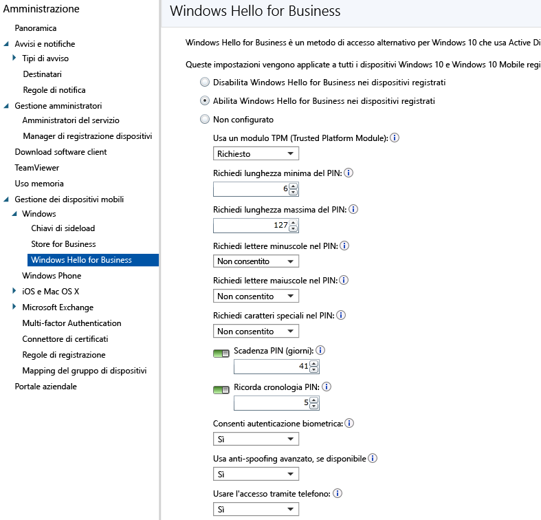

# Controllare le impostazioni di Microsoft Passport nei dispositivi con Microsoft Intune
Microsoft Intune si integra con Microsoft Passport for Work, un metodo di accesso alternativo che usa Active Directory o un account Azure Active Directory per sostituire una password, una smart card o una smart card virtuale.

Passport consente di eseguire l'accesso usando un *movimento dell'utente* invece di una password. Un movimento dell'utente può essere un PIN semplice, l'autenticazione biometrica come Windows Hello o un dispositivo esterno come un lettore di impronte digitali.

>[!TIP]
>Microsoft Passport for Work è ora noto come Windows Hello for Business. La console di Intune non riflette ancora questa modifica.

Intune si integra con Passport for Work in due modi:

-   È possibile usare i criteri di Intune per controllare i movimenti che gli utenti possono usare o meno per l'accesso.

-   È possibile archiviare i certificati di autenticazione nel provider di archiviazione chiavi (KSP) di Passport for Work. Per altre informazioni, vedere [Secure resource access with certificate profiles in Microsoft Intune](secure-resource-access-with-certificate-profiles.md) (Proteggere l'accesso alle risorse con i profili certificato in Microsoft Intune).

## Creare i criteri di Passport for Work

1.  Nella [console di amministrazione di Microsoft Intune](https://manage.microsoft.com) scegliere **Amministrazione**&gt;**Gestione dei dispositivi mobili**&gt;**Windows**&gt;**Passport for Work** per aprire la pagina Passport for Work.

    

2.  Scegliere una delle impostazioni seguenti:
    - **Disabilita Passport for Work nei dispositivi registrati**. Se non si vuole usare Passport for Work nei dispositivi Windows 10, selezionare questa impostazione. Tutte le altre impostazioni nella schermata risultano non disponibili.
    - **Abilita Passport for Work nei dispositivi registrati**. Selezionare questa impostazione per configurare le impostazioni di Passport for Work in tutti i dispositivi Windows 10.
    - **Non configurato**. Selezionare questa impostazione se non si vuole usare Intune per controllare le impostazioni di Passport for Work. Eventuali impostazioni di Passport for Work presenti nei dispositivi Windows 10 non verranno modificate. Tutte le altre impostazioni nella schermata risultano non disponibili.
3.  Se si seleziona **Abilita Passport for Work nei dispositivi registrati**, configurare le impostazioni obbligatorie che verranno applicate a tutti i dispositivi Windows 10 e Windows 10 Mobile registrati.
4.  Al termine, scegliere **Salva**.

## Passport for Work: impostazioni del PIN

- **Richiedi lunghezza minima del PIN**/**Richiedi lunghezza massima del PIN**. Configura i dispositivi in modo che usino i valori massimo e minimo specificati per la lunghezza del PIN per garantire l'accesso protetto. La lunghezza del PIN predefinita è 6 caratteri, ma è possibile applicare una lunghezza minima di 4 caratteri. La lunghezza massima del PIN è 127 caratteri.
- **Richiedi lettere minuscole nel PIN**/**Richiedi lettere maiuscole nel PIN**/**Caratteri speciali nel PIN**. Per applicare un PIN più complesso, richiedere l'utilizzo di lettere maiuscole, lettere minuscole e caratteri speciali nel PIN. È possibile scegliere tra:
    - **Consentito**. Gli utenti possono usare il tipo di carattere specificato nel proprio PIN, ma non è obbligatorio.
    - **Obbligatorio**. Gli utenti devono includere almeno uno dei tipi di carattere specificati nel PIN. Ad esempio, di solito si richiede almeno una lettera maiuscola e un carattere speciale.
    - **Non consentito** (impostazione predefinita). Gli utenti non devono usare questi tipi di carattere nel PIN. Se l'opzione non è configurata, questa è l'impostazione predefinita.
    > [!TIP]
    > I caratteri speciali sono: **! " # $ % &amp; ' ( ) &#42; + , - . / : ; &lt; = &gt; ? @ [ \ ] ^ _ &#96; { &#124; } ~**.
- **Scadenza PIN (giorni)**. Si consiglia di specificare un periodo di scadenza dopo il quale gli utenti finali devono modificare il PIN. L'impostazione predefinita è 41 giorni.
- **Ricorda cronologia PIN**. Limita il riutilizzo di PIN usati in precedenza. Per impostazione predefinita, non è possibile riutilizzare gli ultimi 5 PIN.

## Passport for Work: altre impostazioni

- **Usa un modulo TPM (Trusted Platform Module)**. Un chip TPM (Trusted Platform Module) fornisce un livello aggiuntivo di sicurezza dei dati. Scegliere uno dei valori seguenti:
    - **Obbligatorio** (impostazione predefinita). Solo i dispositivi con un modulo TPM accessibile possono eseguire il provisioning di Passport for Work.
    - **Preferito**. I dispositivi provano a usare prima un modulo TPM. Se non è disponibile, possono usare la crittografia software.
- **Consenti autenticazione biometrica**. Abilita l'autenticazione biometrica, ad esempio il riconoscimento facciale o delle impronte digitali, come alternativa a un PIN di Passport for Work. Gli utenti devono comunque configurare un PIN aziendale in caso di errore dell'autenticazione biometrica. È possibile scegliere tra:
    - **Sì**. Passport for Work consente l'autenticazione biometrica.
    - **No**. Passport for Work impedisce l'autenticazione biometrica per tutti i tipi di account.
- **Usa anti-spoofing avanzato, se disponibile**. Consente di configurare se usare le funzionalità di anti-spoofing di Windows Hello nei dispositivi che lo supportano, ad esempio il rilevamento di una fotografia di un viso invece di un viso reale. Se impostato su **Sì**, Windows richiede a tutti gli utenti di usare la funzionalità di anti-spoofing per le caratteristiche del viso, se supportata.
- **Usare Passport remoto**. Se questa opzione è impostata su **Sì**, gli utenti possono usare Passport remoto come dispositivo portatile complementare per l'autenticazione del computer desktop. Il computer desktop deve essere aggiunto ad Azure Active Directory e il dispositivo complementare deve essere configurato con un PIN di Passport for Work.

## Altre informazioni
Per altre informazioni su Microsoft Passport, vedere [la guida](https://technet.microsoft.com/library/mt589441.aspx) nella documentazione di Windows 10.

<!--HONumber=Aug16_HO1-->

