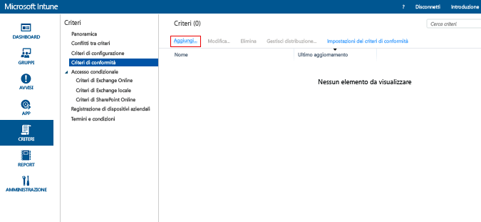
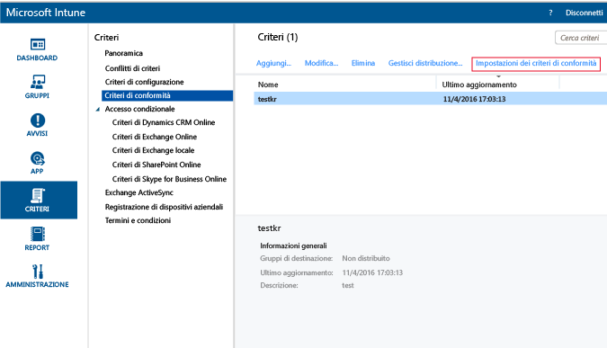
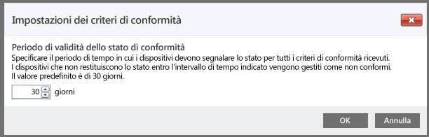

# Creare criteri di conformità dei dispositivi in Microsoft Intune
In questo argomento sono illustrati i passaggi per creare criteri di conformità che un dispositivo deve osservare per essere considerato conforme.

##  Passaggio 1: Aggiungere nuovi criteri
  Nella [console di amministrazione di Microsoft Intune](https://manage.microsoft.com) scegliere **Criteri** &gt; **Criteri di conformità** &gt; **Aggiungi**.

  

##  Passaggio 2: Configurare le impostazioni
Nella pagina **Crea criterio** abilitare le impostazioni richieste:
  -   Impostazioni di protezione del sistema come la password e la crittografia
  -   Impostazioni di integrità del dispositivo, ad esempio se il dispositivo è jailbroken oppure se viene segnalato come integro dal servizio di attestazione dell'integrità di Windows.
  -   Impostazioni delle proprietà del dispositivo, come la versione minima del sistema operativo richiesta o la versione massima del sistema operativo consentita.

##  Passaggio 3: Salvare i criteri
Al termine, scegliere **Salva criterio**.

È possibile scegliere di distribuire i criteri subito dopo il salvataggio o in un secondo momento. Il nuovo criterio viene visualizzato nel nodo **Criteri di conformità** dell'area di lavoro **Criteri**.

##  Passaggio 4: Impostare il periodo di validità dello stato di conformità
Per specificare l'intervallo di tempo in cui il dispositivo deve eseguire l'archiviazione prima di essere considerato non conforme, passare alle impostazioni dei criteri di conformità e aggiornare l'intervallo.  Per impostazione predefinita, questo intervallo è impostato su 30 giorni.

## Impostazioni dei criteri supportate
La tabella seguente include le impostazioni dei criteri di conformità e le piattaforme nelle quali sono supportate.

-------------
|Impostazioni|iOS|Android|Windows|
|-----|----|-----|-----|
|Richiedi una password per sbloccare i dispositivi mobili|iOS 6 e versioni successive|Android 4.0 e versioni successive  Samsung KNOX Standard 4.0 e versioni successive|Windows Phone 8 e versioni successive|
|Consenti password semplici|iOS 6 e versioni successive|Non supportato|Windows Phone 8 e versioni successive|
|Lunghezza minima password|iOS 6 e versioni successive| Android 4.0 e versioni successive Samsung KNOX Standard 4.0 e versioni successive| Windows Phone 8 e versioni successive Windows 8.1|
|Tipo di password richiesto|iOS 6 e versioni successive|Non disponibile|Windows Phone 8 e versioni successive  Windows RT  Windows RT 8.1  Windows 8.1|
|Numero minimo di set di caratteri|iOS 6 e versioni successive|Non disponibile|Windows Phone 8 e versioni successive  Windows RT  Windows RT 8.1  Windows 8.1|
|Qualità password|Non disponibile|Android 4.0 e versioni successive  Samsung KNOX Standard 4.0 e versioni successive|Non disponibile|
|Minuti di inattività prima che venga richiesta la password|iOS 6 e versioni successive|Android 4.0 e versioni successive Samsung KNOX Standard 4.0 e versioni successive|Windows Phone 8 e versioni successive Windows RT e Windows RT 8.1 Windows 8.1|
|Scadenza password (giorni)|iOS 6 e versioni successive|Android 4.0 e versioni successive Samsung KNOX Standard 4.0 e versioni successive|Windows Phone 8 e versioni successive Windows RT e Windows RT 8.1 Windows 8.1|
|Ricorda cronologia password|iOS 6 e versioni successive|Android 4.0 e versioni successive Samsung KNOX Standard 4.0 e versioni successive|Windows Phone 8 e versioni successive Windows RT e Windows RT 8.1 Windows 8.1|
|Impedisci riutilizzo delle password precedenti|iOS 6 e versioni successive|Android 4.0 e versioni successive Samsung KNOX Standard 4.0 e versioni successive|Windows Phone 8 e versioni successive Windows RT e Windows RT 8.1 Windows 8.1|
|Richiedi una password quando il dispositivo torna attivo dopo uno stato di inattività| Non disponibile| Non disponibile|Windows 10 Mobile|
|Richiedi crittografia sui dispositivi mobili|Non applicabile|Android 4.0 e versioni successive Samsung KNOX Standard 4.0 e versioni successive|Windows Phone 8 e versioni successive  Windows 8.1|
|Richiedi che i dispositivi siano riportati come integri| Non disponibile| Non disponibile|Windows  Windows 10 Mobile|
|Il dispositivo non deve essere jailbroken o rooted|iOS 6 e versioni successive|Android 4.0 e versioni successive Samsung KNOX Standard 4.0 e versioni successive|Non disponibile|
|L'account di posta elettronica deve essere gestito da Intune|iOS 6 e versioni successive|Non disponibile| Non disponibile|
|Selezionare il profilo di posta elettronica che deve essere gestito da Intune|iOS 6 e versioni successive|Non disponibile| Non disponibile|
|Versione minima richiesta del sistema operativo|iOS 6 e versioni successive|Android 4.0 e versioni successive Samsung KNOX Standard 4.0 e versioni successive| Windows Phone 8 e versioni successive Windows 8.1|
|Versione massima consentita del sistema operativo|iOS 6 e versioni successive|Android 4.0 e versioni successive Samsung KNOX Standard 4.0 e versioni successive|Windows Phone 8 e versioni successive Windows 8.1|

Per altre informazioni sulle impostazioni di conformità supportate in ogni piattaforma, selezionare una delle seguenti voci:
> [!div class="op_single_selector"]
- [Impostazioni dei criteri di conformità per i dispositivi iOS](ios-compliance-policy-settings-in-microsoft-intune.md)
- [Impostazioni dei criteri di conformità per i dispositivi Android](android-compliance-policy-settings-in-microsoft-intune.md)
- [Impostazioni dei criteri di conformità per Windows e Windows Phone ](windows-compliance-policy-settings-in-microsoft-intune.md)

## Passaggi successivi
[Deploy and monitor a compliance policy (Distribuire e monitorare criteri di conformità)](deploy-and-monitor-a-device-compliance-policy-in-microsoft-intune.md)

### Vedere anche
[Introduction to device compliance policies (Introduzione ai criteri di conformità del dispositivo)](introduction-to-device-compliance-policies-in-microsoft-intune.md)

<!--HONumber=Jul16_HO3-->

