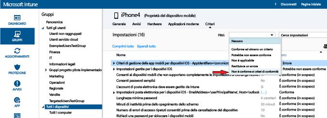

---
# required metadata

title: Distribuire e monitorare i criteri di conformità in Microsoft Intune | Microsoft Intune
description:
keywords:
author: karthikaraman
manager: jeffgilb
ms.date: 04/28/2016
ms.topic: article
ms.prod:
ms.service: microsoft-intune
ms.technology:
ms.assetid: d8f246d4-0d86-4c8b-a1bf-9977985506d8

# optional metadata

#ROBOTS:
#audience:
#ms.devlang:
ms.reviewer: chrisgre
ms.suite: ems
#ms.tgt_pltfrm:
#ms.custom:

---

# Distribuire e monitorare i criteri di conformità di un dispositivo in Microsoft Intune
## Distribuire i criteri di conformità
Distribuire i criteri di conformità [creati](create-a-device-compliance-policy-in-microsoft-intune.md) a uno o più gruppi di utenti o dispositivi nella propria organizzazione.

1.  Nell'area di lavoro **Criteri** selezionare il criterio che si vuole distribuire, quindi scegliere **Gestisci distribuzione**.

2.  Nella finestra di dialogo **Gestisci distribuzione** selezionare uno o più gruppi in cui si vuole distribuire il criterio, quindi scegliere **Aggiungi > OK**.
. È possibile distribuire i criteri di conformità per gli utenti e/o i dispositivi. Usare i gruppi di Active Directory che sono già stati creati e sincronizzati con Intune oppure creare manualmente questi gruppi nella console di Intune. Per altre informazioni su come distribuire i criteri, vedere [Deploy a configuration policy](manage-settings-and-features-on-your-devices-with-microsoft-intune-policies.md) (Distribuire un criterio di configurazione).

Usare il riepilogo dello stato e gli avvisi visualizzati nella pagina **Panoramica** dell'area di lavoro **Criteri** per identificare i problemi relativi ai criteri che richiedono attenzione. Un riepilogo dello stato viene inoltre visualizzato nell'area di lavoro **Dashboard** .

> [!IMPORTANT]Se non sono stati distribuiti i criteri di conformità e abilitati i criteri di accesso condizionale di Exchange, a tutti i dispositivi di destinazione verrà consentito l’accesso.

## Come vengono risolti i conflitti di criteri in Intune
Possono verificarsi conflitti se vengono applicati più criteri di Intune a un dispositivo. Se le impostazioni dei criteri si sovrappongono, Intune risolve eventuali conflitti in base alle regole seguenti:

-   Se le impostazioni in conflitto hanno origine da criteri di configurazione di Intune e da criteri di conformità, le impostazioni nei criteri di conformità hanno la precedenza rispetto a quelle dei criteri di configurazione, anche se queste ultime sono più sicure.

-   Se sono stati distribuiti più criteri di conformità, verranno usati quelli più sicuri.

## Monitorare i criteri di conformità

#### Per visualizzare i dispositivi non conformi ai criteri di conformità

1.  Nella [console di amministrazione di Microsoft Intune](https://manage.microsoft.com) scegliere **Gruppi > Tutti i dispositivi**.

2.  Fare doppio clic sul nome di un dispositivo nell'elenco di dispositivi.

3.  Scegliere la scheda **Criteri** per visualizzare un elenco di criteri per il dispositivo.

4.  Dall'elenco a discesa **Filtri** selezionare **Non è conforme ai criteri di conformità**.

#### Per visualizzare i report di attestazione dell'integrità

1.  Nella [console di amministrazione di Microsoft Intune](https://manage.microsoft.com) scegliere **Report**.

2.  Nella pagina **Report di attestazione dell'integrità - Creare un nuovo report** è possibile visualizzare un report con tutti i dati di attestazione dell'integrità di Windows 10 raccolti da Intune. È anche possibile creare un report con un subset di dati usando i filtri. I filtri possono basarsi sul tipo di dispositivo, sul sistema operativo o solo su un subset di punti dati.

## Passaggi successivi
È ora possibile usare i criteri di conformità con i criteri di accesso condizionale per controllare l'accesso ai servizi nell'organizzazione.

[Limitare l'accesso alla posta elettronica e ai servizi di Office 365](restrict-access-to-email-and-o365-services-with-microsoft-intune.md)

### Vedere anche
[Introduzione ai criteri di conformità del dispositivo in Intune](introduction-to-device-compliance-policies-in-microsoft-intune.md)

<!--HONumber=Jun16_HO2-->

