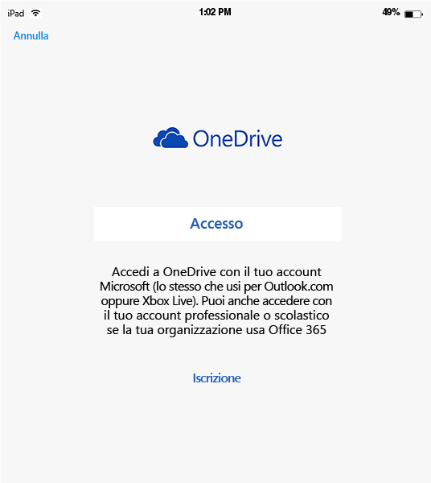
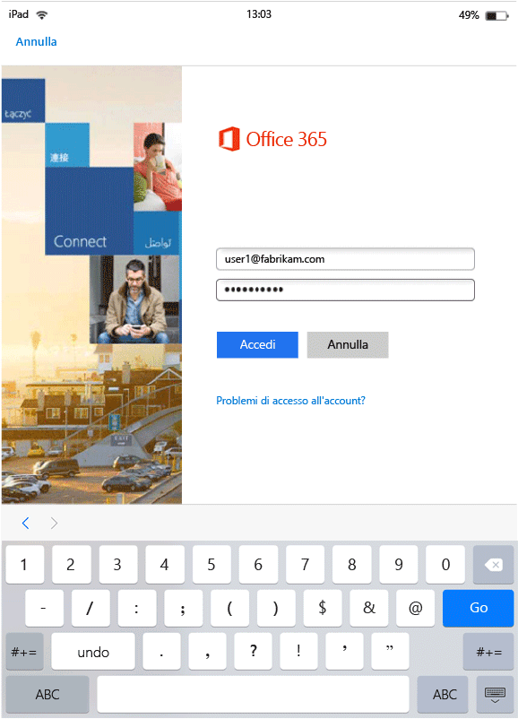
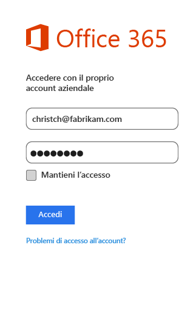

---
# required metadata

title: Esperienza dell'utente finale con app MAM | Microsoft Intune
description:
keywords:
author: karthikaraman
manager: jeffgilb
ms.date: 04/28/2016
ms.topic: article
ms.prod:
ms.service: microsoft-intune
ms.technology:
ms.assetid: b57e6525-b57c-4cb4-a84c-9f70ba1e8e19

# optional metadata

#ROBOTS:
#audience:
#ms.devlang:
ms.reviewer: andcerat
ms.suite: ems
#ms.tgt_pltfrm:
#ms.custom:

---

# Esperienza dell'utente finale con app MAM con Microsoft Intune
I criteri di Gestione per applicazioni mobili (MAM) si applicano solo quando le app vengono usate in un contesto professionale.  Leggere gli scenari seguenti per capire il funzionamento delle app gestite.
##  Accesso a OneDrive in un dispositivo iOS

1.  Avviare l'app  **OneDrive** per aprire la pagina di accesso.

    

    > [!NOTE]
    > In un dispositivo personale l'utente deve solitamente scaricare l'app.  Se il dispositivo è gestito da una soluzione MDM, è possibile distribuire l'app nel dispositivo.

2.  Digitare il nome utente dell'account aziendale. Si verrà reindirizzati alla pagina di **autenticazione di O365** in cui immettere le credenziali di lavoro.

    

3.  Dopo la corretta autenticazione delle credenziali in Azure AD, verranno applicati i criteri MAM e richiesto di riavviare l'app **OneDrive** .

    

4.  Quando si riavvia l'app **OneDrive**, l'app viene avviata con i criteri MAM attivati. A questo punto viene richiesto di impostare un **PIN** per l'applicazione. (se il criterio è configurato per questo).

    

5.  Dopo aver impostato e confermato il PIN, sarà possibile accedere ai file in **OneDrive for Business**.

    

    > [!NOTE] Quando si modifica un criterio distribuito, le modifiche verranno applicate alla successiva apertura dell'applicazione.

##  Accesso a OneDrive in un dispositivo Android

1.  Avviare l'app OneDrive per aprire la pagina di accesso.

    > [!NOTE]
    > In un dispositivo personale l'utente deve solitamente scaricare l'app.  Se il dispositivo è gestito da una soluzione MDM, è possibile distribuire l'app nel dispositivo.

2.  Digitare il nome utente dell'account aziendale. Si verrà reindirizzati alla pagina di **autenticazione di O365** in cui immettere le credenziali di lavoro.

    

3.  Dopo che le credenziali saranno state autenticate da **Azure AD**verrà visualizzato un messaggio contenente le istruzioni per installare l'app dal portale aziendale, se non è già installata sul dispositivo.  Toccare **Scarica l'app** per procedere.

>[!NOTE]
>L'app Portale aziendale è necessaria per tutte le app associate a criteri MAM in dispositivi Android. Per i dispositivi non registrati in Intune, è necessario che l'app sia installata nel dispositivo, ma avvio o accesso all'app non sono necessari.  

  

4.  A questo punto si viene reindirizzati allo store **Google Play** , da cui è possibile scaricare e installare l'app **Portale aziendale** .

    L'app Portale aziendale consente di mantenere i dati sicuri e protetti.

    

5.  Dopo aver completato l'installazione, fare clic su **Accetta** per accettare le condizioni.

6.  L'app **OneDrive** viene avviata automaticamente.

7.  Alla successiva apertura di OneDrive, verrà visualizzato il prompt dei comandi per impostare un **PIN**, purché i criteri siano impostati in modo da richiedere un PIN per accedere all'app **OneDrive** .

    

8.  Dopo aver impostato e verificato il PIN, è possibile continuare a usare **OneDrive**, che è ora gestito da criteri di app.

##  Uso di app con supporto di più identità
Per questo scenario di esempio viene usato Microsoft Word.

1.  Aprire l'app **Word** nel proprio dispositivo. Per dimostrare la procedura viene usato un dispositivo iOS.

2.  Toccare **Nuovo** per creare un nuovo documento di Word.

    

3.  Digitare una frase a scelta.  Quando si salva il documento, vengono visualizzati sia il percorso personale che quello di lavoro come opzioni per il salvataggio del documento appena creato.  In questo passaggio, i criteri dell'app non sono ancora stati applicati perché questo contesto di lavoro/personale non è stato ancora stabilito.

4.  Salvare il documento in OneDrive per nel percorso aziendale. Il documento è ora contrassegnato come dati aziendali e verranno applicate le restrizioni dei criteri.

    

5.  Aprire il documento che è stato salvato nel percorso di lavoro.  Copiare il testo, aprire l'account personale di **Facebook** e provare a incollare il testo copiato.  Si noterà che non è possibile incollare il contenuto nel nuovo post di Facebook. L'opzione Incolla non è disattivata, ma non accade nulla quando si preme **Incolla**.

    

    

6.  Ripetere ora i passaggi 2 e 3 per creare un altro documento nuovo, digitare una frase a scelta e, anziché salvarla nel percorso di lavoro, salvarla nel percorso personale, ad esempio **OneDrive - Personale**.

    

7.  Aprire il documento personale salvato.  Copiare il testo, aprire l'app di **Facebook** e provare a incollare il testo copiato. Si noterà che non è possibile incollare il contenuto in un post di Facebook.

    

##  Gestione degli account utente

Intune supporta solo la distribuzione di criteri MAM a un unico account utente per dispositivo. Se un dispositivo ha più di un account aziendale, un solo account viene gestito dai criteri MAM.

A seconda dell'applicazione che si usa, è possibile scegliere di bloccare o meno il secondo utente del dispositivo. In ogni caso, sarà tuttavia interessato dai criteri MAM solo il primo utente che ottiene i criteri.

Se prima della distribuzione dei criteri MAM, un dispositivo ha più di un account utente, il primo account che riceve la distribuzione dei criteri MAM sarà gestito dai criteri MAM di Intune.

**Microsoft Word**, **Excel** e **PowerPoint** non bloccano un secondo account utente. Questo account utente non sarà tuttavia interessato dai criteri MAM.  

Per le app **OneDrive e Outlook**, è possibile usare un solo account aziendale.  L'aggiunta di più account aziendali è bloccata in queste app.  È tuttavia possibile rimuovere un utente e aggiungere un altro utente sul dispositivo.

Per capire meglio come vengono gestiti gli account utente multipli, leggere lo scenario di esempio riportato sotto.

L'utente A lavora per due aziende, l'**Azienda X** e l'**Azienda Y**. L'utente A ha un account aziendale per ognuna delle aziende per cui lavora e, in entrambi i casi, viene usato Intune per la distribuzione dei criteri MAM. L'**Azienda X** distribuisce i criteri MAM **prima dell'****Azienda Y**. L'account associato all'**Azienda X** otterrà i criteri MAM, a differenza dell'account associato all'Azienda Y. Se si vuole che l'account utente associato all'Azienda Y sia gestito con i criteri MAM, è necessario rimuovere l'utente associato all'Azienda X.
### Aggiunta di un secondo account
#### iOS
Se si usa un dispositivo iOS, quando si prova ad aggiungere un secondo account aziendale sullo stesso dispositivo, verrà visualizzato un messaggio di blocco.  Verrà visualizzata anche un'opzione per rimuovere l'account esistente e aggiungerne uno nuovo. È possibile farlo facendo clic su **Sì**.

####  Android
Se si usa un dispositivo Android, verrà visualizzato un messaggio di blocco con le istruzioni necessarie per rimuovere l'account esistente e aggiungerne uno nuovo.  Nei dispositivi Android per rimuovere l'account esistente, passare a **Impostazioni &gt; Generali &gt; Applicazioni &gt;Portale aziendale e selezionare "Cancella dati"**

##  Visualizzazione di file multimediali con l'app di condivisione file Rights Management
Per visualizzare file AV, PDF e di immagine in dispositivi Android, usare l'[app RMS (Microsoft Rights Management) sharing](https://play.google.com/store/apps/details?id=com.microsoft.ipviewer).

Scaricare questa app da Google Play Store.  Dopo aver installato l'app nel dispositivo, avviare l'applicazione ed eseguire l'autenticazione con le credenziali aziendali. Sarà ora possibile visualizzare file protetti e non protetti da altre app gestite da criteri.

**Dispositivi Android non registrati in Intune**

Prima di usare l'app RMS sharing per visualizzare i file di altre app gestite da Intune, avviare l'app RMS ed eseguire l'autenticazione con l'account aziendale.  Quando si effettua l'accesso, viene visualizzato il messaggio seguente **solo se non si dispone di una licenza RMS**:

**Autenticazione riuscita. È ora possibile visualizzare i file aziendali, ma l'organizzazione non è configurata per consentire la protezione dei file. Per informazioni dettagliate, contattare l'amministratore IT.**

Questo non impedisce l'uso dell'app RMS sharing per visualizzare i file aziendali. È comunque possibile aprire e visualizzare i file aziendali da altre app gestite da Intune. I criteri MAM sono ancora validi.  Il significato del messaggio è che non sarà possibile applicare le funzionalità di protezione aggiuntiva offerte dall'app RMS.  Per aggiungere protezione ai file è necessaria una licenza per RMS. Per altre informazioni sulle funzionalità di protezione dei file di RMS, vedere [Protect a file on a device (protect in-place) by using the Rights Management sharing application](https://docs.microsoft.com/en-us/rights-management/rms-client/sharing-app-protect-in-place) (Proteggere un file in un dispositivo (protezione sul posto) tramite l'applicazione Rights Management sharing) e [Protect a file that you share by email by using the Rights Management sharing application](https://docs.microsoft.com/en-us/rights-management/rms-client/sharing-app-protect-by-email) (Proteggere un file condiviso tramite l'applicazione Rights Management sharing).

### Vedere anche
[Creare e distribuire i criteri di gestione delle app per dispositivi mobili con Microsoft Intune](create-and-deploy-mobile-app-management-policies-with-microsoft-intune.md)

<!--HONumber=Jun16_HO2-->

