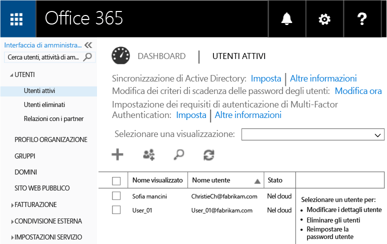
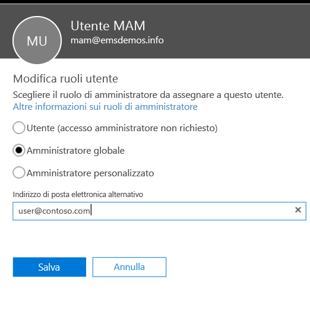
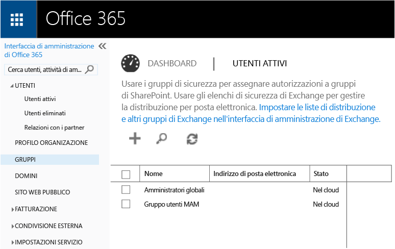
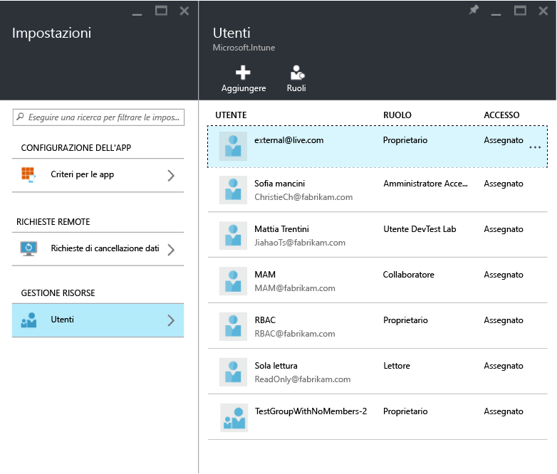
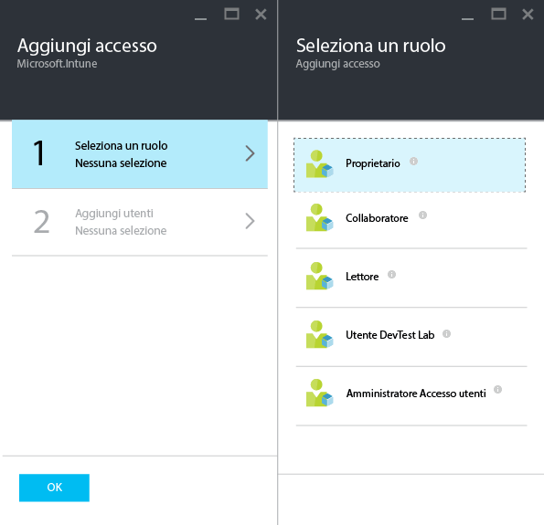
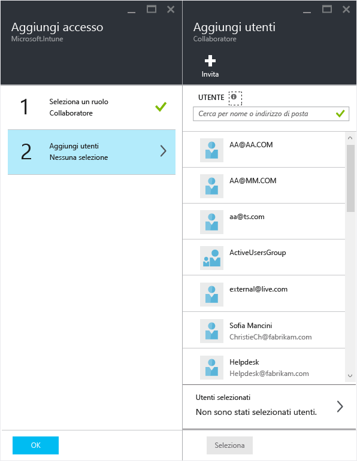

---
# required metadata

title: Preparazione alla configurazione dei criteri di gestione delle app per dispositivi mobili | Microsoft Intune
description:
keywords:
author: karthikaraman
manager: jeffgilb
ms.date: 04/28/2016
ms.topic: article
ms.prod:
ms.service: microsoft-intune
ms.technology:
ms.assetid: 7e6a85e7-e007-41b6-9034-64d77f547b87

# optional metadata

#ROBOTS:
#audience:
#ms.devlang:
ms.reviewer: jeffgilb
ms.suite: ems
#ms.tgt_pltfrm:
#ms.custom:

---

# Preparazione alla configurazione dei criteri di gestione delle app per dispositivi mobili con Microsoft Intune
Questo argomento descrive i passaggi precedenti la creazione dei criteri di gestione delle app per dispositivi mobili (MAM) nel portale di Azure.
Se si sta usando la **console di amministrazione di Intune** per la gestione dei dispositivi, è possibile creare un criterio MAM che supporta le app per i dispositivi registrati in Intune mediante la [console di amministrazione di Intune](configure-and-deploy-mobile-application-management-policies-in-the-microsoft-intune-console.md) stessa..
>[!IMPORTANT]
> È possibile che nella console di amministrazione di Intune non vengano visualizzate tutte le impostazioni dei criteri MAM. Il portale di Azure è la nuova console di amministrazione per la creazione dei criteri MAM.

##  Piattaforme supportate
- iOS 8.1 o versioni successive

- Android 4 o versioni successive

##  App supportate
Per visualizzare l'elenco completo delle applicazioni supportate, andare alla [raccolta di applicazioni per dispositivi mobili di Microsoft Intune](https://www.microsoft.com/en-us/server-cloud/products/microsoft-intune/partners.aspx) nella pagina dei partner di Microsoft Intune.
Fare clic sull'app per visualizzare le piattaforme e gli scenari supportate e per verificare se l'applicazione supportata più identità.

**Prima** di poter configurare i criteri MAM, è necessario:

-   Avere una **sottoscrizione a Microsoft Intune**.    Gli utenti finali devono avere le licenze di [!INCLUDE[wit_nextref](../includes/wit_nextref_md.md)] per ottenere le app con i criteri MAM.

-   Impostare **l'autorità di gestione del dispositivo mobile** su **Intune** o **Configuration Manager**, a seconda del fatto che si usi solo Intune o Configuration Manager integrato con Intune per gestire i dispositivi. Se si usa la gestione dei dispositivi mobili incorporata in Office 365, è necessario acquistare una sottoscrizione di Intune e [impostare Intune come autorità di gestione dei dispositivi mobili](get-ready-to-enroll-devices-in-microsoft-intune.md#set-mobile-device-management-authority).
-   Avere una sottoscrizione **Office 365 (O365)**, necessaria per le operazioni seguenti:
  - Applicare i criteri MAM alle app con supporto di più identità.
  - Creare account aziendali di SharePoint Online ed Exchange Online. Exchange locale e SharePoint locale non sono supportati.

- Usare **Azure Active Directory (Azure AD)** per creare utenti. Azure AD autentica l'utente quando l'utente finale avvia l'app e immette le credenziali aziendali.

    > [!NOTE]
    > Se si stanno impostando utenti che usano la console di [!INCLUDE[wit_nextref](../includes/wit_nextref_md.md)], tenere presente che la configurazione dei criteri MAM in futuro verrà soppiantata dal portale di Azure e che, per usare questo portale, è necessario impostare i gruppi di utenti di Azure AD tramite il portale di Office 365.

## Creare utenti e assegnare le licenze di Microsoft Intune

1. È necessario avere una sottoscrizione di Intune: si dispone già di una sottoscrizione di [!INCLUDE[wit_nextref](../includes/wit_nextref_md.md)] se si sta già usando [!INCLUDE[wit_nextref](../includes/wit_nextref_md.md)] per gestire i dispositivi.  La sottoscrizione di [!INCLUDE[wit_nextref](../includes/wit_nextref_md.md)] è già disponibile anche se è stata acquistata una licenza EMS. Se si sta provando [!INCLUDE[wit_nextref](../includes/wit_nextref_md.md)] per testare le funzionalità MAM, è possibile ottenere un account di valutazione [qui](http://www.microsoft.com/en-us/server-cloud/products/microsoft-intune/).

    Per verificare se si ha già una sottoscrizione di [!INCLUDE[wit_nextref](../includes/wit_nextref_md.md)], accedere alla pagina Fatturazione nel portale di Office.  [!INCLUDE[wit_nextref](../includes/wit_nextref_md.md)] dovrebbe essere visualizzato come **Attivo** nella sezione delle sottoscrizioni.

2.  Accedere al   [portale di Office](http://portal.office.com) con le credenziali di amministratore.

3.  Accedere alla pagina **Utenti attivi** per aggiungere utenti e assegnare licenze di [!INCLUDE[wit_nextref](../includes/wit_nextref_md.md)].

    

4.  Per consentire a un utente di accedere al portale di Office, al portale di Azure AD e al portale di Azure, assegnare il **ruolo Amministratore globale** all'utente.

    

5.  I criteri MAM vengono distribuiti ai gruppi di utenti in Azure Active Directory. Per creare i gruppi di utenti da usare per i criteri MAM, accedere alla pagina **Gruppi** nel **portale di Office** e fare clic sull'icona **+** per creare un nuovo gruppo di sicurezza.  Digitare un nome e una descrizione e fare clic su **Crea**. Quando viene creato il gruppo, è possibile aggiungere utenti al gruppo facendo clic su **Modifica appartenenza** nel gruppo di sicurezza appena creato. Il gruppo di sicurezza viene creato in Azure Active Directory.

    

La tabella seguente elenca ruoli e autorizzazioni che possono essere assegnati agli utenti amministratori.

|||
|--|----|
|**Ruolo**|**Autorizzazioni**|
|Amministratore globale (portale di O365)|Accesso al portale di Office 365 e al portale di Azure AD  Accesso al portale di Azure (può eseguire sia la gestione dei ruoli che le attività di gestione per le app per dispositivi mobili).|
|Ruolo di proprietario (portale di Azure)|Accesso al portale di Azure (può eseguire sia la gestione dei ruoli che le attività di gestione per le app per dispositivi mobili).|
|Ruolo di collaboratore (portale di Azure)|Accesso al portale di Azure (può eseguire solo le attività di gestione di app per dispositivi mobili).|

## Assegnare il ruolo di collaboratore a un utente

Gli**amministratori globali** hanno accesso al portale di Azure.  Se si vuole che altri utenti amministratori siano in grado di configurare i criteri ed eseguire altre attività di gestione di app per dispositivi mobili, è possibile assegnare il **ruolo di collaboratore** all'utente, come descritto di seguito:

1.  Nel pannello **Impostazioni** fare clic su **Utenti**nella sezione **Gestione risorse**.

    

2.  Fare clic su **Aggiungi** per aprire il pannello **Aggiungi accesso** .

3.  Fare clic su **Selezionare un ruolo**, quindi sul **ruolo Collaboratore**.

    

4.  Dopo aver selezionato il ruolo, fare clic su **Aggiungi utente**e cercare l'utente in base all'indirizzo di posta elettronica o al nome utente. Gli utenti visualizzati in questo elenco sono i primi 1000 utenti creati in precedenza in Azure AD tramite il portale di Office. Fare clic su **OK** sul pannello **Aggiungi accesso** per salvare e assegnare il ruolo all'utente.

    

    > [!IMPORTANT]
    > Se è stato selezionato un utente cui non è associata una licenza di [!INCLUDE[wit_nextref](../includes/wit_nextref_md.md)], tale utente non riuscirà ad accedere al portale.

## Passaggi successivi
[Creare e distribuire i criteri di gestione delle app per dispositivi mobili con Microsoft Intune](create-and-deploy-mobile-app-management-policies-with-microsoft-intune.md)

<!--HONumber=May16_HO1-->

