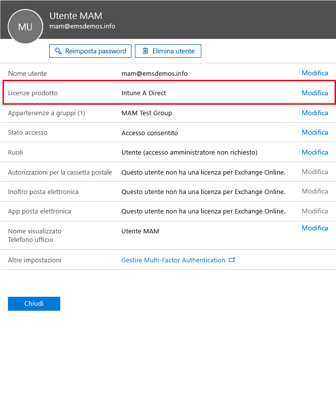

# Preparazione alla configurazione dei criteri di gestione delle app per dispositivi mobili con Microsoft Intune
Questo argomento descrive i passaggi da eseguire prima di creare i criteri di gestione di app mobili (MAM) nel portale di Azure.

Il portale di Azure è la nuova console di amministrazione per la creazione dei criteri MAM. È consigliabile usare questo portale per creare i criteri MAM. Il portale di Azure supporta gli scenari MAM seguenti:
- Dispositivi registrati in Intune
- Dispositivi gestiti da una soluzione MDM di terze parti
- Dispositivi non gestiti da alcuna soluzione MDM (BYOD)

Se non si ha familiarità con l'uso del portale di Azure, leggere l'argomento [Azure portal for Microsoft Intune MAM policies (Portale di Azure per i criteri MAM di Microsoft Intune)](azure-portal-for-microsoft-intune-mam-policies.md) per una breve panoramica.

>[!IMPORTANT]

> Se si sta usando la console di amministrazione di Intune per la gestione dei dispositivi, è possibile creare criteri MAM che supportano le app per i dispositivi registrati in Intune mediante la console di amministrazione di Intune stessa. È consigliabile, tuttavia, usare il portale di Azure, anche per i dispositivi registrati in Intune. Per istruzioni su come creare un criterio MAM usando la console di amministrazione di Intune, vedere [Configurare e distribuire criteri di gestione delle applicazioni mobili nella console di Microsoft Intune](configure-and-deploy-mobile-application-management-policies-in-the-microsoft-intune-console.md).

> È possibile che nella console di amministrazione di Intune non vengano visualizzate tutte le impostazioni dei criteri MAM. Se si creano criteri MAM sia nella console di amministrazione di Intune che nel portale di Azure, i criteri di quest'ultimo vengono applicati alle app e distribuiti agli utenti.
> I criteri MAM creati nella console di amministrazione di Intune non possono essere importati nel portale di Azure.  Tali criteri devono essere ricreati nel portale di Azure.

##  Piattaforme supportate
- iOS 8.1 o versioni successive

- Android 4 o versioni successive

I dispositivi Windows non sono attualmente supportati.
##  App supportate
* **App Microsoft:** queste app includono Intune App SDK e non richiedono alcuna elaborazione aggiuntiva per l'applicazione dei criteri MAM.
Per visualizzare l'elenco completo delle app Microsoft supportate, passare alla [raccolta di applicazioni mobili di Microsoft Intune](https://www.microsoft.com/en-us/server-cloud/products/microsoft-intune/partners.aspx) nella pagina dei partner di Microsoft Intune. Fare clic su un'app per visualizzare le piattaforme e gli scenari supportati e per verificare se l'app supporta più identità.
* **App line-of-business create internamente:** è necessario preparare queste app per includere Intune App SDK prima di applicare i criteri MAM.

  * Per i dispositivi gestiti da Intune, vedere [Decide how to prepare apps for MAM (Decidere come preparare le app per MAM)](decide-how-to-prepare-apps-for-mobile-application-management-with-microsoft-intune.md).
  * Per i dispositivi non gestiti, ad esempio i dispositivi personali dei dipendenti, o per i dispositivi gestiti da una soluzione di gestione dei dispositivi mobili di terze parti, vedere [Protect line-of-business apps and data on devices not enrolled in Intune](protect-line-of-business-apps-and-data-on-devices-not-enrolled-in-microsoft-intune.md) (Proteggere le app line-of-business e i dati su dispositivi non registrati in Intune).

*Prima* di poter configurare i criteri MAM, è necessario:

-   Avere una sottoscrizione a Microsoft Intune.    Gli utenti devono avere le licenze di [!INCLUDE[wit_nextref](../includes/wit_nextref_md.md)] per ottenere app con criteri MAM.

-   Avere una sottoscrizione Office 365, necessaria per le operazioni seguenti:
  - Applicare criteri MAM alle app con supporto per più identità.
  - Creare account aziendali di SharePoint Online ed Exchange Online. Exchange locale e SharePoint locale non sono supportati.
-   Configurazione di Skype for Business Online per l'autenticazione moderna. Per altre informazioni, vedere [Enable modern authentication (Abilitare l'autenticazione moderna)](http://social.technet.microsoft.com/wiki/contents/articles/34339.skype-for-business-online-enable-your-tenant-for-modern-authentication.aspx).

- Azure Active Directory (Azure AD) per creare utenti. Azure AD esegue l'autenticazione quando gli utenti aprono l'app e immettono le credenziali di lavoro.

    > [!NOTE]
    > Se gli utenti vengono configurati usando la console di [!INCLUDE[wit_nextref](../includes/wit_nextref_md.md)], tenere presente che la configurazione dei criteri MAM viene trasferita al portale di Azure. Per usare questo portale, è necessario configurare i gruppi utenti di Azure AD mediante il portale di Office 365.

## Creare utenti e assegnare le licenze di Microsoft Intune

1. Assicurarsi di avere una sottoscrizione di Intune. Si dispone già di una sottoscrizione di [!INCLUDE[wit_nextref](../includes/wit_nextref_md.md)] se si usa [!INCLUDE[wit_nextref](../includes/wit_nextref_md.md)] per gestire i dispositivi.  Si dispone di una sottoscrizione di [!INCLUDE[wit_nextref](../includes/wit_nextref_md.md)] anche nel caso in cui sia stata acquistata una licenza di Enterprise Mobility Suite (EMS). Se si sta provando [!INCLUDE[wit_nextref](../includes/wit_nextref_md.md)] per testare le funzionalità MAM, è possibile ottenere un account di valutazione nella [pagina Web di Microsoft Intune](http://www.microsoft.com/en-us/server-cloud/products/microsoft-intune/).

    Per verificare se si ha già una sottoscrizione di [!INCLUDE[wit_nextref](../includes/wit_nextref_md.md)], accedere alla pagina **Fatturazione** nel portale di Office.  [!INCLUDE[wit_nextref](../includes/wit_nextref_md.md)] dovrebbe essere visualizzato come **Attivo** nella sezione delle sottoscrizioni.

2.  Accedere al [portale di Office](http://portal.office.com) con le credenziali di amministratore.

3.  Accedere alla pagina **Utenti attivi** per aggiungere utenti e assegnare licenze di [!INCLUDE[wit_nextref](../includes/wit_nextref_md.md)].

    

    

4.  Per consentire a un utente di accedere al portale di Office, al portale di Azure AD e al portale di Azure, assegnare all'utente il ruolo **Amministratore globale**.

    

5.  I criteri MAM vengono distribuiti ai gruppi di utenti in Azure Active Directory. Per creare i gruppi di utenti per i criteri MAM, accedere alla pagina **Gruppi** nel portale di Office e scegliere l'icona **Aggiungi gruppo** nel menu superiore per creare un nuovo gruppo di sicurezza.  Digitare un nome e una descrizione e quindi fare clic su **Crea**. Dopo aver creato il gruppo, è possibile aggiungere utenti al gruppo facendo clic su **Modifica appartenenza**. Il gruppo di sicurezza viene creato in Azure Active Directory.

    

La tabella seguente elenca i ruoli e le autorizzazioni che possono essere assegnati agli utenti amministratori.

|||
|--|----|
|**Ruolo**|**Autorizzazioni**|
|Amministratore globale (portale di Office 365)|Accesso al portale di Office 365 e al portale di Azure AD.  Accesso al portale di Azure (può eseguire attività di gestione sia dei ruoli che delle app mobili).|
|Proprietario (portale di Azure)|Accesso al portale di Azure (può eseguire attività di gestione sia dei ruoli che delle app mobili).|
|Collaboratore (portale di Azure)|Accesso al portale di Azure (può eseguire solo le attività di gestione di app mobili).|

## Assegnare il ruolo di collaboratore a un utente

Gli amministratori globali hanno accesso al [portale di Azure](https://portal.azure.com).  Se si vuole che altri utenti amministratori siano in grado di configurare i criteri ed eseguire altre attività di gestione di app mobili, è possibile assegnare a tali utenti il ruolo di collaboratore:

1.  Nel pannello **Impostazioni** fare clic su **Utenti** nella sezione **Gestione risorse**.

    

2.  Fare clic su **Aggiungi** per aprire il pannello **Aggiungi accesso** .

3.  Fare clic su **Selezionare un ruolo** e quindi su **Collaboratore**.

    

4.  Fare clic su **Aggiungi utente** e cercare l'utente in base al nome o all'indirizzo di posta elettronica. Gli utenti visualizzati in questo elenco sono i primi 1000 utenti creati in precedenza in Azure AD tramite il portale di Office. Fare clic su **OK** nel pannello **Aggiungi accesso** per salvare e assegnare il ruolo all'utente.

    

    > [!IMPORTANT]
    > Se è stato selezionato un utente cui non è associata una licenza di [!INCLUDE[wit_nextref](../includes/wit_nextref_md.md)], tale utente non riuscirà ad accedere al portale.

## Passaggi successivi
[Creare e distribuire i criteri di gestione delle app per dispositivi mobili con Microsoft Intune](create-and-deploy-mobile-app-management-policies-with-microsoft-intune.md)

<!--HONumber=Aug16_HO1-->

