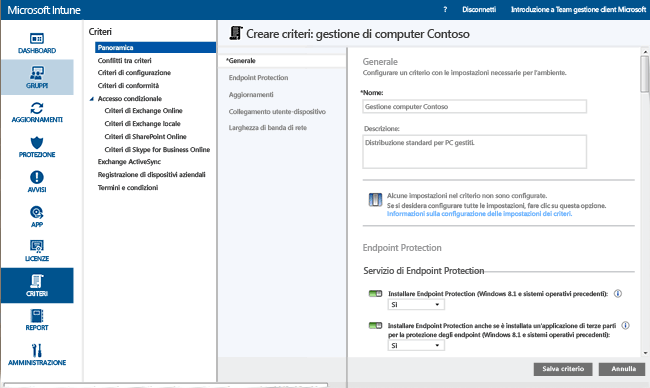
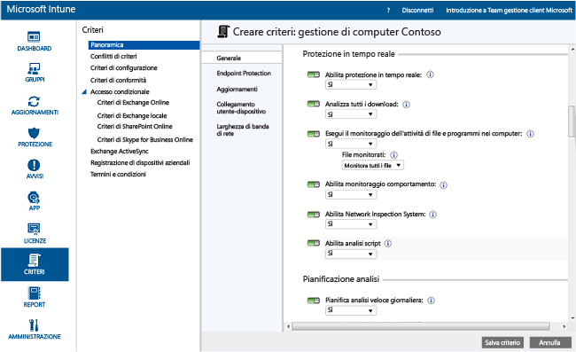
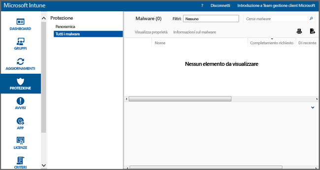

---
# required metadata

title: Endpoint Protection per PC Windows | Microsoft Intune
description:
keywords:
author: NathBarn
manager: jeffgilb
ms.date: 04/28/2016
ms.topic: article
ms.prod:
ms.service: microsoft-intune
ms.technology:
ms.assetid: 002241bf-6cd0-4c75-a4f0-891ac7e6721a

# optional metadata

#ROBOTS:
#audience:
#ms.devlang:
ms.reviewer: jeffgilb
ms.suite: ems
#ms.tgt_pltfrm:
#ms.custom:

---

# Proteggere i PC Windows con Endpoint Protection per Microsoft Intune
Microsoft Intune consente di proteggere i computer gestiti in diversi modi, ad esempio con Endpoint Protection che offre protezione in tempo reale contro potenziali minacce di tipo malware, mantenendo aggiornate le definizioni dei malware ed eseguendo analisi automatiche dei computer. Endpoint Protection offre anche strumenti che consentono di gestire e monitorare gli attacchi malware.

Se il client Intune non è ancora stato installato nei computer, vedere [Install the Windows PC client with Microsoft Intune](install-the-windows-pc-client-with-microsoft-intune.md) (Installare il client PC Windows con Microsoft Intune).

Usare le informazioni delle sezioni seguenti per configurare, distribuire e monitorare Endpoint Protection.

## Quando usare Endpoint Protection
Come amministratore IT, mantenere i computer gestiti privi di virus e malware è una delle priorità più importanti. Prima di distribuire Intune ai PC Windows aziendali, è necessario decidere come proteggerli selezionando una delle opzioni seguenti e configurando le impostazioni dei criteri associate:

|Opzione richiesta:|Impostazioni dei criteri di Endpoint Protection|Altre informazioni|
|--------------|---------------------------------------|--------------------|
|Installare Microsoft Intune Endpoint Protection solo se non è stata installata alcuna applicazione di terze parti per la protezione degli endpoint.  È possibile usare Microsoft Intune Endpoint Protection in tutti i computer in cui non è installata alcuna applicazione di terze parti per la protezione degli endpoint.|Installa Endpoint Protection = **Sì**  Abilita Endpoint Protection = **Sì**  Installa Endpoint Protection anche se è installata un'applicazione di terze parti per la protezione degli endpoint = **No**|Se viene rilevata un'applicazione di terze parti per la protezione degli endpoint, Microsoft Intune Endpoint Protection non verrà installato o verrà rimosso se è già stato installato.|
|Usare Microsoft Intune Endpoint Protection anche se è stata installata un'applicazione di terze parti per la protezione degli endpoint.  Con questo approccio, Microsoft Intune Endpoint Protection e l'applicazione di terze parti per la protezione degli endpoint verranno eseguiti contemporaneamente. A causa di potenziali problemi di prestazioni, questa configurazione non è consigliata.|Installa Endpoint Protection = **Sì**  Abilita Endpoint Protection = **Sì**  Installa Endpoint Protection anche se è installata un'applicazione di terze parti per la protezione degli endpoint = **Sì**|Usare quando:  - Si vuole passare all'uso di Microsoft Intune Endpoint Protection. - Viene distribuito un nuovo client che usa Microsoft Intune Endpoint Protection. - Viene aggiornato un client che usa Microsoft Intune Endpoint Protection.|
|Usare Intune senza Microsoft Intune Endpoint Protection. Si utilizzerà invece un'applicazione Endpoint Protection di terze parti.|Installa Endpoint Protection = **No**|Se non si usa un'applicazione Endpoint Protection di terze parti, questa configurazione non è consigliata perché potrebbe esporre i computer aziendali a malware o altri attacchi.  Microsoft Intune Endpoint Protection non viene installato e se è stato installato in precedenza verrà rimosso.|
Per passare dall'applicazione di protezione degli endpoint corrente a Microsoft Intune Endpoint Protection, eseguire le operazioni seguenti:

1.  Lasciare l'applicazione di protezione degli endpoint in esecuzione durante la distribuzione del software client di Intune nei computer.

2.  Verificare che Microsoft Intune Endpoint Protection sia installato e funzioni correttamente per proteggere i computer client.

3.  Rimuovere il software Endpoint Protection di terze parti in uno dei seguenti modi:

    -   Tramite la distribuzione del software di Intune, distribuire uno strumento di rimozione software offerto dal produttore dell'applicazione di protezione degli endpoint di terze parti. Per altre informazioni, vedere [Deploy apps in Microsoft Intune](deploy-apps.md) (Distribuire app in Microsoft Intune).

    -   Tramite la rimozione manuale dell'applicazione Endpoint Protection di terze parti.

> [!NOTE]
> Intune non eseguirà automaticamente la disinstallazione delle applicazioni di protezione degli endopoint di terze parti.

## Come configurare Microsoft Intune Endpoint Protection
Attenersi alla procedura seguente per configurare Endpoint Protection per Microsoft Intune.

1.  Nella [console di amministrazione di Microsoft Intune](https://manage.microsoft.com/) fare clic su **Criteri** > **Aggiungi criterio**.

2.  Espandere **Gestione Computer** e selezionare **Impostazioni agente di Microsoft Intune**. Selezionare **Creare e distribuire criteri personalizzati** per specificare criteri per le impostazioni di Endpoint Protection e quindi selezionare il pulsante **Crea criterio**. È possibile usare le impostazioni consigliate o personalizzare le impostazioni. Per altre informazioni su come creare e distribuire i criteri, vedere l'argomento [Common Windows PC management tasks with the Microsoft Intune computer client](common-windows-pc-management-tasks-with-the-microsoft-intune-computer-client.md) (Attività comuni di gestione di PC Windows con client di Microsoft Intune).

  

È possibile visualizzare i criteri di Endpoint Protection distribuiti nella pagina **Tutti i criteri** dell'area di lavoro **Criteri**.

## Impostazioni del servizio Endpoint Protection

|Impostazione criterio|Dettagli|
|------------------|--------------------|
|**Installa Endpoint Protection**|Impostare su **Sì** per installare Endpoint Protection nei computer gestiti. Se durante l'installazione viene rilevata un'applicazione di protezione degli endpoint di terze parti, Endpoint Protection non verrà installato, a meno che l'opzione **Installa Endpoint Protection anche se è installata un'applicazione di terze parti per la protezione degli endpoint** è impostata su **Sì**. ** Nota:** Intune Endpoint Protection viene installato nei computer gestiti per impostazione predefinita. Se non si vuole che Endpoint Protection venga installato nei computer gestiti, impostare questo criterio su **No**. Se Endpoint Protection è stato installato precedentemente e il criterio è stato aggiornato impostandolo su **No**, il client di Endpoint Protection verrà disinstallato. Impostazione consigliata: **Sì**|
|**Installa Endpoint Protection anche se è installata un'applicazione Endpoint Protection di terze parti**|Impostare su **Sì** per installare Microsoft Intune Endpoint Protection anche se è stata rilevata un'applicazione di terze parti per la protezione degli endpoint.  Impostazione consigliata: **Sì**|
|**Abilita Endpoint Protection**|Impostare su **Sì** per abilitare Microsoft Intune Endpoint Protection nei computer in cui è presente il client Endpoint Protection.  Se il criterio viene impostato su **No** e se è stato installato Microsoft Intune Endpoint Protection, l'interfaccia utente del client di Endpoint Protection non verrà visualizzata agli utenti e tutte le funzionalità di protezione risulteranno inattive.  Impostazione consigliata: **Sì**|
|**Disattiva interfaccia utente client**|Impostare su **Sì** per nascondere l'interfaccia utente del client di Endpoint Protection. Sarà necessario riavviare il computer client perché la modifica abbia effetto.  Impostazione consigliata: **No**|
|**Installa Endpoint Protection anche se è installata un'applicazione Endpoint Protection di terze parti**|Impostare su **Sì** per forzare l'installazione di Microsoft Intune Endpoint Protection, anche se è stata rilevata un'applicazione di terze parti per la protezione degli endpoint.  Impostazione consigliata: **No**|
|**Crea un punto di ripristino del sistema prima della rimozione del malware**|Impostare su **Sì** per creare un punto di ripristino del sistema Windows prima di iniziare qualsiasi correzione di malware.  Impostazione consigliata: **Sì**|
|**Rileva malware risolto (giorni)**|Consente a Endpoint Protection di rilevare il malware risolto per un periodo di tempo specificato in modo da controllare manualmente i computer precedentemente infetti.  È possibile specificare un valore qualsiasi compreso tra 0 e 30 giorni.  Impostazione consigliata: **7 giorni**|
Impostando i valori dei criteri per **Installa Endpoint Protection** e **Abilita Endpoint Protection** su **Sì**, e il valore del criterio  **Installa Endpoint Protection anche se è installata un'applicazione Endpoint Protection di terze parti** su **No**, Microsoft Intune Endpoint Protection rileverà che un'altra applicazione di protezione degli endpoint è stata installata e non verrà installato o verrà disinstallato se è già presente. Tuttavia, Microsoft Intune Endpoint Protection genererà report sull'integrità dell'altra applicazione in Intune.

  La protezione in tempo reale di Microsoft Security Essentials avvisa l'utente quando minacce potenziali, ad esempio virus e spyware, stanno per essere installate o eseguite nel PC. Nel momento in cui ciò si verifica, viene visualizzato un messaggio nell'area di notifica all'estrema destra della barra delle applicazioni

### Impostazioni di protezione in tempo reale

|Impostazione criterio|Dettagli|
|------------------|--------------------|
|**Abilita protezione in tempo reale**|Abilita il monitoraggio e l'analisi di tutti i file e di tutte le applicazioni a cui si accede. Consente inoltre di bloccare eventuali file e applicazioni dannosi prima che vengano eseguiti nei computer.  Impostazione consigliata: **Sì**|
|**Analizza tutti i download**|Abilita l'analisi di tutti i file e di tutti gli allegati che vengono scaricati da Internet nei computer.  Impostazione consigliata: **Sì**|
|**Monitorizza attività di file e programmi nei computer**|Consente il monitoraggio dei file in ingresso e in uscita nonché delle attività dei programmi sui computer. Con questa impostazione, Endpoint Protection è in grado di monitorare quando vengono eseguiti file e programmi nonché di notificare l'utente in merito alle operazioni relative a questi file e programmi.  Impostazione consigliata: **Sì**|
|**File monitorati**|Se l'impostazione **Monitorizza attività di file e programmi nei computer** è abilitata, è possibile scegliere se monitorare solo i file in entrata, solo i file in uscita o entrambi i tipi.  Impostazione consigliata: **Monitora tutti i file**|
|**Abilita monitoraggio del comportamento**|Consente a Microsoft Intune Endpoint Protection di verificare la presenza di alcuni criteri che segnalino attività sospette nei computer client.  Impostazione consigliata: **Sì**|
|**Abilita Network Inspection System**|Abilita Network Inspection System (NIS) nei computer client. Con NIS vengono usate firme di vulnerabilità note ottenute da [Microsoft Malware Protection Center](http://go.microsoft.com/fwlink/?LinkId=234249) per rilevare e bloccare il traffico di rete dannoso.  Impostazione consigliata: **Sì**|

  

### Impostazioni di pianificazione di analisi

|Impostazione criterio|Altre informazioni|
|------------------|--------------------|
|**Pianifica analisi veloce giornaliera**|Pianifica un'analisi veloce giornaliera dei file usati di frequente e di importanti file di sistema sui computer. Questa analisi veloce ha un effetto minimo sulle prestazioni.  Impostazione consigliata: **Sì**|
|**Esegui un'analisi veloce se sono state saltate due analisi veloci consecutive**|Configura Endpoint Protection per eseguire automaticamente un'analisi veloce dei computer che hanno saltato le analisi veloci pianificate per due volte consecutive.  Impostazione consigliata: **Sì**|
|**Pianifica un'analisi completa**|Consente di configurare un'analisi completa di tutti i file e di tutte le risorse sui dischi rigidi locali dei computer. A seconda del numero di file e risorse da analizzare, l'analisi potrebbe richiedere alcuni minuti e potrebbe influire sulle prestazioni del computer.  Impostazione consigliata: **No**|
|**Esegui un'analisi completa se sono state saltate due analisi complete consecutive**|Configura Endpoint Protection per eseguire automaticamente un'analisi completa dei computer che hanno saltato le analisi complete pianificate per due volte consecutive.  Valore consigliato: Non configurata|

### Impostazioni delle opzioni di analisi

|Impostazione criterio|Dettagli|
|------------------|--------------------|
|**Esegui analisi completa dopo l'installazione di Endpoint Protection**|Configura Endpoint Protection per eseguire automaticamente un'analisi completa del sistema dopo l'installazione nei computer. Per ridurre l'effetto sulla produttività degli utenti, questa analisi viene eseguita solo quando i computer sono inattivi.  Impostazione consigliata: **Sì**|
|**Se necessario, esegui automaticamente un'analisi completa per completare la rimozione di malware**|Impostare su **Sì** per consentire a Endpoint Protection di eseguire automaticamente un'analisi completa del sistema nei computer dopo la rimozione di malware per verificare che altri file non siano stati interessati.  Impostazione consigliata: **Sì**|
|**Avvia un'analisi pianificata solo quando il computer è inattivo**|Impostare su **Sì** per impedire l'avvio di analisi pianificate quando i computer sono in uso ed evitare così una perdita di produttività dell'utente.  Impostazione consigliata: **Sì**|
|**Prima di avviare un'analisi, controllare di disporre delle definizioni malware più recenti**|Impostare su **Sì** per consentire a Endpoint Protection di verificare automaticamente le definizioni dei malware più recenti prima di iniziare la scansione dei computer.  Impostazione consigliata: **Sì**|
|**Analizza file di archivio**|Impostare su **Sì** per configurare Endpoint Protection in modo che esegua la scansione alla ricerca di malware nei file di archivio, ad esempio file con estensione zip o cab, nei computer.  Impostazione consigliata: **No**|
|**Analisi dei messaggi di posta elettronica**|Impostare su **Sì** per configurare Endpoint Protection in modo che analizzi i messaggi di posta elettronica quando vengono ricevuti nei computer.  Impostazione consigliata: **Sì**|
|**Analizza file aperti da cartelle di rete condivise**|Impostare su **Sì** per configurare Endpoint Protection in modo che analizzi i file aperti da cartelle condivise in rete. Generalmente si tratta di file accessibili tramite un percorso UNC. L'abilitazione di questa funzionalità può causare problemi agli utenti che dispongono di accesso in sola lettura poiché gli utenti non sono in grado di rimuovere il malware.  Impostazione consigliata: **No**|
|**Analizza unità di rete mappate**|Impostare su **Sì** per configurare Endpoint Protection per l'analisi dei file nelle unità di rete mappate. L'abilitazione di questa funzionalità può causare problemi agli utenti che dispongono di accesso in sola lettura poiché gli utenti non sono in grado di rimuovere il malware.  Impostazione consigliata: **No**|
|**Analizza unità rimovibili**|Impostare su **Sì** per configurare Endpoint Protection in modo che esegua la scansione alla ricerca di malware e software indesiderato nel contenuto delle unità rimovibili, ad esempio le unità flash USB, durante l'esecuzione di un'analisi completa dei computer.  Impostazione consigliata: **Sì**|
|**Limita utilizzo CPU durante un'analisi a**|Consente di configurare la percentuale massima di utilizzo della CPU durante le analisi pianificate sui computer. È possibile impostare questo valore da 1 a 100%.  Impostazione consigliata: **50%**|

### Impostazioni di azioni predefinite

L'impostazione **Scegliere l'azione eseguita da Endpoint Protection sul malware con i seguenti livelli di attenzione** specifica l'azione predefinita eseguita da Endpoint Protection quando viene rilevato malware di vari livelli di attenzione. Per ogni livello di attenzione, è possibile rimuovere il malware, metterlo in quarantena o intraprendere le azioni consigliate di Microsoft. Valore consigliato: **Azione consigliata** che consente a Endpoint Protection di specificare l'azione.   

### Impostazioni di cartelle e file esclusi

L'impostazione **File e cartelle da escludere durante l'esecuzione di un'analisi o l'utilizzo della protezione in tempo reale** consente di escludere cartelle o file specifici durante un'analisi o quando si usa la protezione in tempo reale nei computer.

### Impostazioni dei processi esclusi

L'impostazione **Processi per escludere durante l'esecuzione di un'analisi o l'utilizzo della protezione in tempo reale** consente di escludere processi specifici quando si esegue un'analisi o si usa la protezione in tempo reale. È possibile escludere solo i file con le estensioni seguenti: **exe**, **com** o **scr**.

### Impostazioni dei tipi di file esclusi

L'impostazione **Estensioni di file da escludere durante l'esecuzione di un'analisi o l'utilizzo della protezione in tempo reale** consente di escludere alcune estensioni di file specifiche quando si esegue un'analisi o si usa la protezione in tempo reale nei computer.

### Impostazioni del servizio Microsoft Active Protection
Microsoft Active Protection Service è una comunità online che fornisce informazioni utili per decidere come rispondere a potenziali rischi. La comunità contribuisce inoltre ad arrestare la diffusione di nuove infezioni di malware. È possibile abilitare **Partecipa a Microsoft Active Protection Service** selezionando **Sì** e quindi specificando il **livello di appartenenza**:
  - **Base**: invia a Microsoft informazioni di base sul malware rilevato. Le informazioni includono la provenienza del software, le azioni applicate dall'utente o automaticamente da Endpoint Protection e l'eventuale riuscita di tali azioni.
  - **Avanzato**: invia a Microsoft altre informazioni su malware, spyware e software potenzialmente indesiderato. Le informazioni includeranno il percorso del software, i nomi file, il funzionamento del software e l'influenza sul computer.

È possibile anche attivare l'opzione **Ricevi definizioni dinamiche in base ai report di Microsoft Active Protection Service**.

## Attività di gestione per Endpoint Protection
Le attività seguenti consentono di eseguire varie operazioni di gestione sui computer gestiti che eseguono Endpoint Protection:
 - Aggiorna definizioni malware
  - Console di Intune: dall'area di lavoro **Gruppi** selezionare i computer da aggiornare. Fare clic su **Attività remote** &gt; **Aggiorna definizioni malware**.
  - Computer gestiti: avviare il software client di Endpoint Protection dall'area di notifica di Windows. Fare clic sulla scheda **Aggiornamento** e quindi su **Aggiorna**.
 - Eseguire un'analisi di malware:
  - Console di Intune: dall'area di lavoro **Gruppi**, selezionare i computer da analizzare. Fare clic su **Esegui un'analisi completa di malware** oppure **Esegui un'analisi rapida di malware**.
  - Computer gestiti: avviare il software client di Endpoint Protection dall'area di notifica di Windows. Selezionare **Rapido**, **Completo**oppure **Personalizzato**, quindi fare clic su **Avvia analisi**.

Per visualizzare lo stato di un'attività remota, fare clic sul collegamento **Attività remote** nell'angolo inferiore destro della console di Intune. Nella finestra di dialogo **Stato attività in remoto** sono elencate le attività remote correnti, il relativo stato, il nome del dispositivo e gli eventuali errori segnalati, nonché un collegamento per consultare le informazioni sulla risoluzione dei problemi, se il caso lo richiede.

## Monitorare Endpoint Protection
È possibile monitorare lo stato del malware nei computer usando l'area di lavoro **Protezione** della [console di amministrazione di Microsoft Intune](https://manage.microsoft.com/). Quest'area di lavoro contiene due pagine:
 - **Panoramica Endpoint Protection**: visualizza i problemi importanti come collegamenti che è possibile selezionare per altre informazioni. I problemi che potrebbero essere visualizzati includono:
  - **Istanze di malware che richiedono completamento**: fare clic sul collegamento per visualizzare un elenco di problemi malware, incluse le azioni da intraprendere per risolverli. È possibile analizzare ulteriormente questo elenco per visualizzare i computer interessati.
  - **Computer con malware che richiedono completamento**: fare clic sul collegamento per visualizzare tutti i computer che presentano problemi malware non risolti, incluse le azioni da intraprendere per risolverli.
  - **Dispositivi non protetti**: fare clic sul collegamento per visualizzare tutti i computer che non sono protetti da un qualsiasi software di protezione degli endpoint perché non è installato alcun software o perché si è verificato un errore. Selezionare un computer per visualizzare ulteriori dettagli.
  - **Dispositivi che eseguono un'altra applicazione di protezione degli endpoint**: fare clic sul collegamento per visualizzare i computer che eseguono un'applicazione di terze parti per la protezione degli endpoint.
 - **Tutti i malware**: consente di visualizzare un elenco di tutti i malware attivi trovati nei computer. È possibile scorrere l'elenco per visualizzare tutti i computer in cui è presente un malware particolare, oppure è possibile selezionare una delle attività seguenti:
  - **Visualizza proprietà**: apre una pagina con altre informazioni sul malware selezionato.
  - **Informazioni sul malware**: apre un argomento di Microsoft Malware Protection Center che contiene altre informazioni sul malware.

> [!IMPORTANT]
> L'area di lavoro **Protezione** non viene visualizzata nella console di amministrazione finché non si installa il client e si gestisce almeno un client del computer.

  

### Come visualizzare recenti percorsi di rilevamento di malware nel computer.
Intune è possibile visualizzare i percorsi di fino a 10 istanze rilevate più di recente di software dannoso in un dispositivo. Il **recente rilevamento percorso** è disabilitato per impostazione predefinita. Per abilitare questa visualizzazione:

1.  Nella [console di amministrazione Microsoft Intune](https://manage.microsoft.com/) accedere a **Gruppi** > **Tutti i dispositivi** . **Malware**.

2.  Fare doppio clic su un'intestazione di colonna. Verrà visualizzato un elenco delle colonne disponibili.

3.  Contrassegna il **recente rilevamento percorsi** casella di controllo nell'elenco. Il **recente rilevamento percorsi** colonna vengono visualizzati e monitorate sul dispositivo fino a 10 istanze di malware più recenti.

## Ulteriore assistenza?
Per altre informazioni e supporto tecnico, vedere [Troubleshoot Endpoint Protection in Microsoft Intune](/intune/troubleshoot/troubleshoot-endpoint-protection-in-microsoft-intune) (Risolvere i problemi di Endpoint Protection in Microsoft Intune).

### Vedere anche
[Policies to protect Windows PCs (Criteri per la protezione dei PC Windows)](policies-to-protect-windows-pcs-in-microsoft-intune.md)

<!--HONumber=May16_HO1-->

