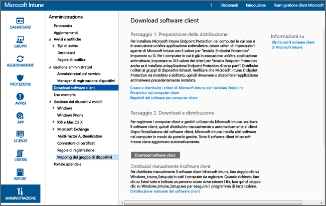

# Installare il client PC Windows con Microsoft Intune
Usare questa guida per far gestire i computer Windows dal software client di Microsoft Intune.

## Prima di iniziare
Prima di iniziare l'installazione del software client di Intune, leggere l'argomento [Resolve GPO and Microsoft Intune policy conflicts](resolve-gpo-and-microsoft-intune-policy-conflicts.md) (Risolvere i conflitti di criteri tra Microsoft Intune e gli oggetti Criteri di gruppo) per conoscere i requisiti per installare correttamente il client, quindi tornare a queste istruzioni.

## Installare il client
Usare che questa procedura per installare il client:

-   [Per scaricare il software client](#to-download-the-client-software)

Quindi usare uno o più dei seguenti metodi per installare il client:

-   [Per distribuire manualmente il software client](#to-manually-deploy-the-client-software)

-   [Per distribuire automaticamente il software client usando Criteri di gruppo](#to-automatically-deploy-the-client-software-by-using-group-policy)

-   [Modalità di autoregistrazione dei computer](#how-users-can-self-enroll-their-computers)

-   [Installare il software client Microsoft Intune come parte di un'immagine](#install-the-microsoft-intune-client-software-as-part-of-an-image)

Se non è più necessario gestire un computer con Intune, è possibile disattivarlo. Durante l'operazione verrà rimosso dal computer anche il software client. Per altre informazioni, vedere [Attività comuni di gestione di PC Windows con client di Microsoft Intune](common-windows-pc-management-tasks-with-the-microsoft-intune-computer-client.md).

### Per scaricare il software client

1.  Nella [console di amministrazione di Microsoft Intune](https://manage.microsoft.com/) fare clic su **Amministrazione** &gt; **Download software client**

  

2.  Nella pagina **Download software client** fare clic su **Scarica software client** e salvare il pacchetto **Microsoft_Intune_Setup.zip** che contiene il software in un percorso sicuro nella rete.

    > [!NOTE]
    > Il pacchetto di installazione del software client di Intune contiene le informazioni sull'account dell'utente. Se utenti non autorizzati ottengono l'accesso al pacchetto di installazione, tali utenti possono registrare i computer nell'account rappresentato dal certificato incorporato.

3.  Estrarre il contenuto del pacchetto di installazione in un percorso sicuro nella rete locale.

    > [!IMPORTANT]
    > Non rinominare o rimuovere il file **ACCOUNTCERT** estratto, altrimenti l'installazione del software client non riuscirà.

### Per distribuire manualmente il software client

1.  Nel computer individuare la cartella che contiene i file di installazione del software client, quindi eseguire **Microsoft_Intune_Setup.exe** per installare il software client.

    > [!NOTE]
    > Lo stato dell'installazione viene visualizzato quando si passa il mouse sull'icona nella barra delle applicazioni del computer client.

### Per distribuire automaticamente il software client usando Criteri di gruppo

1.  Nella cartella che contiene i file **Microsoft_Intune_Setup.exe** e **MicrosoftIntune.accountcert** eseguire questo comando per estrarre i programmi di installazione basati su Windows Installer per i computer a 32 e 64 bit:

    ```
    Microsoft_Intune_Setup.exe/Extract <destination folder>
    ```

2.  Copiare i file **Microsoft_Intune_x86.msi**, **Microsoft_Intune_x64.msi** e **MicrosoftIntune.accountcert** in un percorso di rete a cui possono avere accesso tutti i computer in cui verrà installato il software client.

    > [!IMPORTANT]
    > Non separare o rinominare i file altrimenti l'installazione del software client non riuscirà.

3.  Usare Criteri di gruppo per distribuire il software nei computer della rete.

    Per altre informazioni sull'utilizzo di Criteri di gruppo per distribuire automaticamente il software, vedere la documentazione di Windows Server.

### Modalità di autoregistrazione dei computer
Gli utenti possono registrare autonomamente i propri computer tramite il portale aziendale di Intune. Ogni computer registrato è collegato all'account utente usato per installare il software client.

> [!NOTE]
> -   L'utente deve essere un amministratore del computer per installare il software client.
> -   Per eseguire autonomamente la registrazione, è necessario che nel computer client sia installato Internet Explorer.
> -   Ogni volta che un utente registra autonomamente un computer, usa una licenza per Intune.
> -   Per registrare autonomamente un computer, è necessario usare un account aziendale o dell'istituto di istruzione. Non è possibile autoregistrare un computer usando un account Microsoft.
> -   Se il software client è già installato in un computer, l'utente finale riceverà un errore.

### Per autoregistrare un computer (informazioni per gli utenti finali)

1.  Accedere al portale aziendale dal computer che si desidera registrare.

2.  Fare clic su **Aggiungi dispositivo**.

3.  Fare clic sul pulsante **Scarica software** , quindi scegliere **Esegui**.

4.  Fare clic su **Avanti** per avviare l'installazione guidata di Microsoft Intune.

5.  Quando l'installazione guidata è stata completata, fare clic su **Fine**.

### Installare il software client Microsoft Intune come parte di un'immagine
Il software client di Intune può essere distribuito nei computer come parte di un'immagine del sistema operativo usando la seguente procedura di esempio come base:

1.  Copiare i file di installazione client **Microsoft_Intune_Setup.exe** e **MicrosoftIntune.accountcert** nella cartella **%Systemdrive%\Temp\Microsoft_Intune_Setup** del computer di riferimento.

2.  Creare la voce del Registro di sistema **WindowsIntuneEnrollPending** aggiungendo il comando seguente allo script **SetupComplete.cmd** :

    ```
    %windir%\system32\reg.exe add HKEY_LOCAL_MACHINE\Software\Microsoft\Onlinemanagement\Deployment /v
    WindowsIntuneEnrollPending /t REG_DWORD /d 1
    ```

3.  Aggiungere il comando seguente a **setupcomplete.cmd** per eseguire il pacchetto di registrazione con l'argomento della riga di comando /PrepareEnroll:

    ```
    %systemdrive%\temp\Microsoft_Intune_Setup\Microsoft_Intune_Setup.exe /PrepareEnroll
    ```
    > [!TIP]
    > Lo script **SetupComplete.cmd** consente a Installazione di Windows di apportare modifiche al sistema prima che un utente vi effettui l'accesso. Al termine dell'esecuzione del programma Installazione di Windows, l'argomento della riga di comando **/PrepareEnroll** predispone un computer di destinazione per la registrazione automatica in Intune.

4.  Inserire **SetupComplete.cmd** nella cartella **%Windir%\Setup\Scripts** del computer di riferimento.

5.  Acquisire un'immagine del computer di riferimento e distribuirla nei computer di destinazione.

Dopo aver riavviato il computer di destinazione una volta eseguito il programma Installazione di Windows, verrà creata la chiave del Registro di sistema **WindowsIntuneEnrollPending** . Il pacchetto di registrazione verificherà se il computer è iscritto. Se il computer è registrato, non verrà intrapresa alcuna azione. Se il computer non è registrato, il pacchetto creerà un'attività di registrazione automatica in Microsoft Intune.

L'attività di registrazione automatica, eseguita al successivo orario pianificato, verifica l'esistenza del valore del Registro di sistema **WindowsIntuneEnrollPending** e tenta di registrare il PC di destinazione in Intune. Se il tentativo non riesce a causa di un errore, la registrazione verrà ripetuta al momento della successiva esecuzione dell'attività. I tentativi continuano per un periodo di un mese.

L'attività di registrazione automatica, il valore del Registro di sistema **WindowsIntuneEnrollPending** e il certificato dell'account vengono eliminati dal computer di destinazione al completamento della registrazione o dopo un mese.

## Controllare e convalidare la distribuzione del client
Usare una delle seguenti procedure per controllare e convalidare la distribuzione del client.

### Per verificare l'installazione del software client dalla console di amministrazione di Microsoft Intune

1.  Nella [console di amministrazione di Microsoft Intune](https://manage.microsoft.com/) fare clic su **Gruppi** &gt; **Tutti i dispositivi** &gt; **Tutti i computer**.

2.  Scorrere l'elenco dei computer per individuare quelli gestiti che comunicano con Intune oppure per cercare un computer gestito specifico, digitando tutto o parte del nome nella casella **Cerca dispositivi**.

3.  Verificare lo stato del computer nel riquadro inferiore della console e risolvere gli eventuali errori.

### Per creare un report di inventario dei computer al fine di visualizzare tutti i computer registrati

1.  Nella [console di amministrazione di Microsoft Intune](https://manage.microsoft.com/) fare clic su **Report** &gt; **Report inventario computer**.

2.  Nella pagina **Crea nuovo report** lasciare i valori predefiniti in tutti i campi (a meno che non si desideri applicare i filtri) e fare clic su **Visualizza report**.

3.  In una nuova finestra viene aperta la pagina **Report inventario computer** che consente di visualizzare tutti i computer che sono stati registrati in Intune.

    > [!TIP]
    > Fare clic su un'intestazione di colonna nel report per ordinare l'elenco in base al contenuto della colonna.


### Vedere anche
[Gestire i PC Windows con Microsoft Intune](manage-windows-pcs-with-microsoft-intune.md)


<!--HONumber=Jun16_HO4-->


