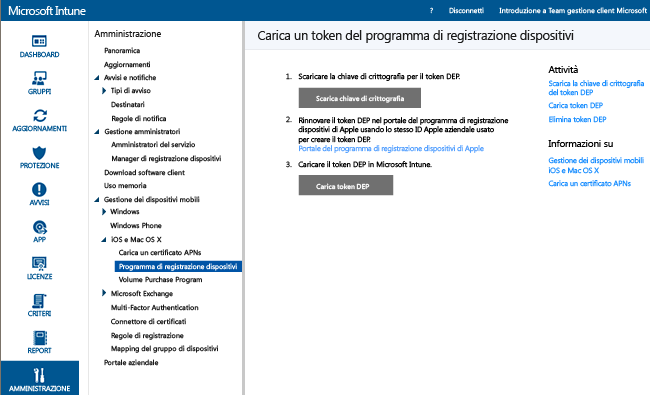
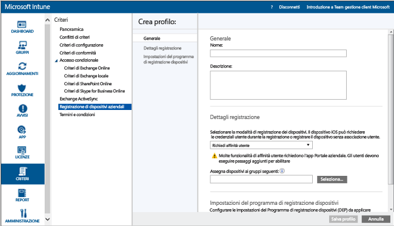

# Registrare i dispositivi IOS di proprietà dell'azienda usando il programma di registrazione dispositivi (DEP)
Microsoft Intune può distribuire un profilo di registrazione che registra in modalità wireless i dispositivi iOS acquistati tramite il programma di registrazione dispositivi (DEP). Il pacchetto di registrazione può includere opzioni di Assistente configurazione per il dispositivo. La registrazione dei dispositivi registrati tramite DEP non può essere annullata dagli utenti.

## Gestione del servizio DEP di Apple per i dispositivi iOS con Microsoft Intune
Per gestire i dispositivi iOS di proprietà dell'azienda con il programma di registrazione dispositivi (DEP) di Apple, le organizzazioni devono partecipare al programma DEP di Apple e acquisire i dispositivi attraverso il programma. I dettagli del processo sono disponibili in:  [https://deploy.apple.com](https://deploy.apple.com) I vantaggi del programma includono la configurazione dei dispositivi senza intervento dell'utente e senza dover connettere tramite USB ogni dispositivo a un computer.

Per registrare i dispositivi iOS di proprietà dell'azienda con DEP, è necessario un token DEP di Apple. Questo token consente a Intune di sincronizzare le informazioni sui dispositivi di proprietà dell'azienda che partecipano a DEP. Consente inoltre di caricare i profili di registrazione in Apple e assegnare i dispositivi a tali profili.

1.  **Iniziare a gestire i dispositivi iOS con Microsoft Intune** Per poter registrare i dispositivi del programma di registrazione dispositivi (DEP) per iOS è necessario abilitare la gestione iOS per Intune.

2.  **Ottenere una chiave di crittografia** Come utente amministratore, aprire la [console di amministrazione di Microsoft Intune](http://manage.microsoft.com), andare a **Amministrazione** &gt; **Gestione dei dispositivi mobili** &gt; **iOS** &gt; **Programma di registrazione dispositivi** e fare clic su **Scarica chiave di crittografia**. Salvare il file della chiave di crittografia (con estensione pem) localmente. Il file PEM viene usato per richiedere un certificato di relazione di trust dal portale del programma di registrazione dispositivi di Apple.

      

3.  **Ottenere un token del programma di registrazione dispositivi** Andare al [portale del programma di registrazione dispositivi](https://deploy.apple.com) (https://deploy.apple.com) e accedere con l'ID Apple aziendale. Questo ID Apple dovrà essere usato in futuro per rinnovare il token DEP.

    1.  Nel [portale del programma di registrazione dispositivi](https://deploy.apple.com) andare a **Programma di registrazione dispositivi** &gt; **Gestisci i server** e fare clic su **Add MDM Server** (Aggiungi server MDM).

    2.  Immettere il **nome del server MDM** e scegliere **Avanti**. Il nome del server viene fornito come riferimento per identificare il server MDM. Non è il nome o l'URL del server Microsoft Intune.

    3.  Si apre la finestra di dialogo **Aggiungi &lt;NomeServer&gt;**. Fare clic su **Scegli file…** per caricare il file PEM, quindi scegliere **Avanti**.

    4.  Si apre la finestra di dialogo **Aggiungi &lt;NomeServer&gt;** con un collegamento **Token del server**. Scaricare il file token del server (.p7m) nel computer, quindi fare clic su **Fine**.

    Questo file del certificato (.p7m) viene usato per stabilire una relazione di trust tra i server di Intune e del programma di registrazione dispositivi di Apple.

4.  **Aggiungere il token DEP a Intune** Nella [console di amministrazione di Microsoft Intune](http://manage.microsoft.com) andare ad **Amministrazione** &gt; **Gestione dei dispositivi mobili** &gt; **iOS** &gt; **Programma di registrazione dispositivi** e fare clic su **Carica un token DEP**. **Andare** al file del certificato (.p7m), immettere l' **ID Apple**, quindi fare clic su **Carica**.

5.  **Aggiungere il criterio Registrazione di dispositivi aziendali** Nella [console di amministrazione di Microsoft Intune](http://manage.microsoft.com) andare a **Criteri** &gt; **Registrazione di dispositivi aziendali** e fare clic su **Aggiungi**.

    Specificare le informazioni **generali** inclusi **Nome** e **Descrizione** e indicare se i dispositivi assegnati al profilo presentano l'affinità utente o appartengono a un gruppo.
      - **Richiedi affinità utente**: il dispositivo può essere associato a un utente durante la configurazione iniziale e potrebbe quindi accedere ai dati aziendali e alla posta elettronica con questo nome utente.  **Affinità utente** deve essere configurata per i dispositivi gestiti tramite DEP che appartengono agli utenti e devono usare il portale aziendale (ad esempio per installare app).
      - **Nessuna affinità utente**: il dispositivo non è associato a un utente. Usare questa associazione per i dispositivi che eseguono attività senza accedere ai dati utente locali. Le app che richiedono l'associazione utente, inclusa l'app del portale aziendale usata per installare le app line-of-business, non funzioneranno.

    È anche possibile **assegnare dispositivi ai gruppi seguenti**. Fare clic su **Select... (Seleziona...)** per scegliere un gruppo.

    [!INCLUDE[groups deprecated](../includes/group-deprecation.md)]

    Quindi abilitare **Configura le impostazioni del programma di registrazione dispositivi per questo criterio** per supportare il programma di registrazione dispositivi.

      

     Per i dispositivi gestiti da DEP sono disponibili le seguenti impostazioni:

     - **Department** (Reparto): viene visualizzata quando gli utenti toccano "Informazioni configurazione" durante l'attivazione.
     - **Numero di telefono per supporto tecnico**: viene visualizzata quando l'utente fa clic sul pulsante **Need help** (Richiesta di supporto) durante l'attivazione.
     - **Modalità di preparazione**: questo stato viene impostato durante l'attivazione e non può essere modificato senza ripristinare le impostazioni predefinite del dispositivo:
        - **Supervisione non eseguita**: capacità di gestione limitate.
        - **Supervisione eseguita**: attiva altre opzioni di gestione e disattiva il blocco attivazione per impostazione predefinita.
     - **Bloccare il profilo di registrazione nel dispositivo**: questo stato viene configurato all'attivazione e può essere cambiato solo ripristinando le impostazioni predefinite.
        - **Disattiva**: consente la rimozione del profilo di gestione dal menu **Impostazioni**.
        - **Attiva**: richiede **Modalità di preparazione** = **Supervisione eseguita**. Disattiva le impostazioni iOS che potrebbero permettere la rimozione del profilo di gestione.
     - **Setup Assistant Options** (Opzioni Assistente configurazione): queste impostazioni sono facoltative e possono essere configurate in un secondo momento nel menu **Impostazioni** di iOS.
        - **Passcode**: consente di richiedere un passcode durante l'attivazione. Richiedere sempre un passcode, salvo se il dispositivo viene protetto o l'accesso al dispositivo viene controllato in un altro modo (ad esempio con la modalità tutto schermo, che limita l'uso del dispositivo a una sola app).
        - **Servizi di posizione**: se l'opzione è abilitata, Assistente configurazione richiede il servizio al momento dell'attivazione.
        - **Ripristina**: se l'opzione è abilitata, Assistente configurazione richiede il backup in iCloud durante l'attivazione.
        - **ID Apple**: necessario per il download delle app da iOS App Store, incluse le app installate da Intune. Se l'opzione è abilitata, quando Intune prova a installare un'applicazione senza ID, iOS richiede agli utenti un ID Apple.
        - **Terms and Conditions** (Termini e condizioni): se l'opzione è abilitata, Assistente configurazione richiede di accettare i termini e condizioni Apple durante l'attivazione.
        - **ID tocco**: se l'opzione è abilitata, Assistente configurazione richiede questo servizio durante l'attivazione.
        - **Apple Pay**: se l'opzione è abilitata, Assistente configurazione richiede questo servizio durante l'attivazione.
        - **Zoom**: se l'opzione è abilitata, Assistente configurazione richiede questo servizio durante l'attivazione.
        - **Siri**: se l'opzione è abilitata, Assistente configurazione richiede questo servizio durante l'attivazione.
        - **Invia i dati di diagnostica ad Apple**: se l'opzione è abilitata, Assistente configurazione richiede questo servizio durante l'attivazione.
     -  **Abilita la gestione di Apple Configurator**: se impostata su **Non consentire**, evita la sincronizzazione di file con iTunes o la gestione tramite Apple Configurator. Microsoft consiglia di impostare questa opzione su **Non consentire**, di esportare le altre configurazioni da Apple Configurator, quindi di eseguire la distribuzione come profilo di configurazione iOS personalizzato, anziché di usare questa impostazione per consentire la distribuzione manuale con o senza un certificato.
        - **Non consentire**: impedisce al dispositivo di comunicare tramite USB (disattiva l'associazione).
        - **Consenti**: consente al dispositivo di comunicare tramite la connessione USB con qualsiasi PC o Mac.
        - **Richiedi certificato**: consente l'associazione a un Mac con un certificato importato nel profilo di registrazione.

6.  **Assegnare i dispositivi DEP per la gestione** Andare al [portale del programma di registrazione dispositivi (DEP)](https://deploy.apple.com) (https://deploy.apple.com) e accedere con l'ID Apple aziendale. Scegliere **Deployment Program** (Programma di distribuzione) &gt; **Programma di registrazione dispositivi** &gt; **Gestisci dispositivi**. Specificare come **scegliere i dispositivi**, fornire le informazioni sul dispositivo e specificare i dettagli in base al **Numero di serie**del dispositivo, al **Numero dell'ordine**o **caricando un file CSV**. Quindi selezionare **Assign to Server** (Assegna al server), selezionare il &lt;ServerName&gt; (NomeServer) specificato per Microsoft Intune e fare clic su **OK**.

7.  **Sincronizzare i dispositivi gestiti da DEP** In qualità di utente amministratore, aprire la [console di amministrazione di Microsoft Intune](http://manage.microsoft.com), andare in **Amministrazione** &gt; **Gestione dei dispositivi mobili** &gt; **iOS** &gt; **Programma di registrazione dispositivi**, quindi fare clic su **Sincronizza**. Viene inviata una richiesta di sincronizzazione ad Apple. Per visualizzare i dispositivi gestiti da DEP dopo la sincronizzazione, nella [console di amministrazione di Microsoft Intune](http://manage.microsoft.com) andare in **Gruppi** &gt; **Dispositivi di proprietà dell'azienda**. Nell'area di lavoro **Dispositivi di proprietà dell'azienda**, lo **Stato** per i dispositivi gestiti rimane "Non contattato" finché il dispositivo non viene acceso e non viene eseguito l'Assistente configurazione per la registrazione del dispositivo.

    Per soddisfare i requisiti Apple per volumi di traffico DEP accettabili, Intune impone le seguenti limitazioni:
     -  Una sincronizzazione DEP completa può essere eseguita non più di una volta ogni 7 giorni. Durante una sincronizzazione completa, Intune aggiorna tutti i numeri di serie che Apple ha assegnato a Intune, anche se sono già stati sincronizzati in precedenza. Se si tenta una sincronizzazione completa entro 7 giorni della precedente, Intune aggiorna solo i numeri di serie che non sono ancora elencati in Intune.
     -  Il tempo disponibile per il completamento di una richiesta di sincronizzazione è pari a 10 minuti. Durante questo tempo o fino al completamento della richiesta, il pulsante Sincronizza è disabilitato.

8.  **Distribuire i dispositivi agli utenti** Ora è possibile distribuire i dispositivi di proprietà dell'azienda agli utenti. Quando un dispositivo iOS viene attivato, viene registrato per la gestione con Intune.

## Modifiche alle assegnazioni di gruppo di Intune

A partire dal mese di ottobre la gestione dei gruppi di dispositivi passerà ad Azure Active Directory. Dopo la transizione ai gruppi di Azure Active Directory le assegnazioni di gruppo non saranno più incluse nelle opzioni del **profilo di registrazione aziendale**. Poiché questa modifica verrà implementata nel corso di diversi mesi, potrebbe non essere visibile immediatamente. Dopo il passaggio al nuovo portale, è possibile definire le assegnazioni di gruppi di dispositivi dinamici in base ai nomi dei profili di registrazione aziendali. Questo processo assicura che i dispositivi pre-assegnati a un gruppo di dispositivi verranno registrati automaticamente in tale gruppo con le app e i criteri distribuiti. [Altre informazioni sui gruppi di Azure Active Directory](https://azure.microsoft.com/documentation/articles/active-directory-accessmanagement-manage-groups/)

### Vedere anche
[Prepararsi alla registrazione dei dispositivi](get-ready-to-enroll-devices-in-microsoft-intune.md)

<!--HONumber=Aug16_HO2-->

