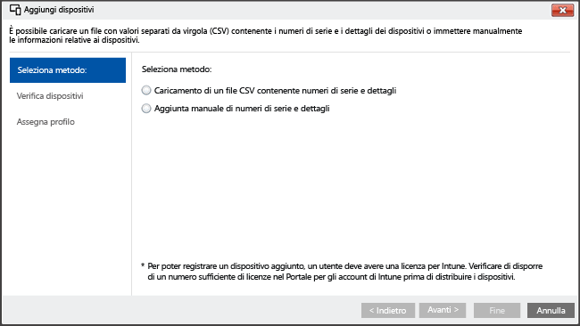

---
# required metadata

title: Registrazione diretta per i dispositivi iOS con Microsoft Intune | Microsoft Intune
description:
keywords:
author: NathBarn
manager: jeffgilb
ms.date: 04/28/2016
ms.topic: article
ms.prod:
ms.service: microsoft-intune
ms.technology:
ms.assetid: a692b90c-72ae-47d1-ba9c-67a2e2576cc2

# optional metadata

#ROBOTS:
#audience:
#ms.devlang:
ms.reviewer: jeffgilb
ms.suite: ems
#ms.tgt_pltfrm:
#ms.custom:

---

# Registrare direttamente i dispositivi iOS con Apple Configurator
Intune supporta la registrazione di dispositivi iOS di proprietà dell'azienda con lo strumento [Apple Configurator](http://go.microsoft.com/fwlink/?LinkId=518017) in esecuzione in un computer Mac. Questo processo non ripristina le impostazioni predefinite del dispositivo e lo registra con un criterio predefinito. Questo metodo è destinato ai dispositivi con **Nessuna affinità utente** e richiede la connessione con USB del dispositivo iOS a un computer Mac per configurare la registrazione aziendale. L'app Portale aziendale non è supportata per i dispositivi con registrazione diretta. In queste istruzioni si presuppone l'uso di Apple Configurator 2.0 in un computer Mac.

1.  **Creare un profilo per dispositivi**
    Un profilo di registrazione dispositivi consente di definire le impostazioni applicate ai dispositivi. Se non lo si è ancora fatto, creare un profilo di registrazione dispositivi per i dispositivi iOS registrati tramite Apple Configurator.

    #### Per creare un profilo

    1.  Nella [console di amministrazione di Microsoft Intune](http://manage.microsoft.com), selezionare **Criteri** &gt; **Registrazione di dispositivi aziendali**, quindi fare clic su **Aggiungi**..

        

    2.  Immettere i dettagli per i profili di dispositivo:

        -   **Nome** : nome del profilo di registrazione dispositivi. Non è visibile agli utenti.

        -   **Descrizione**: descrizione del profilo di registrazione dispositivi. Non è visibile agli utenti.

        -   **Associazione utente** : consente di specificare la modalità di registrazione dei dispositivi. Per la registrazione diretta selezionare **Nessuna affinità utente**..

        -   **Pre-assegnazione al gruppo di dispositivi**: tutti i dispositivi distribuiti con questo profilo apparterranno inizialmente a questo gruppo. È possibile riassegnare i dispositivi dopo la registrazione.

    3.  Fare clic su **Salva profilo** per aggiungere il profilo.

2.  **Aggiungere i dispositivi iOS per la registrazione con Apple Configurator**
    Nella [console di amministrazione di Microsoft Intune](http://manage.microsoft.com) fare clic su **Gruppi** &gt; **Tutti i dispositivi** &gt; **Dispositivi aziendali preregistrati** &gt; **Per numero di serie iOS**, quindi fare clic su **Aggiungi dispositivi**.

    

      È possibile aggiungere dispositivi in due modi:

    -   **Caricare un file CSV contenente i numeri di serie**: creare un elenco delimitato da virgole (CSV) composto da due colonne senza intestazione e limitato a 5 MB o 5000 dispositivi per ogni file CSV.

        |||
        |-|-|
        |&lt;Numero di serie 1&gt;|&lt;Dettagli sul dispositivo 1&gt;|
        |&lt;Numero di serie 2&gt;|&lt;Dettagli sul dispositivo 2&gt;|
        Il file con estensione CSV quando viene visualizzato in un editor di testo viene visualizzato come:

        ```
        0000000,PO 1234
        111111111,PO 1234
        ```

    -   **Aggiungere manualmente i dettagli dispositivo**: immettere il numero di serie e i dettagli per un massimo di cinque dispositivi, quindi fare clic su **Avanti**..

    > [!NOTE]
    > Se successivamente occorre rimuovere i dispositivi di proprietà dell'azienda dalla gestione di Intune, è necessario rimuoverne il numero di serie da Intune nel gruppo **Dispositivi di proprietà dell’azienda** per disabilitarne la registrazione.  Se Intune esegue una procedura di ripristino di emergenza nell’ora in cui sono stati rimossi i numeri di serie, sarà necessario verificare che solo i numeri di serie dei dispositivi attivi siano presenti in tale gruppo.

3.  **Selezionare i dispositivi da registrare**
    Confermare i dispositivi da registrare. I numeri di serie già registrati o registrati in altro modo non possono essere importati. Fare clic su **Avanti** per continuare.

4.  **Assegnare il profilo**
    Specificare il profilo da assegnare ai dispositivi aggiunti dall'elenco dei profili disponibili, esaminare i **Dettagli del profilo di registrazione**, quindi fare clic su **Fine**. I dispositivi aggiunti manualmente possono essere assegnati a qualsiasi profilo di registrazione.

5.  **Selezionare un profilo per la distribuzione nei dispositivi iOS**
    Nella [console di amministrazione di Microsoft Intune](http://manage.microsoft.com) fare clic su **Criteri** &gt; **Registrazione di dispositivi aziendali**, quindi selezionare il profilo di dispositivo da distribuire ai dispositivi mobili. Questo profilo deve essere lo stesso profilo che è stato assegnato per la distribuzione nel passaggio precedente. Fare clic su **Esporta…** nella barra delle attività. Fare clic su **Scarica il profilo** e salvare il file con estensione mobileconfig scaricato.

6.  **Trasferire il file**
    Copiare il file con estensione mobileconfig scaricato in un computer Mac.
    > [!NOTE]
    > L'URL del profilo di registrazione è valido per due settimane quando viene esportato. Dopo due settimane è necessario esportare un nuovo URL del profilo di registrazione per registrare i dispositivi iOS con Assistente configurazione.
7.  **Preparare il dispositivo con Apple Configurator**
    I dispositivi iOS vengono connessi al computer Mac e registrati per la gestione dei dispositivi mobili.

    1.  In un computer Mac avviare **Apple Configurator 2.0**..

    2.  Connettere il dispositivo iOS al computer Mac con un cavo USB. Chiudere **Photos**, **iTunes** e altre app che vengono aperte quando viene rilevato il dispositivo.

    3.  In Apple Configurator fare clic sul dispositivo iOS connesso e quindi scegliere **Aggiungi**. Nell'elenco a discesa vengono visualizzate le opzioni che possono essere aggiunte al dispositivo. Fare clic su **Profili**. .

    4.  Usare il selettore file per selezionare il file con estensione mobileconfig esportato da Intune e quindi fare clic su **Aggiungi**. Il profilo viene aggiunto al dispositivo.  Se per il dispositivo è indicato **Supervisione non eseguita**, l'installazione richiederà accettazione sul dispositivo.

8.  **Installare il profilo**
    È ora possibile installare il profilo nel dispositivo iOS. Il dispositivo deve aver già completato l'Assistente configurazione ed essere pronto per l'uso.  Se la registrazione comporta distribuzioni dell'app, il dispositivo deve avere un ID Apple configurato perché le distribuzioni di app richiederanno l'accesso all'App Store con un ID Apple.

    ###### Completamento dell'accettazione del profilo per i dispositivi iOS non supervisionati

    1.  Sbloccare il dispositivo iOS.

    2.  Nella finestra di dialogo **Install profile** (Installa profilo), per **Management profile** (Profilo di gestione) toccare **Install** (Installa)..

    3.  Indicare **Device Passcode** o **Apple ID**, se necessario.

    4.  Accettare l'**avviso** e toccare **Install** (Installa)..

    5.  Accettare l'**avviso remoto** e toccare **Trust** (Considera attendibile)..

    6.  Quando la casella **Profile Installed** (Profilo installato) conferma che il profilo è **Installed** (Installato), fare clic su **Done** (Fine)..

9. **Verificare il profilo**
    Nel dispositivo iOS, avviare **Settings** (Impostazioni) e passare a **General**(Generale)  &gt; **Device Management** (Gestione dispositivi)  &gt; **Management Profile** &gt; (Profilo di gestione), quindi confermare che l'installazione del profilo sia elencata e verificare le restrizioni dei criteri iOS e le app installate. La visualizzazione delle restrizioni dei criteri e delle app sul dispositivo può richiedere fino a 10 minuti.

10. **Distribuire i dispositivi**
    Il dispositivo iOS viene ora registrato con Intune e gestito.


### Vedere anche
[Prepararsi alla registrazione dei dispositivi](get-ready-to-enroll-devices-in-microsoft-intune.md)


<!--HONumber=May16_HO1-->


