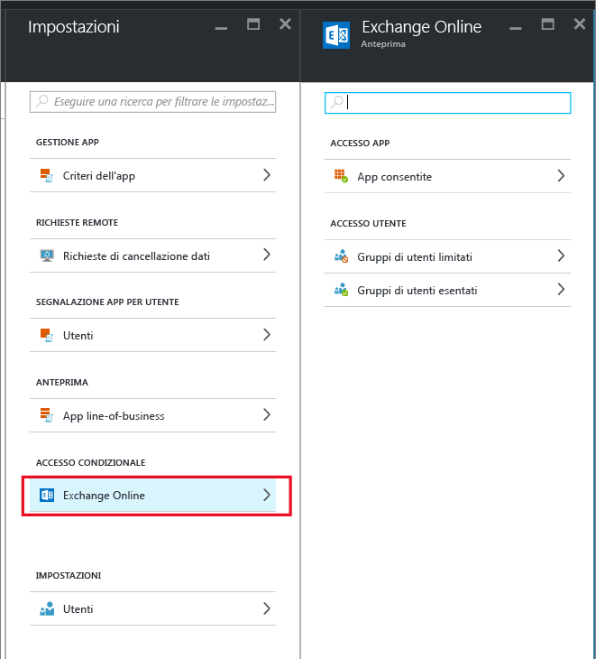
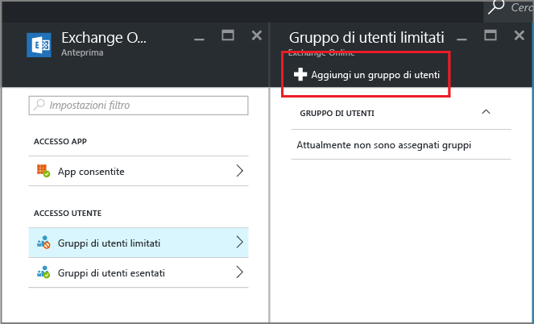

# Creare un accesso condizionale a Exchange Online per consentire solo le app supportate dalla gestione di applicazioni mobili
Questo argomento contiene istruzioni dettagliate su come configurare un accesso condizionale a Exchange Online in modo da consentire solo le app mobili che sopportano i criteri di gestione delle app mobili Intune.

## Creare criteri di Exchange Online
1.  Accedere al [Portale di Azure](portal.azure.com) in cui è disponibile la funzionalità di accesso delle app. Se non si ha familiarità con il Portale di Azure, leggere l'argomento [Portale di Azure per i criteri MAM](azure-portal-for-microsoft-intune-mam-policies.md).

2.  Scegliere **Sfoglia > Intune > Gestione di applicazioni mobili di Intune > Impostazioni** e nella sezione **Accesso condizionale** scegliere **Exchange Online**.

  

3.  Nel pannello **App consentite** scegliere l'opzione **Allow apps that support Intune app policies** (Consenti app che supportano i criteri per app Intune) per consentire solo alle app supportate dai criteri MAM di Intune di accedere a Exchange Online. Quando si seleziona questa opzione, viene visualizzato l'elenco delle app supportate.

  >[!NOTE]
  >Tutti i client di posta elettronica di Exchange Active Sync, tra cui i client di posta elettronica predefiniti in iOS e Android che si connettono a Exchange Online, non potranno inviare né ricevere messaggi di posta elettronica. Gli utenti riceveranno invece un solo messaggio di posta elettronica che li avvisa di usare Outlook come app di posta elettronica. 
4.   Per applicare questi criteri agli utenti, aprire il pannello **Gruppi di utenti limitati** e scegliere **Aggiungi un gruppo di utenti**. Selezionare uno o più gruppi di utenti a cui applicare questi criteri.

  

5.  È possibile che alcuni utenti appartenenti al gruppo selezionato nel passaggio precedente non debbano essere interessati da questi criteri. In questi casi aggiungere il gruppo di utenti all'elenco dei gruppi esentati. Scegliere **Exempted user groups** (Gruppi di utenti esentati) dal pannello **Exchange Online**. Scegliere **Aggiungi un gruppo di utenti** per aprire l'elenco dei gruppi di utenti. Selezionare i gruppi che si vuole esentare da questi criteri.  

## Modificare criteri esistenti
### Aggiungere o eliminare gruppi di utenti

Per **eliminare un gruppo di utenti** dall'elenco dei **gruppi di utenti limitati**, aprire il pannello **Gruppi di utenti limitati**, evidenziare il gruppo da eliminare e fare clic sui **puntini di sospensione (...)** per visualizzare l'opzione **Elimina**. Scegliere **Elimina** per rimuovere il gruppo di utenti dall'elenco. È possibile seguire la stessa procedura per rimuovere un gruppo di utenti dall'elenco dei **gruppi di utenti esentati**.

## Passaggi successivi
[Block apps that do not have modern authentication (Bloccare le app che non usano l'autenticazione moderna)](block-apps-with-no-modern-authentication.md)
### Vedere anche
[Proteggere i dati delle app con MAM](protect-app-data-using-mobile-app-management-policies-with-microsoft-intune.md)

<!--HONumber=Oct16_HO2-->

