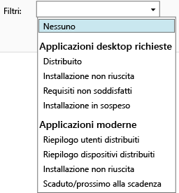

# Monitoraggio delle distribuzioni di app in Microsoft Intune

## Monitorare la distribuzione di un'app
È possibile visualizzare le app gestite e lo stato di tutte le distribuzioni nella console di amministrazione di Intune.

### Per visualizzare le app gestite e il relativo stato
Nell'area di lavoro **App** fare clic sul nodo **App** e quindi su **App**.

Viene visualizzato l'elenco delle app gestite. È possibile fare clic su un'app per visualizzare uno stato di installazione nel riquadro inferiore delle finestre della console. Per visualizzare altri dettagli, fare clic sullo stato. Ad esempio, se lo stato è **1 utente dispone di questo software**, si può fare clic sul messaggio per visualizzare il nome dell'utente.

> [!TIP]
> È possibile usare l'elenco a discesa **Filtri** per visualizzare solo le app che soddisfano i criteri specificati, ad esempio le app la cui installazione non è riuscita o quelle distribuite correttamente.
> 
> 

Inoltre, l'area di lavoro **Dashboard** include anche una panoramica dello stato delle app. Se si fa clic su un punto qualsiasi della panoramica, verrà visualizzato l'elenco di app.

## Per visualizzare informazioni più dettagliate su un'app
Nell'elenco di app selezionare un'app e quindi fare clic su **Visualizza proprietà**.

Nella pagina **Proprietà software** per l'app fare clic su una di queste schede: **Generale**, che contiene informazioni generali sull'app e sul relativo stato di installazione, **Dispositivi**, che indica i dispositivi su cui è installata una distribuzione di destinazione dell'app e **Utenti**, che indica gli utenti che hanno eseguito correttamente l'installazione di una distribuzione di destinazione dell'app nei propri dispositivi.

Come illustrato in precedenza, è possibile usare l'elenco a discesa **Filtri** per configurare i valori mostrati in ogni scheda.

<!--HONumber=Jun16_HO4-->

