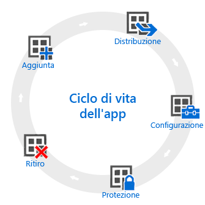

# Panoramica del ciclo di vita dell'app

Il ciclo di vita di un'app di Intune inizia quando si aggiunge l'app e termina, dopo alcuni passaggi intermedi, quando si rimuove l'app.

## Aggiunta

Il primo passaggio della distribuzione di app consiste nell'aggiungere a Intune le app da gestire e distribuire. Le procedure di base per i molti tipi di app che possono essere usati sono le stesse. Intune consente di aggiungere app sia per i [dispositivi registrati](add-apps-for-mobile-devices-in-microsoft-intune.md) che per i [PC Windows gestiti con il software client di Intune](add-apps-for-windows-pcs-in-microsoft-intune.md).

## Distribuisci

Dopo aver aggiunto l'app a Intune è possibile [distribuirla ai dispositivi gestiti](deploy-apps.md). Intune semplifica questo processo e, dopo aver distribuito l'app, consente di [monitorare il risultato](monitor-apps-in-microsoft-intune.md) della distribuzione dalla console di amministrazione di Intune. In alcuni App Store, come quelli di [Apple](manage-ios-apps-you-purchased-through-a-volume-purchase-program-with-microsoft-intune.md) e [Windows](manage-apps-you-purchased-from-the-windows-store-for-business-with-microsoft-intune.md), è anche possibile acquistare licenze di app in blocco per l'azienda. Intune consente di sincronizzare i dati con gli App Store per distribuire e monitorare l'uso delle licenze per determinati tipi di app direttamente dalla console di amministrazione di Intune.

## Configura

Come parte del ciclo di vita, vengono rilasciate regolarmente nuove versioni delle app. Intune offre strumenti con cui è possibile [aggiornare facilmente le app](update-apps-using-microsoft-intune.md) distribuite a una versione più recente. Alcune app consentono anche di configurare funzionalità aggiuntive, ad esempio:
- I [criteri di configurazione delle app iOS](configure-ios-apps-with-mobile-app-configuration-policies-in-microsoft-intune.md) applicano le impostazioni per le app iOS compatibili usate quando si esegue l'app. Ad esempio, un'app potrebbe richiedere impostazioni di personalizzazione specifiche o il nome di un server a cui connettersi.
- Con i [criteri per Managed Browser](manage-internet-access-using-managed-browser-policies.md) è possibile configurare le impostazioni per Intune Managed Browser, che sostituisce il browser predefinito del dispositivo e consente di limitare i siti Web che gli utenti possono visitare.

## Protezione

Intune offre molti modi per proteggere i dati nelle app. I metodi principali sono:
- L'[accesso condizionale](restrict-access-to-email-and-o365-services-with-microsoft-intune.md) controlla l'accesso alla posta elettronica e agli altri servizi in base alle condizioni specificate. Le condizioni includono i tipi di dispositivo o la conformità con un [criterio di conformità del dispositivo](introduction-to-device-compliance-policies-in-microsoft-intune.md) che è stato distribuito.
- [Gestione delle applicazioni mobili (MAM)](protect-app-data-using-mobile-app-management-policies-with-microsoft-intune.md) funziona con singole app e consente di proteggere i dati aziendali che usano. Ad esempio, è possibile limitare la copia dei dati tra app non gestite e app gestite dall'utente oppure impedire l'esecuzione delle app su dispositivi jailbroken o rooted.

## Ritiro

È probabile che le app distribuite a un certo punto diventino obsolete e vadano rimosse. Intune semplifica la procedura di [ritiro delle app dal servizio](retire-apps-using-microsoft-intune.md).

<!--HONumber=Aug16_HO2-->

