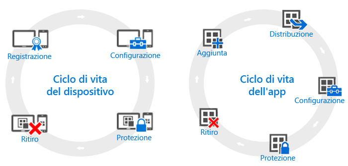

# Panoramica dei cicli di vita del dispositivo e dell'app

Anche se le esigenze delle singole organizzazioni possono essere diverse, esistono alcune operazioni comuni che tutte le organizzazioni devono eseguire con regolarità, indipendentemente dalle effettive esigenze operative. Tali operazioni possono essere raggruppate in due categorie principali, definite **cicli di vita**. Il ciclo di vita di distribuzione seguito dipende dallo scenario che si vuole abilitare. Ad esempio, può essere necessario solo il ciclo di vita del dispositivo, il ciclo di vita dell'app o entrambi.

Ai fini della gestione, tutti i dispositivi hanno un ciclo di vita, dalla registrazione iniziale del dispositivo fino al ritiro quando non è più necessario. Il [ciclo di vita di gestione del dispositivo](overview-of-device-lifecycle-in-microsoft-intune.md) descrive tutte le opzioni di registrazione, i modi in cui è possibile configurare e proteggere questi dispositivi e come rimuoverli dalla gestione.

Analogamente, le app usate hanno un proprio [ciclo di vita dell'app](overview-of-app-lifecycle-in-microsoft-intune.md) che include vari passaggi, dall'aggiunta di un'app a Intune fino alla rimozione quando non sono più necessarie.

<!--HONumber=Oct16_HO4-->

