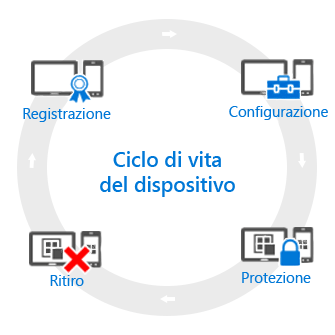

# Panoramica del ciclo di vita di gestione dei dispositivi mobili (MDM)

Tutti i dispositivi gestiti hanno ciò che viene definito un *ciclo di vita*. Intune può aiutare a gestire il ciclo di vita del dispositivo, dalla registrazione alla configurazione e alla protezione fino al ritiro del dispositivo stesso quando non è più necessario:

## Registrazione
Le moderne strategie di gestione dei dispositivi mobili (MDM) riguardano una vasta gamma di telefoni, tablet e PC (iOS, Android, Windows e Mac OS X). Se si deve poter gestire il dispositivo, come nel caso dei dispositivi aziendali, il primo passaggio consiste nella [registrazione del dispositivo](enroll-devices-in-microsoft-intune.md). È anche possibile gestire i PC Windows registrandoli con Intune (MDM) oppure [installando il software client di Intune](manage-windows-pcs-with-microsoft-intune.md).

## Configura
La registrazione dei dispositivi costituisce il primo passaggio. Per poter usufruire di tutte le offerte di Intune e verificare che i dispositivi siano protetti e conformi agli standard aziendali, è possibile scegliere tra una vasta gamma di criteri che consentono di configurare quasi ogni aspetto correlato al funzionamento dei dispositivi gestiti. Ad esempio, gli utenti devono usare una password per i dispositivi che contengono dati aziendali? È possibile impostare questo requisito. È disponibile una rete Wi-Fi aziendale? È possibile configurarla automaticamente. Di seguito sono descritti i tipi di opzioni di configurazione disponibili:

- [**Criteri di configurazione**](manage-settings-and-features-on-your-devices-with-microsoft-intune-policies.md). Questi criteri consentono di configurare le caratteristiche e le funzionalità dei dispositivi gestiti. Ad esempio, può essere necessario usare una password nei telefoni Windows o disabilitare l'uso della fotocamera negli iPhone.
- [**Criteri di accesso alle risorse aziendali**](enable-access-to-company-resources-with-microsoft-intune.md). Quando si consente agli utenti di accedere ai dati aziendali da un dispositivo personale, possono emergere alcuni rischi. Ad esempio, come è possibile garantire che tutti i dispositivi che devono accedere alla posta elettronica aziendale siano configurati correttamente? Come si può garantire l'accesso degli utenti alla rete aziendale con una connessione VPN senza conoscere le complesse impostazioni sottostanti? Con Intune è possibile semplificare il processo configurando automaticamente i dispositivi gestiti per l'accesso alle risorse aziendali comuni.
- [**Criteri di gestione di PC Windows (con il software client di Intune)**](common-windows-pc-management-tasks-with-the-microsoft-intune-computer-client.md). Mentre la registrazione dei PC Windows con Intune fornisce la maggior parte delle funzionalità di gestione dei dispositivi, Intune continua a supportare la gestione dei PC Windows con il software client di Intune. Per altre informazioni su alcune delle attività che è possibile eseguire con i PC, iniziare da qui.

## Protezione
Al giorno d'oggi, la protezione dei dispositivi da accessi non autorizzati è una delle attività più importanti da eseguire. Oltre agli elementi descritti nel passaggio **Configurazione** del ciclo di vita del dispositivo, Intune fornisce altre funzionalità che consentono di proteggere i dispositivi gestiti da accessi non autorizzati o attacchi dannosi:
- [**Multi-Factor Authentication**](protect-windows-devices-with-multi-factor-authentication.md). L'aggiunta di un ulteriore livello di autenticazione agli accessi dell'utente contribuisce a rendere i dispositivi ancora più sicuri. I dispositivi Windows, Windows Phone e Windows Mobile offrono un'autenticazione a più fattori che richiede un secondo livello di autenticazione per l'accesso, ad esempio una telefonata o un messaggio di testo.
- [**Impostazioni di Microsoft Passport**](control-microsoft-passport-settings-on-devices-with-microsoft-intune.md). Microsoft Passport è un metodo di accesso alternativo che consente agli utenti di usare un *movimento*, ad esempio un'impronta digitale o Windows Hello, per accedere senza dover immettere una password.
- [**Criteri per proteggere i PC Windows (con il software client di Intune)**](policies-to-protect-windows-pcs-in-microsoft-intune.md). Quando si gestiscono i PC Windows con il software client di Intune, sono disponibili criteri che consentono di controllare le impostazioni per Endpoint Protection, gli aggiornamenti software e Windows Firewall nei PC gestiti.

## Ritiro
È opportuno [ritirare o cancellare](use-remote-wipe-to-help-protect-data-using-microsoft-intune.md) il dispositivo quando viene smarrito o rubato e deve essere sostituito oppure quando gli utenti si trasferiscono altrove. Esistono diversi modi per eseguire questa operazione: dal ripristino del dispositivo alla rimozione dalla gestione o alla cancellazione dei dati aziendali contenuti.

<!--HONumber=Aug16_HO2-->

