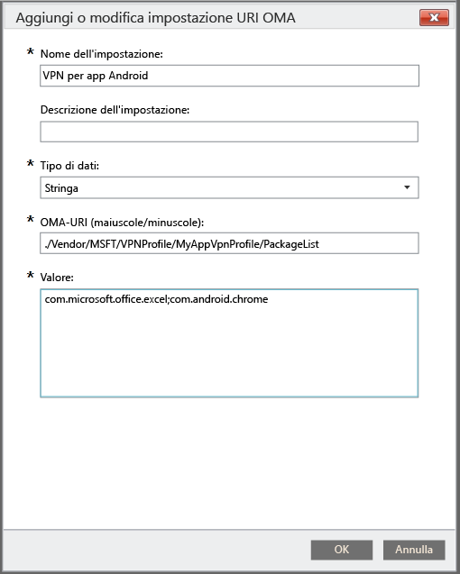

# Usare criteri personalizzati per creare un profilo VPN per app per dispositivi Android

È possibile creare un profilo VPN per app specifiche per i dispositivi Android 5.0 e versione successiva gestiti da Intune. Creare innanzitutto un profilo VPN che usa il tipo di connessione Pulse Secure. Definire quindi criteri di configurazione personalizzati che associano il profilo ad app specifiche. 

Dopo aver distribuito i criteri ai gruppi di utenti o ai dispositivi Android, gli utenti devono avviare la VPN PulseSecure. PulseSecure quindi consentirà il traffico solo dalle app specificate per usare la connessione VPN aperta.

> [!NOTE]
>
> Per questo profilo è supportato solo il tipo di connessione Pulse Secure.

### Passaggio 1: Creare un profilo VPN

1. Nella [console di amministrazione di Microsoft Intune](https://manage.microsoft.com) fare clic su **Criteri** > **Aggiungi criterio**.
2. Per selezionare un modello per il nuovo criterio, espandere **Android** e quindi scegliere **Profilo VPN (Android 4 e versioni successive)**.
3. Nel modello, in **Tipo di connessione** scegliere **Pulse Secure**.
4. Completare e salvare il profilo VPN. Per altri dettagli sui profili VPN vedere [Connessioni VPN in Microsoft Intune](../deploy-use/vpn-connections-in-microsoft-intune.md).

> [!NOTE]
>
> Prendere nota del nome del profilo VPN per usarlo nel passaggio successivo. Ad esempio, MyAppVpnProfile.

### Passaggio 2: Creare criteri di configurazione personalizzati

   1. Nella console di amministrazione di Intune scegliere **Criteri** > **Aggiungi criterio** > **Android** > **Configurazione personalizzata** > **Crea criterio**.
   2. Immettere un nome per il criterio.
   3. In **Impostazioni URI OMA** scegliere **Aggiungi**.
   4. Immettere un nome per l'impostazione.
   5. In **Tipo di dati** specificare **Stringa**.
   6. In **URI OMA** specificare la stringa seguente: **./Vendor/MSFT/VPN/Profile/*nome*/PackageList** dove *nome* è il nome del profilo VPN annotato nel Passaggio 1. Con il nome di esempio, citato in precedenza la stringa sarà **./Vendor/MSFT/VPN/Profile/MyAppVpnProfile/PackageList**.
   7.   Per l'opzione **Valore** creare un elenco separato da punti e virgola dei pacchetti da associare al profilo. Ad esempio, se si vuole che Excel e il browser Google Chrome usino la connessione VPN, digitare: **com.microsoft.office.excel;com.android.chrome**.

#### Impostare l'elenco di app come blacklist o whitelist (facoltativo)
  È possibile specificare un elenco di app che *non possono* usare la connessione VPN tramite il valore **BLACKLIST**. Tutte le app non incluse nell'elenco si connetteranno mediante la VPN.
In alternativa, è possibile usare il valore **WHITELIST** per specificare un elenco di app che *possono* usare la connessione VPN. Le app non incluse nell'elenco non si connetteranno mediante la VPN.
  1.    In **Impostazioni URI OMA** scegliere **Aggiungi**.
  2.    Immettere un nome per l'impostazione.
  3.    In **Tipo di dati** specificare **Stringa**.
  4.    Per **URI OMA** usare la stringa seguente: **./Vendor/MSFT/VPN/Profile/*nome*/Mode** dove *nome* è il nome del profilo VPN annotato nel Passaggio 1. Con il nome di esempio citato in precedenza la stringa sarà **./Vendor/MSFT/VPN/Profile/MyAppVpnProfile/Mode**.
  5.    In **Valore** immettere **BLACKLIST** o **WHITELIST**.

### Passaggio 3: Distribuire entrambi i criteri

È necessario distribuire *entrambi* i criteri agli *stessi* gruppi di Intune.

1.  Nell'area di lavoro **Criteri** selezionare il criterio che si vuole distribuire e quindi scegliere **Gestisci distribuzione**.
2.  Nella finestra di dialogo **Gestisci distribuzione** :
    -   **Per distribuire il criterio**, selezionare uno o più gruppi a cui distribuire il criterio, quindi scegliere **Aggiungi** > **OK**.
    -   **Per chiudere la finestra di dialogo senza distribuire il criterio**, scegliere **Annulla**.

Un riepilogo dello stato e gli avvisi visualizzati nella pagina **Panoramica** dell'area di lavoro **Criteri** consentono di identificare i problemi relativi ai criteri che richiedono attenzione. Un riepilogo dello stato viene visualizzato nell'area di lavoro **Dashboard**.

<!--HONumber=Aug16_HO5-->

