# Pianificare i gruppi di utenti e dispositivi
I gruppi di Intune offrono una grande flessibilità per la gestione di dispositivi e utenti. È possibile impostare i gruppi in base alle esigenze dell'organizzazione in riferimento a:

- posizione geografica
- reparto
- caratteristiche hardware
- sistema operativo
- proprietà del dispositivo da parte dell'utente o della società

## Funzionamento dei gruppi di Intune

La visualizzazione predefinita del nodo **Gruppi** nella console di amministrazione di Intune è la seguente:

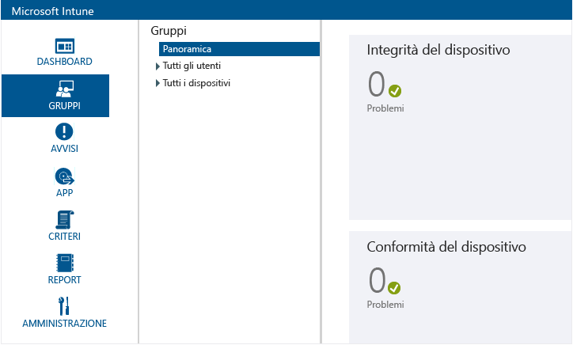

I criteri vengono distribuiti ai gruppi, motivo per cui la gerarchia dei gruppi rappresenta una delle più importanti considerazioni sulla progettazione. È anche importante sapere che, dopo aver creato il gruppo, non è possibile modificarne il gruppo padre. La struttura del gruppo è di vitale importanza dal momento in cui si inizia a usare il servizio Intune. Di seguito vengono descritte alcune delle procedure consigliate per la progettazione di una gerarchia di gruppi in base alle esigenze organizzative.

## Ruoli di appartenenza a gruppi

- Un gruppo può contenere utenti o dispositivi, ma non entrambi.

    * **Gruppi di dispositivi**. Sono inclusi computer e dispositivi mobili. Prima di aggiungere un computer a un gruppo, deve essere registrato. Prima di aggiungere un dispositivo mobile a un gruppo, l'ambiente deve essere configurato per il supporto dei dispositivi mobili. Il dispositivo, inoltre, deve essere registrato o individuato in Exchange ActiveSync.

    * **Gruppi di utenti**. Un gruppo può contenere utenti dei gruppi di sicurezza. Tali gruppi eseguono la sincronizzazione con l'istanza di Active Directory dell'utente. Se non si esegue la sincronizzazione con Active Directory, è possibile creare questi gruppi in modo manuale.

- Un dispositivo o un utente può appartenere a più gruppi.

- Un gruppo può includere ed escludere i membri in base alle seguenti regole di appartenenza:

    * **Criteri di appartenenza**. Si tratta di regole dinamiche che Intune esegue per includere o escludere membri. Questi criteri usano i gruppi di sicurezza e altre informazioni sincronizzate con l'istanza locale di Active Directory. Quando il gruppo di sicurezza o i dati vengono modificati, l'appartenenza al gruppo cambia al momento della sincronizzazione con Active Directory.

    * **Appartenenza diretta**. Queste sono regole statiche che consentono di aggiungere o escludere i membri in modo esplicito. L'elenco di appartenenza è statico.

-   Per creare gruppi di utenti o di dispositivi che includono utenti o computer, non è necessario usare Servizi di dominio Active Directory. Per consentire l'aggiunta di dispositivi mobili nei gruppi di dispositivi, è tuttavia necessario configurare l'ambiente per il supporto dei dispositivi mobili.

    Inoltre, i dispositivi devono essere rilevati e aggiunti a Intune.

## Regole di relazione dei gruppi

- Ogni gruppo creato deve avere un gruppo padre, che non è più possibile modificare dopo la creazione del gruppo stesso.

- Quando si aggiungono utenti o dispositivi a un gruppo figlio:

    * Il gruppo figlio è sempre un sottoinsieme del gruppo padre.

    * I nuovi membri aggiunti a un gruppo figlio vengono aggiunti automaticamente al relativo gruppo padre.

    * Non è possibile aggiungere un membro a un gruppo figlio quando tale membro viene escluso dal gruppo padre.

- L'appartenenza di un gruppo padre definisce la possibile appartenenza del gruppo figlio.

- Quando si elimina un gruppo padre, vengono eliminati tutti i gruppi figlio.

- È possibile distribuire i contenuti e i criteri a un gruppo padre escludendo però la distribuzione ai gruppi figlio.

- È possibile aggiungere uno specifico utente o dispositivo a un gruppo figlio se tale utente o dispositivo non è già membro del gruppo padre. In questo caso, il nuovo membro del gruppo figlio verrà aggiunto al gruppo padre.

    Non è tuttavia possibile aggiungere un membro a un gruppo figlio escluso dal gruppo padre.

- L'appartenenza ai gruppi è ricorsiva. Ad esempio:

    * **Pat** è un membro di un solo gruppo, il gruppo di sicurezza **Utenti portatile** .

    * Il gruppo **Utenti laptop** è un membro del gruppo di sicurezza **Utenti approvati** .

    * Viene creato un gruppo in Intune che usa una query di appartenenza dinamica che include i membri del gruppo **Utenti approvati**. Il risultato è che il gruppo utenti di Intune include **Pat**.

> [!TIP]
> Quando si creano gruppi, considerare la modalità di applicazione dei criteri. Ad esempio, si possono applicare criteri specifici dei sistemi operativi dei dispositivi o criteri specifici di differenti unità organizzative o ruoli già definiti nel servizio Active Directory. Alcuni amministratori ritengono utile creare gruppi di dispositivi specifici dei sistemi operativi iOS, Android, e Windows, nonché gruppi di utenti per ciascun ruolo dell'organizzazione.

<!--- should we just link to a policies topic at this point and remove this? Ask Rob
 You'll probably want to create a default policy that applies to all groups and devices, to establish the basic compliance requirements of your organization. Then, you create more specific policies for the broadest categories of users and devices, for example, email policies for each of the device operating systems.

 Be careful when you name your policies, so that you can easily identify them later. For example, a good, descriptive policy name is **WP Email Policy for Entire Company**.

 Each time you create a restrictive policy, you'll want to communicate it to your users. After you create the more general groups and policies, pay attention to how you create smaller groups so that you can reduce unnecessary communication.--->

## Gruppi predefiniti
Intune fornisce nove gruppi predefiniti che non è possibile modificare o eliminare: <!--maybe a screen shot would be best?-->

-   **Tutti gli utenti**
    -   Utenti non raggruppati
-   **Tutti i dispositivi**
    -   Tutti i computer
    -   Tutti i dispositivi mobili
        -   Tutti i dispositivi gestiti direttamente
        -   Tutti i dispositivi gestiti da Exchange ActiveSync
    -   Tutti i dispositivi di proprietà dell'azienda
    -   Dispositivi non raggruppati

> [!NOTE]
> È fondamentale la *semplicità*. Se l'organizzazione non ha esigenze specifiche come quelle descritte nelle sezioni seguenti, mantenere la struttura e i criteri del gruppo predefiniti. Questo accorgimento renderà il servizio più gestibile a lungo termine. La manutenzione risulterà più semplice se è possibile gestire gli utenti in modo uniforme. Con una minima differenziazione per gruppo, inoltre, il numero di criteri da gestire sarà minore.

### Tutti gli utenti e i dispositivi nella propria organizzazione
Definire un gruppo padre per tutti gli utenti e i dispositivi dell'organizzazione, perché è probabile che vi siano criteri applicabili a tutti. A questo scopo, è possibile usare i gruppi predefiniti **All Users** (Tutti gli utenti) e **All devices** (Tutti i dispositivi) in Intune. I sottogruppi che consentono di organizzare i dispositivi in base alle specifiche, ad esempio un gruppo per i dispositivi BYOD e uno per i dispositivi di proprietà dell'azienda (CO), possono essere gruppi figlio dei gruppi padre **All Users** (Tutti gli utenti) e **All devices** (Tutti i dispositivi).

## Personalizzare i gruppi per l'organizzazione

### Dispositivi BYOD e di proprietà aziendale
Se l'organizzazione consente ai dipendenti di usare i propri dispositivi durante il lavoro (BYOD), fornisce i dispositivi di proprietà dell'azienda (CO) o consente una combinazione di entrambi gli scenari, si consiglia di applicare criteri basati su queste due categorie di dispositivi.

Nel caso di dispositivi BYOD o di una combinazione dei due scenari, assicurarsi di pianificare i criteri che non violano le normative locali in materia di privacy. Creare un gruppo padre per tutti gli utenti che porteranno i propri dispositivi. È quindi possibile usare questo gruppo per applicare i criteri che sono applicabili a tutti gli utenti di questa categoria.

Analogamente, è possibile creare un gruppo per gli utenti di dispositivi CO dell'organizzazione:

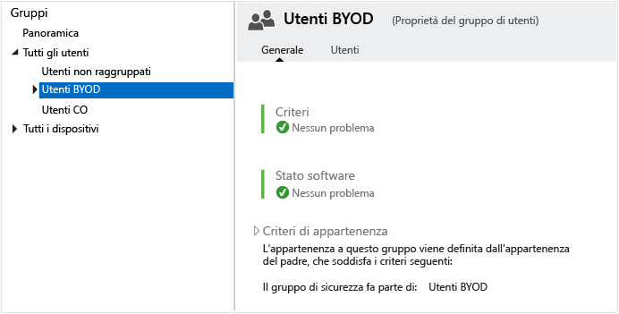

<!---START HERE--->

### Gruppi per aree geografiche
Se l'organizzazione necessita di criteri per aree specifiche, è possibile creare gruppi in base all'area geografica. È possibile basare tali criteri su gruppi regionali già creati nell'istanza di Active Directory e quindi sincronizzarli con il servizio Azure Active Directory. È possibile anche creare gruppi regionali direttamente in Azure Active Directory.

Gli screenshot seguenti mostrano come creare gruppi di Intune sulla base dei gruppi sincronizzati con l'istanza locale di Active Directory. In questi esempi si presuppone la presenza di un gruppo di sicurezza di Active Directory denominato **US Users Group** (Gruppo utenti USA).

Fornire innanzitutto le informazioni generali.

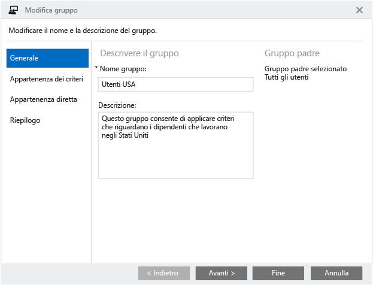

In **Criteri di appartenenza** selezionare **US Users Group** (Gruppo utenti USA), sincronizzato con Active Directory, come gruppo di sicurezza da usare in base alle regole di appartenenza.

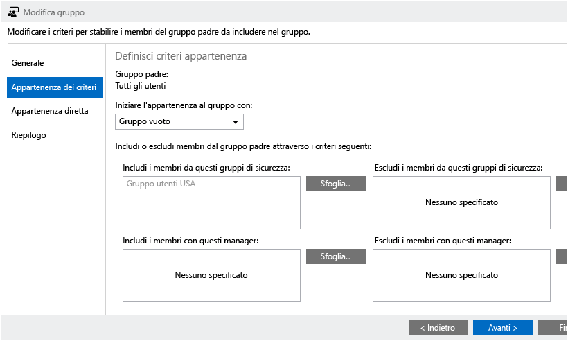

Verificare i dati immessi e quindi fare clic su **Fine** per creare il gruppo.

Nel nostro esempio, abbiamo creato anche un gruppo **MEA** per Medio Oriente e Asia.

> [!NOTE]
> Se l'appartenenza al gruppo non viene popolata in base all'appartenenza al gruppi di sicurezza, verificare di avere assegnato licenze Intune ai membri del gruppo.

### Gruppi per hardware specifico
Se l'organizzazione necessita di criteri applicabili a tipi di hardware specifici, è possibile creare gruppi in base a questo requisito. È possibile basare i criteri su gruppi specifici già creati nell'istanza locale di Active Directory e quindi sincronizzarli con Active Directory. È possibile anche creare gruppi direttamente in Azure Active Directory. In questo esempio il gruppo **US Users Group** (Gruppo utenti USA) viene usato come gruppo padre del gruppo **Laptop Users** (Utenti laptop).

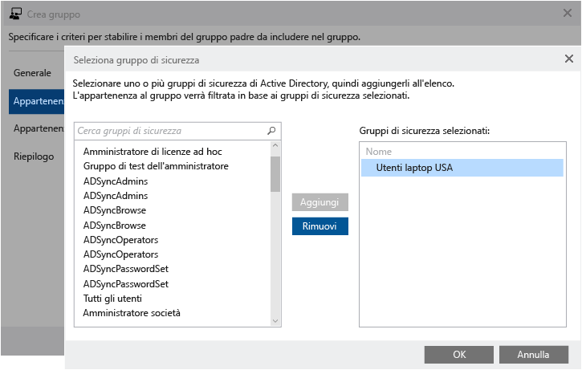

A questo punto la gerarchia del gruppo dovrebbe essere simile allo screenshot seguente. Come si può notare, nel gruppo Intune **Laptop Users** (Utenti laptop) sono ora presenti dei membri. Tutti i criteri applicati a questo gruppo verranno applicati agli utenti di portatili BYOD dall'area degli Stati Uniti.

### Gruppi per sistemi operativi specifici
Se l'organizzazione necessita di criteri applicabili a sistemi operativi specifici, ad esempio Android, iOS o Windows, è possibile creare gruppi in base a questo requisito. Come negli esempi precedenti, è possibile basare tali criteri su gruppi specifici già creati nell'istanza locale di Active Directory e quindi sincronizzarli con Azure Active Directory. È possibile anche crearli nell'istanza di Azure Active Directory.

Seguendo lo stesso metodo degli esempi precedenti, è possibile creare gruppi basati su utenti <!--devices?--> che usano specifiche piattaforme del sistema operativo.

> [!NOTE]
> Se gli utenti usano più piattaforme mobili/sistemi operativi e non dispongono di un metodo automatico per classificare gli utenti come utenti di Android, utenti di iOS o utenti di Windows, è possibile applicare i criteri a livello di dispositivo. Questo consente una maggiore flessibilità nell'applicazione di criteri specifici del sistema operativo.
>
> Non è possibile eseguire il provisioning dei gruppi in modo dinamico in base al sistema operativo del dispositivo. È invece possibile eseguire questa operazione usando i gruppi di sicurezza di Active Directory o Azure Active Directory.

Dopo che tutti i gruppi di utenti sono stati popolati in base ai requisiti aziendali, la gerarchia dei gruppi dovrebbe essere simile alla seguente:

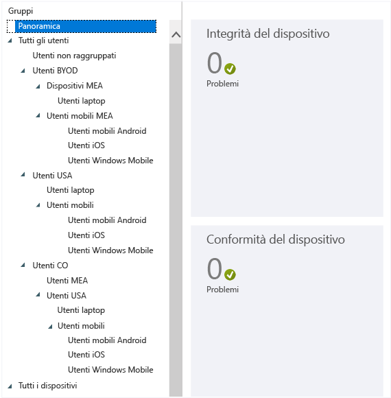

È possibile usare questa gerarchia per applicare i criteri dell'organizzazione.

### Gruppi di dispositivi
È anche possibile creare gruppi simili per i dispositivi, come illustrato di seguito, a partire da un gruppo esteso che includa tutti i dispositivi di proprietà dei dipendenti per lo scenario BYOD.

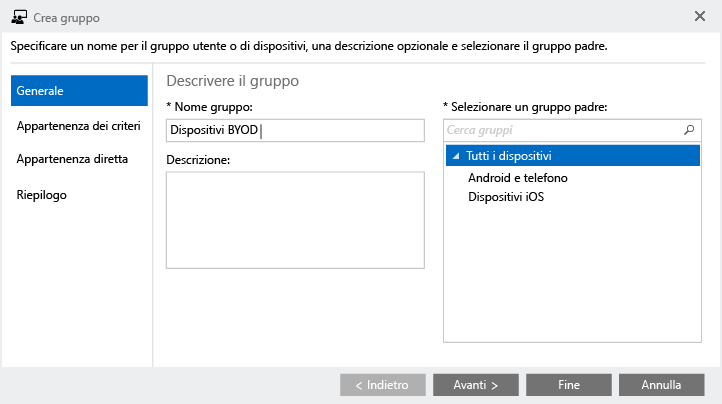

Assicurarsi di selezionare **Tutti i dispositivi (computer e dispositivi mobili)** in modo che il gruppo includa tutti i dispositivi BYOD:

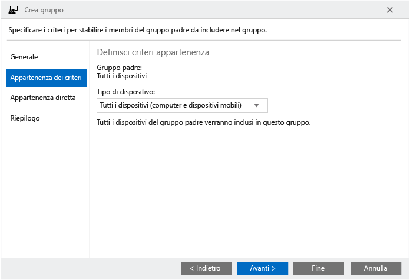

Verificare i dati immessi e quindi fare clic su **Fine** per creare il gruppo BYOD.

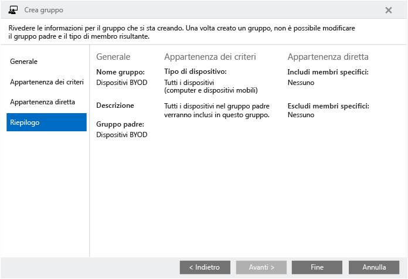

Continuare a creare gruppi di dispositivi, fino a quando non si avrà una gerarchia di gruppi di dispositivi simile a quella dei gruppi di utenti. Il nodo del gruppo nella console di Intune dovrebbe essere simile al seguente:

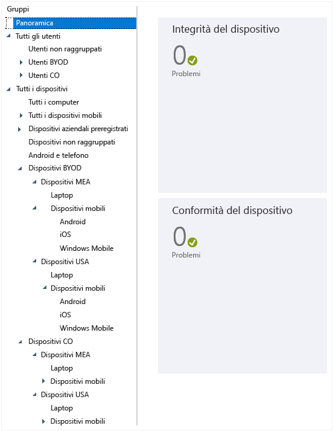

## Gerarchie di gruppi e convenzioni di denominazione
Per semplificare la gestione dei criteri è consigliabile assegnare a ogni criterio un nome in base allo scopo, alla piattaforma e all'ambito a cui viene applicato. Usare uno standard di denominazione che segua la struttura dei gruppi creata in preparazione dell'applicazione dei criteri.

Ad esempio, per un criterio Android che viene applicato a tutti i dispositivi mobili Android aziendali a livello dell'area degli Stati Uniti, il criterio può essere denominato **CO_US_Mob_Android_General**.

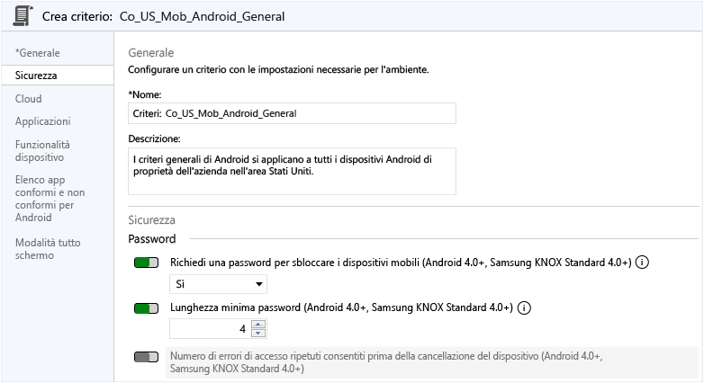

Quando si assegnano i nomi ai criteri nel modo sopra descritto, è possibile identificare rapidamente i criteri stessi e il relativo scopo e ambito nel nodo **Criteri**, come illustrato di seguito:

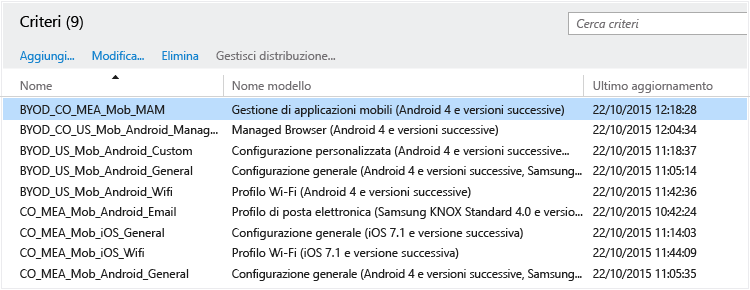

## Passaggi successivi
[Creare i gruppi](use-groups-to-manage-users-and-devices-with-microsoft-intune.md)

<!--HONumber=Aug16_HO3-->

