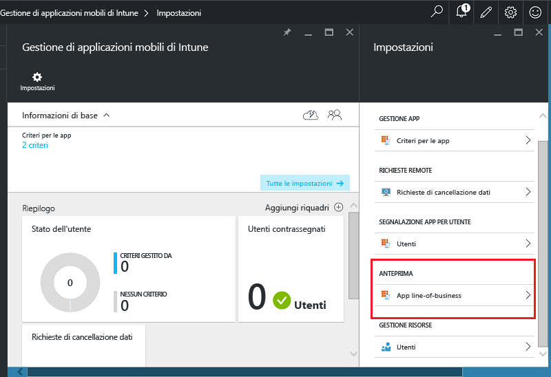
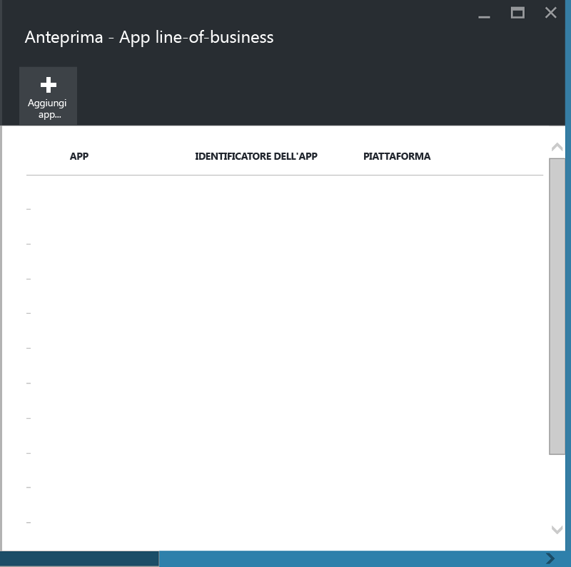
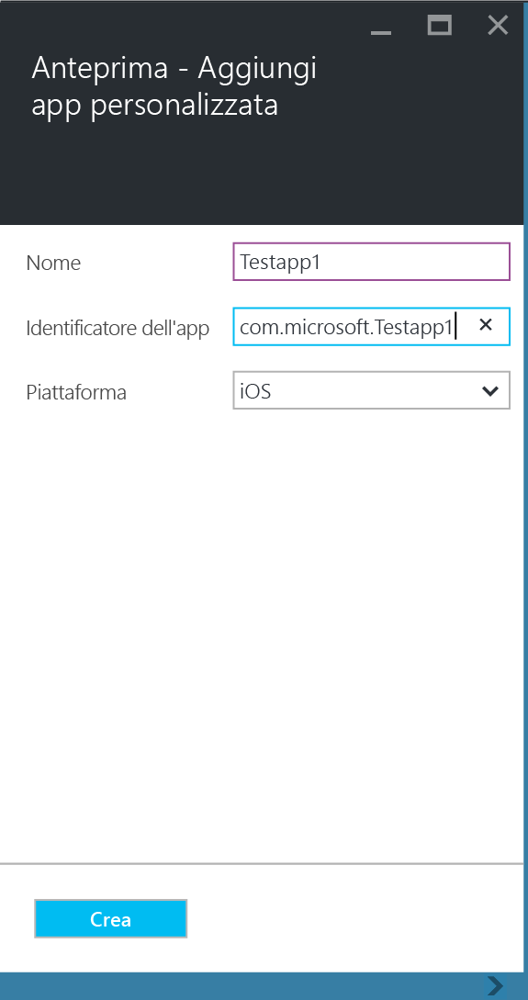
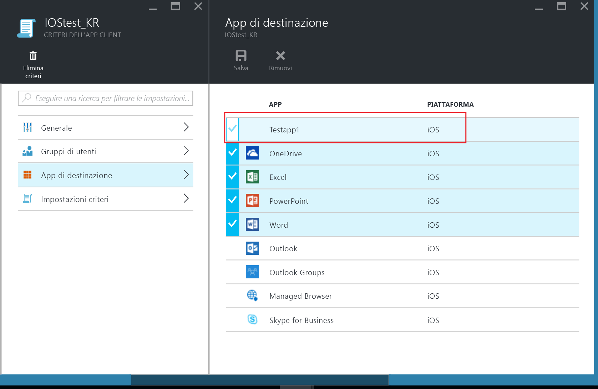
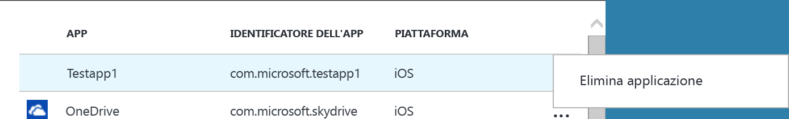

---
# required metadata

title: Proteggere app e dati line-of-business su dispositivi non registrati | Microsoft Intune
description:
keywords:
author: karthikaraman
manager: jeffgilb
ms.date: 04/28/2016
ms.topic: article
ms.prod:
ms.service:
ms.technology:
ms.assetid: 00219467-a62e-43b6-954b-3084f54c45ba

# optional metadata

#ROBOTS:
#audience:
#ms.devlang:
ms.reviewer: joglocke
ms.suite: ems
#ms.tgt_pltfrm:
#ms.custom:

---

# Proteggere app e dati line-of-business su dispositivi non registrati

I criteri di gestione delle app per dispositivi mobili (MAM) aiutano a proteggere i dati aziendali limitando gli spostamenti dei dati come le operazioni di copia e incolla o impedendo agli utenti di salvare documenti aziendali in un percorso personale.   Prima di applicare i criteri MAM alle applicazioni line-of-business per iOS e Android è necessario eseguire il wrapping dell'app con lo strumento di wrapping delle app di Microsoft Intune.  Il wrapping dell’app è il processo di applicazione di un livello di gestione a un'app per dispositivi mobili senza alcuna modifica dell'applicazione sottostante.  Dopo aver eseguito il wrapping è possibile applicare i criteri MAM all'app e distribuirla agli utenti finali.  

Questo argomento elenca i passaggi per l'applicazione dei criteri MAM alle app a cui si accede su **dispositivi di proprietà degli utenti e non gestiti** e dispositivi gestiti da **soluzioni di gestione dei dispositivi mobili (MDM) di terze parti**.  Per preparare le app line-of-business eseguite su **dispositivi registrati in Intune**, vedere [Stabilire come preparare le app per la gestione delle applicazioni mobili con Microsoft Intune](decide-how-to-prepare-apps-for-mobile-application-management-with-microsoft-intune.md).
##  Passaggio 1: Preparare l'app.
Prima di applicare i criteri MAM a un'app è necessario eseguire il wrapping dell'app con lo strumento di wrapping delle app di Microsoft Intune.  Le istruzioni per l'installazione e l'uso dello strumento di wrapping delle app sono incluse nel download.  
>[!IMPORTANT]  
>Questa versione dello strumento di wrapping dell'app, che supporta i dispositivi non registrati in Intune, sarà disponibile in anteprima privata nelle prossime settimane. Se si vuole partecipare inviare un messaggio di posta elettronica all'indirizzo msintuneappsdk@microsoft.com per altre informazioni.

## Passaggio 2: Aggiungere l'app.

Per associare l'app line-of-business con i criteri MAM è necessario aggiungere i dettagli dell'app alla sottoscrizione/tenant Intune con la seguente procedura:

1. Nel [portale di Azure](https://portal.azure.com/) andare a **Gestione di applicazioni mobili di Intune > Impostazioni** e scegliere **App line-of-business**.

  

2. Nel pannello **App line-of-business** scegliere **Aggiungi app personalizzata**.

  
3.  Specificare il nome dell'app, l'identificatore del bundle nel campo Identificatore dell'app e la piattaforma (iOS o Android).

   Questo passaggio crea una voce elenco unica per l'app.  L'app viene anche visualizzata nell'elenco App di destinazione di un criterio MAM del tenant, come descritto nel passaggio successivo.

## Passaggio 3: Applicare i criteri MAM
Dopo aver caricato nel servizio i metadati dell'app, questa appare nell'elenco delle app.  È ora possibile [creare un nuovo criterio o modificare un criterio esistente](create-and-deploy-mobile-app-management-policies-with-microsoft-intune.md) e applicarlo alla riga dell'app line-of-business aggiunta nel passaggio 2.

>[!IMPORTANT]
>È necessario assegnare il criterio MAM agli utenti che useranno l'applicazione sottoposta a wrapping.  Gli utenti a cui non è stato distribuito questo criterio non potranno usare l'app.

  
## Passaggio 4: Distribuire l'app.
È possibile distribuire app agli utenti finali nei modi seguenti:
* Per i dispositivi registrati in una soluzione MDM di terze parti è possibile distribuire le app con la soluzione MDM.
* Per i dispositivi non gestiti da una soluzione MDM occorre una soluzione personalizzata. Gli utenti finali dovranno scaricare e installare l'app sul loro dispositivo.

## Modifica dei metadati
Per la modifica di dettagli come il nome o l'identificatore bundle dell'app è necessario [rimuovere l'app](#remove-apps) e quindi [aggiungerla](#add-the-app) con i nuovi metadati.

##  Rimuovere app
È possibile rimuovere un'app line-of-business dall'elenco di app.  L'app viene rimossa dall'elenco e l'associazione ai criteri MAM viene eliminata, ma l'app non viene rimossa o disinstallata dal dispositivo dell'utente finale.  

1.  Nel [portale Azure](https://portal.azure.com/), andare a **Gestione di applicazioni mobili di Intune > Impostazioni**.  Nel pannello **Impostazioni** scegliere **Line-of-business** per aprire l'elenco delle app esistenti.  
2.  Selezionare l'app da rimuovere e scegliere **(...)**.

  
3.  Scegliere **Elimina applicazione** per eliminare l'app.

  

  Le app vengono rimosse dall'elenco di app line-of-business e dall'elenco delle app di destinazione nel criterio MAM.

<!--HONumber=Jun16_HO2-->

