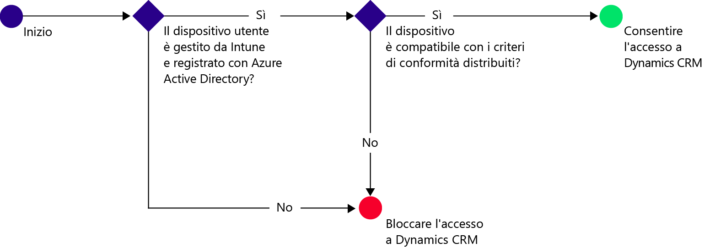
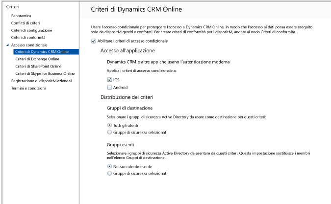

# Limitare l'accesso alla posta elettronica a Dynamics CRM Online
È possibile controllare l'accesso a Microsoft Dynamics CRM Online dai dispositivi iOS e Android con l'accesso condizionale di Microsoft Intune.  L'accesso condizionale di Intune è costituito da due componenti:
* [Criteri di conformità](introduction-to-device-compliance-policies-in-microsoft-intune.md) che il dispositivo deve soddisfare per essere considerato conforme.
* [Criteri di accesso condizionale](restrict-access-to-email-and-o365-services-with-microsoft-intune.md) in cui si specificano le condizioni che il dispositivo deve soddisfare per poter accedere al servizio.

Per altre informazioni sul funzionamento dell'accesso condizionale, leggere l'articolo [Limitare l'accesso alla posta elettronica, a Office 365 e ad altri servizi con Microsoft Intune](restrict-access-to-email-and-o365-services-with-microsoft-intune.md).

Quando un utente di destinazione tenta di usare l'app Dynamics CRM sul proprio dispositivo, si verifica quanto segue:

Il dispositivo che necessita dell'accesso a Dynamics CRM Online deve:
* Essere un dispositivo **Android** o **iOS**.
* Essere **registrato** con Microsoft Intune.
* Essere **conforme** a tutti i criteri di conformità distribuiti per Microsoft Intune.

Lo stato del dispositivo viene archiviato in Azure Active Directory che consente o blocca l'accesso, in base alle condizioni specificate.

Se non viene soddisfatta una condizione, viene visualizzato uno dei due messaggi seguenti quando l'utente esegue l'accesso:
* Se il dispositivo non è registrato con Microsoft Intune oppure non è registrato in Azure Active Directory, viene visualizzato un messaggio contenente le istruzioni su come installare l'app del portale aziendale ed eseguire la registrazione.
* Se il dispositivo non è conforme, viene visualizzato un messaggio che indirizza l'utente al sito Web del portale aziendale di Microsoft Intune o all'app del portale aziendale dove sono disponibili informazioni sul problema e su come risolverlo.

## Configurare l'accesso condizionale per Dynamics CRM Online  
### Passaggio 1: Configurare i gruppi di sicurezza di Active Directory

Prima di iniziare configurare i gruppi di sicurezza di Azure Active Directory per i criteri di accesso condizionale. È possibile configurare questi gruppi nel **centro di amministrazione di Office 365**. Questi gruppi verranno usati per destinare o escludere gli utenti dai criteri. Per poter accedere alle risorse, un utente di destinazione in un criterio deve usare solo dispositivi conformi.

È possibile specificare due tipi di gruppo da usare per i criteri di Dynamics CRM:
* **Gruppi di destinazione**: contiene i gruppi di utenti ai quali si applicano i criteri.
* **Gruppi di esenzione**: contiene i gruppi di utenti esclusi dai criteri.

Se un utente si trova in entrambi i gruppi, sarà esentato dai criteri.

### Passaggio 2: Configurare e distribuire i criteri di conformità
[Creare](create-a-device-compliance-policy-in-microsoft-intune.md) e [distribuire](deploy-and-monitor-a-device-compliance-policy-in-microsoft-intune.md) i criteri di conformità a tutti i dispositivi interessati dai criteri, ossia tutti i dispositivi usati dagli utenti nei Gruppi di destinazione.

> [!NOTE]
> Mentre i criteri di conformità vengono distribuiti nei gruppi di Microsoft Intune, i criteri di accesso condizionale sono assegnati ai gruppi di sicurezza di Azure Active Directory.

> [!IMPORTANT]
> Se i criteri di conformità non sono stati distribuiti, i dispositivi verranno considerati conformi.

Quando si è pronti, continuare con il Passaggio 3.
### Passaggio 3: Configurare i criteri di Dynamics CRM
A questo punto, configurare i criteri in modo che solo i dispositivi gestiti e conformi possano accedere a Dynamics CRM. Questi criteri verranno archiviati in Azure Active Directory.

1.  Nella console di amministrazione di Microsoft Intune scegliere **Criteri > Accesso condizionale > Criteri di Dynamics CRM Online**.

  

2.  Selezionare **Abilitare i criteri di accesso condizionale**.
3.  In **Accesso all'applicazione** è possibile scegliere di applicare i criteri di accesso condizionale a:
  * **iOS**
  * **Android**
4.  In **Gruppi di destinazione** scegliere **Modifica** per selezionare i gruppi di sicurezza di Azure Active Directory ai quali verranno applicati i criteri. È possibile scegliere di applicare questa opzione a tutti gli utenti o solo a un gruppo di utenti selezionato.
5.  Facoltativamente, in **Gruppi esentati** scegliere **Modifica** per selezionare i gruppi di sicurezza di Azure Active Directory esentati da questi criteri.
6.  Al termine, scegliere **Salva**.

L'accesso condizionale per Dynamics CRM è stato configurato. Non è necessario distribuire i criteri di accesso condizionale perché diventano immediatamente effettivi.
##  Monitorare i criteri di conformità e di accesso condizionale

Nell'area di lavoro **Gruppi** è possibile visualizzare lo stato dell'accesso condizionale per i dispositivi.

Selezionare un gruppo qualsiasi di dispositivi mobili e quindi nella scheda **Dispositivi** selezionare uno dei **filtri**seguenti:
* **Dispositivi non registrati con AAD** : dispositivi che non possono accedere a Dynamics CRM.
* **Dispositivi non conformi** : dispositivi che non possono accedere a Dynamics CRM.
* **Dispositivi conformi e registrati con AAD** : dispositivi che possono accedere a Dynamics CRM.

##  Passaggi successivi
[Limitare l'accesso a Exchange Online](restrict-access-to-exchange-online-with-microsoft-intune.md)

[Limitare l'accesso a Exchange locale](restrict-access-to-exchange-onpremises-with-microsoft-intune.md)
[Limitare l'accesso a SharePoint Online](restrict-access-to-sharepoint-online-with-microsoft-intune.md)

[Limitare l'accesso a Skype for Business Online](restrict-access-to-skype-for-business-online-with-microsoft-intune.md)

<!--HONumber=Jul16_HO3-->

