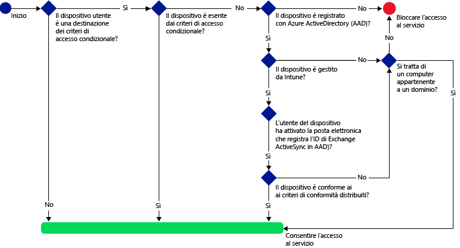
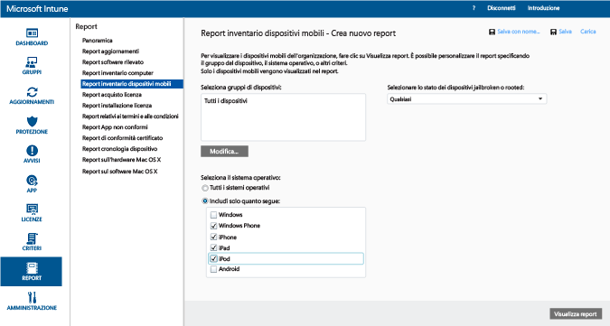
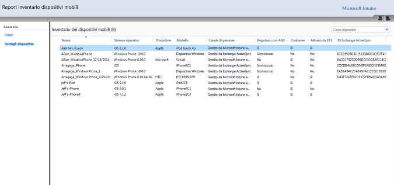
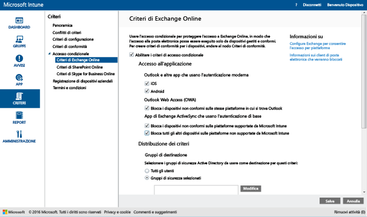
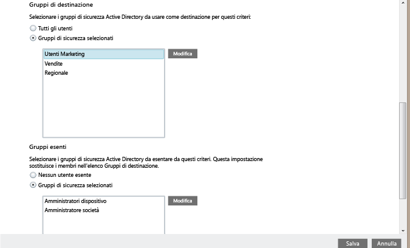
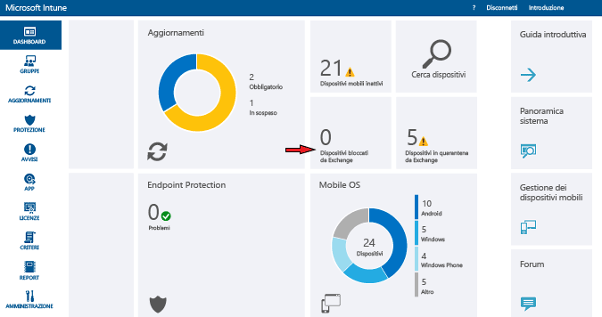

# Limitare l'accesso alla posta elettronica per Exchange Online e il nuovo ambiente Exchange Online dedicato

Se si dispone di un ambiente Exchange Online dedicato ed è necessario definire se si trova nell'ambiente di configurazione nuovo o legacy, contattare l'account manager.

Per controllare l'accesso alla posta elettronica per Exchange Online o il nuovo ambiente Exchange Online dedicato, configurare l'accesso condizionale per Exchange Online in Intune.
Per altre informazioni sul funzionamento dell'accesso condizionale, leggere l'articolo relativo alla [limitazione dell'accesso alla posta elettronica, a Office 365 e ad altri servizi](restrict-access-to-email-and-o365-services-with-microsoft-intune.md).

**Prima** di configurare l'accesso condizionale, è necessario:

-   Avere una **sottoscrizione a Office 365 che include Exchange Online (ad esempio E3)** e gli utenti devono avere una licenza per Exchange Online.

- Avere una **sottoscrizione di Enterprise Mobility + Security o una sottoscrizione di Azure Active Directory Premium** e gli utenti devono essere licenziatari di EMS o Azure AD. Per altre informazioni dettagliate, vedere la [pagina dei prezzi di Enterprise Mobility](https://www.microsoft.com/en-us/cloud-platform/enterprise-mobility-pricing) o la [pagina dei prezzi di Azure Active Directory](https://azure.microsoft.com/en-us/pricing/details/active-directory/).

-  Può essere opportuno configurare l'opzione facoltativa **Microsoft Intune Service to Service Connector** che connette [!INCLUDE[wit_nextref](../includes/wit_nextref_md.md)] a Microsoft Exchange Online e consente di gestire le informazioni sui dispositivi tramite la console di [!INCLUDE[wit_nextref](../includes/wit_nextref_md.md)]. Non è necessario usare il connettore per i criteri di conformità o i criteri di accesso condizionale, ma è obbligatorio eseguire i report per valutare l'impatto dell'accesso condizionale.

   > [!NOTE]
   > Non configurare Service to Service Connector se si prevede di usare l'accesso condizionale sia per Exchange Online che per Exchange locale.

   Per istruzioni su come configurare il connettore, vedere l'articolo relativo al [connettore Service to Service di Intune](intune-service-to-service-exchange-connector.md).

Quando i criteri per l'accesso condizionale sono stati configurati e indirizzati a un utente, prima che un utente possa connettersi alla posta elettronica, il **dispositivo** in uso deve:

-   Essere **registrato** con [!INCLUDE[wit_nextref](../includes/wit_nextref_md.md)] o essere un PC aggiunto a un dominio.

-  Essere **registrato in Azure Active Directory**. Ciò avviene automaticamente quando il dispositivo è registrato con [!INCLUDE[wit_nextref](../includes/wit_nextref_md.md)]. Inoltre, l'ID client Exchange ActiveSync deve essere registrato con Azure Active Directory.

  Il servizio AAD DRS verrà attivato automaticamente per i clienti di Intune e Office 365. I clienti che hanno già distribuito il servizio di registrazione dei dispositivi di ADFS non visualizzeranno i dispositivi registrati in Active Directory locale.

-   Essere **compatibile** con qualsiasi criterio di conformità di [!INCLUDE[wit_nextref](../includes/wit_nextref_md.md)] distribuito per quel dispositivo o unito a un dominio locale.

Se i criteri di accesso condizionale non vengono soddisfatti, all'accesso l'utente visualizzerà uno dei messaggi seguenti:

- Se il dispositivo non è registrato con [!INCLUDE[wit_nextref](../includes/wit_nextref_md.md)] oppure non è registrato in Azure Active Directory, viene visualizzato un messaggio contenente istruzioni su come installare l'app Portale aziendale, eseguire la registrazione e attivare la posta elettronica. Questo processo associa anche l'ID Exchange ActiveSync del dispositivo con il record in Azure Active Directory.

-   Se il dispositivo viene dichiarato non conforme con le regole dei criteri di conformità, l'utente viene reindirizzato al sito Web del portale aziendale o all'app Portale aziendale di [!INCLUDE[wit_nextref](../includes/wit_nextref_md.md)] dove sono disponibili informazioni sul problema e su come risolverlo.

L'immagine seguente illustra il flusso usato dai criteri di accesso condizionale per Exchange Online.

## Supporto per dispositivi mobili
È possibile limitare l'accesso per la posta elettronica a Exchange Online da **Outlook** e altre **app che usano l'autenticazione moderna**:

- Android 4.0 e versioni successive, Samsung Knox Standard 4.0 e versioni successive e Android for Work
- iOS 8.0 e versioni successive
- Windows Phone 8.1 e versioni successive

Con l'**autenticazione moderna**, i client Microsoft Office possono usare l'accesso basato su Active Directory Authentication Library (ADAL).

-   Questo tipo di autenticazione consente ai client Office di usare l'autenticazione basata su browser, nota anche come autenticazione passiva.  Per eseguire l'autenticazione, l'utente viene indirizzato a una pagina Web di accesso. Questo nuovo metodo di accesso offre migliori opzioni di sicurezza, come l'**autenticazione a più fattori** e **l'autenticazione basata sui certificati**.
Per maggiori informazioni sul funzionamento dell'autenticazione moderna, vedere questo [articolo](https://support.office.com/en-US/article/How-modern-authentication-works-for-Office-2013-and-Office-2016-client-apps-e4c45989-4b1a-462e-a81b-2a13191cf517).
Configurare le regole delle attestazioni ADFS per bloccare i protocolli di autenticazione non moderni. Istruzioni dettagliate sono descritte nello scenario 3: [Bloccare completamente l'accesso a Office 365, ad eccezione delle applicazioni basate su browser](https://technet.microsoft.com/library/dn592182.aspx).

È possibile limitare l'accesso a **Outlook Web Access (OWA)** in Exchange Online quando si accede da un browser in dispositivi **iOS** e **Android**.  L'accesso verrà consentito solo dai browser supportati su dispositivi conformi:

* Safari (iOS)
* Chrome (Android)
* Managed Browser (iOS e Android)

**I browser non supportati verranno bloccati**.

**L'app OWA per iOS e Android può essere modificata in modo da evitare l'uso dell'autenticazione moderna e non è supportata.  L'accesso dall'applicazione OWA deve essere bloccato tramite le regole delle attestazioni di AD FS.**

È possibile limitare l'accesso per la posta elettronica a Exchange dal **client di posta elettronica Exchange ActiveSync** integrato sulle piattaforme seguenti:

- Android 4.0 e versioni successive, Samsung Knox Standard 4.0 e versioni successive

- iOS 8.0 e versioni successive

- Windows Phone 8.1 e versioni successive

## Supporto per PC

È possibile configurare l'accesso condizionale per i PC che eseguono le applicazioni desktop di Office al fine di accedere a **Exchange Online** e **SharePoint Online** , se i PC soddisfano i requisiti seguenti:

-   Il PC deve eseguire Windows 7.0, Windows 8.1 o Windows 10.

  >[!NOTE]
  > Per usare l'accesso condizionale con PC Windows 10, è necessario aggiornare i PC con Windows 10 Anniversary Update.

  Il PC deve essere aggiunto a un dominio oppure essere conforme alle regole dei criteri di conformità.

  Affinché sia ritenuto conforme, il PC deve essere registrato in [!INCLUDE[wit_nextref](../includes/wit_nextref_md.md)] e rispettare i criteri.

  Per i PC aggiunti a un dominio, è necessario configurare la [registrazione automatica del dispositivo](https://azure.microsoft.com/documentation/articles/active-directory-conditional-access-automatic-device-registration/) con Azure Active Directory.

  >[!NOTE]
    >L'accesso condizionale non è supportato nei computer che eseguono il client dei computer Intune.

-   [L'autenticazione moderna di Office 365 deve essere abilitata](https://support.office.com/en-US/article/Using-Office-365-modern-authentication-with-Office-clients-776c0036-66fd-41cb-8928-5495c0f9168a) ed è necessario disporre di tutti gli aggiornamenti di Office più recenti.

    L'autenticazione moderna consente l'accesso basato su Active Directory Authentication Library (ADAL) ai client Windows con Office 2013 e offre migliori opzioni di sicurezza, come l'**autenticazione a più fattori** e l'**autenticazione basata sui certificati**.

-   Configurare le regole delle attestazioni AD FS per bloccare i protocolli di autenticazione non moderni. Istruzioni dettagliate sono descritte nello scenario 3: [Bloccare completamente l'accesso a Office 365, ad eccezione delle applicazioni basate su browser](https://technet.microsoft.com/library/dn592182.aspx).

## Configurare l'accesso condizionale
### Passaggio 1: Configurare e distribuire i criteri di conformità
Assicurarsi di [creare](create-a-device-compliance-policy-in-microsoft-intune.md) e [distribuire](deploy-and-monitor-a-device-compliance-policy-in-microsoft-intune.md) i criteri di conformità ai gruppi di utenti che riceveranno anche i criteri di accesso condizionale.

> [!IMPORTANT]
> Se i criteri di conformità non sono stati distribuiti, i dispositivi verranno considerati conformi e verrà loro consentito l'accesso a Exchange.

### Passaggio 2: Valutare l'effetto dei criteri di accesso condizionale
È possibile usare i **Report inventario dispositivi mobili** per individuare i dispositivi che non potranno accedere a Exchange dopo aver configurato i criteri di accesso condizionale.

A tale scopo, configurare una connessione tra [!INCLUDE[wit_nextref](../includes/wit_nextref_md.md)] ed Exchange usando [Microsoft Intune Service to Service Connector](intune-service-to-service-exchange-connector.md).
1.  Accedere a **Report -> Report inventario dispositivi mobili**.

2.  Nei parametri del report selezionare il gruppo [!INCLUDE[wit_nextref](../includes/wit_nextref_md.md)] da valutare e, se necessario, le piattaforme del dispositivo a cui applicare i criteri.
3.  Dopo aver selezionato i criteri che soddisfano le esigenze dell'organizzazione, scegliere **Visualizza report**.
Il Visualizzatore report verrà aperto in una nuova finestra.

Dopo aver eseguito il report, esaminare le quattro colonne seguenti per determinare se un utente verrà bloccato:

-   **Canale di gestione** : indica se il dispositivo è gestito da Intune, Exchange ActiveSync o entrambi.

-   **AAD registrato** : indica se il dispositivo è registrato con Azure Active Directory (aggiunto all'area di lavoro).

-   **Conforme** : indica se il dispositivo è conforme ai criteri di conformità distribuiti.

-   **ID Exchange ActiveSync** : i dispositivi iOS e Android devono avere un ID Exchange ActiveSync associato al record di registrazione del dispositivo in Azure Active Directory. Ciò si verifica quando l'utente sceglie il collegamento di **attivazione della posta elettronica** nel messaggio di posta elettronica di quarantena.

    > [!NOTE]
    > Per i dispositivi Windows Phone un valore viene sempre visualizzato in questa colonna.

L'accesso ad Exchange da parte dei dispositivi che appartengono a un gruppo di destinazione verrà bloccato a meno che i valori delle colonne non corrispondano a quelli elencati nella tabella seguente:

--------------------------
|Canale di gestione|AAD registrato|Conforme|ID Exchange ActiveSync|Azione risultante|
|----------------------|------------------|-------------|--------------------------|--------------------|
|**Gestito da Microsoft Intune ed Exchange ActiveSync**|Sì|Sì|Viene visualizzato un valore|Accesso alla posta elettronica consentito|
|Qualsiasi altro valore|No|No|Non viene visualizzato alcun valore|Accesso alla posta elettronica bloccato|
----------------------
È possibile esportare il contenuto del report e usare la colonna **Indirizzo di posta elettronica** per informare gli utenti che verranno bloccati.

### Passaggio 3: Configurare i gruppi di utenti per i criteri di accesso condizionale.
I criteri di accesso condizionale sono destinati a diversi gruppi di utenti di sicurezza di Azure Active Directory. È anche possibile escludere alcuni gruppi di utenti da questi criteri.  Quando a un utente viene destinato un criterio, ogni dispositivo in uso deve essere conforme per accedere alla posta elettronica.

È possibile configurare questi gruppi nel **centro di amministrazione di Office 365**o nel **portale per gli account di Intune**.

È possibile specificare due tipi di gruppi in ogni criterio:

-   **Gruppi di destinazione**: gruppi di utenti a cui sono applicati i criteri

-   **Gruppi esentati** : gruppi di utenti che sono esentati dai criteri (facoltativo)

Se un utente si trova in entrambi i gruppi, sarà esentato dai criteri.

Solo i gruppi che sono considerati come destinazione dei criteri di accesso condizionale vengono valutati.

### Passaggio 4: Configurare i criteri di accesso condizionale

>[!NOTE]
> È inoltre possibile creare criteri di accesso condizionale nella console di gestione di Azure AD. La console di gestione di Azure AD consente di creare i criteri di accesso condizionale del dispositivo Intune (definiti come **criteri di accesso condizionale basato su dispositivo** in Azure AD) oltre ad altri criteri di accesso condizionale come l'autenticazione a più fattori.  È inoltre possibile impostare i criteri di accesso condizionale per app aziendali di terze parti come Salesforce e Box supportate da Azure AD. Per altre informazioni dettagliate, vedere [Come impostare criteri di accesso condizionale basato su dispositivo di Azure Active Directory per controllare gli accessi delle applicazioni connesse ad Azure Active Directory](https://azure.microsoft.com/en-us/documentation/articles/active-directory-conditional-access-policy-connected-applications/).

1.  Nella [console di amministrazione di Microsoft Intune](https://manage.microsoft.com) scegliere **Criteri** > **Accesso condizionale** > **Criteri di Exchange Online**.

2.  Nella pagina **Criteri di Exchange Online** selezionare **Abilita criteri di accesso condizionale per Exchange Online**.

    > [!NOTE]
    > Se i criteri di conformità non sono stati distribuiti, i dispositivi vengono considerati conformi.
    >
    > Indipendentemente dallo stato di conformità, tutti gli utenti interessati dai criteri dovranno registrare i propri dispositivi con [!INCLUDE[wit_nextref](../includes/wit_nextref_md.md)].

3.  In **Accesso all'applicazione**, per le app che usano l'autenticazione moderna, sono disponibili due modi per scegliere le piattaforme su cui applicare i criteri. Le piattaforme supportate includono Android, iOS, Windows e Windows Phone.

    -   **Tutte le piattaforme**

        Tutti i dispositivi usati per accedere a **Exchange Online** dovranno essere registrati in Intune e dovranno essere conformi ai criteri.  Tutte le applicazioni client che usano l'**autenticazione moderna** sono soggette ai criteri di accesso condizionale e, se la piattaforma non è attualmente supportata da Intune, l'accesso a **Exchange Online** risulta bloccato.

        La selezione dell'opzione **Tutte le piattaforme** indica che Azure Active Directory applicherà questo criterio a tutte le richieste di autenticazione, indipendentemente dalla piattaforma segnalata dall'applicazione client.  Tutte le piattaforme dovranno essere registrate e conformi, ad eccezione di:
        *   I dispositivi Windows dovranno essere registrati e conformi e/o aggiunti a un dominio con Active Directory locale
        * Piattaforme non supportate come Mac OS.  Tuttavia, le app che usano l'autenticazione moderna da queste piattaforme verranno comunque bloccate.

    -   **Piattaforme specifiche**

         I criteri di accesso condizionale si applicano a tutte le app client che usano l'**autenticazione moderna** nelle piattaforme specificate.

4. In **Outlook Web Access (OWA)** è possibile scegliere di consentire l'accesso a Exchange Online solo dai browser supportati: Safari (iOS) e Chrome (Android). Non sarà possibile accedere da altri browser. Vengono applicate le stesse restrizioni di piattaforma selezionate per l'accesso all'applicazione per Outlook.

  Nei dispositivi **Android** gli utenti devono abilitare l'accesso al browser.  Per eseguire questa operazione, l'utente finale deve abilitare l'opzione "Abilita l'accesso al browser" sul dispositivo registrato come indicato di seguito:
  1.    Avviare **l'app Portale aziendale**.
  2.    Passare alla pagina **Impostazioni** dai tre punti (...) o usando il pulsante di menu hardware.
  3.    Premere il pulsante **Abilita l'accesso al browser**.
  4.    Nel browser Chrome disconnettersi da Office 365 e riavviare Chrome.

  Nelle piattaforme **iOS e Android**, per identificare il dispositivo usato per accedere al servizio, Azure Active Directory emetterà un certificato TLS (Transport Layer Security) per il dispositivo.  Il dispositivo visualizza il certificato richiedendo all'utente finale la selezione del certificato, come illustrato nelle schermate riportate di seguito. L'utente finale deve selezionare il certificato per poter continuare a usare il browser.

  **iOS**

  

  **Android**

  

5.  In **App Exchange ActiveSync** è possibile scegliere di bloccare i dispositivi non conformi dall'accesso a Exchange Online. È anche possibile scegliere se consentire o bloccare l'accesso alla posta elettronica quando il dispositivo non esegue una piattaforma supportata. Le piattaforme supportate includono Android, iOS, Windows e Windows Phone.

 App Exchange Active Sync **dispositivi Android for Work**:
 -  Nei dispositivi Android for Work sono supportate solo le app **Gmail**e **Nine Work** nel **profilo di lavoro**. Perché l'accesso condizionale funzioni nei dispositivi Android for Work, è necessario distribuire un profilo di posta elettronica per l'app Gmail o Nine Work. È anche necessario distribuire tale profilo come installazione **obbligatoria**. 

6.  In **Gruppi di destinazione**selezionare i gruppi di sicurezza di Active Directory degli utenti ai quali applicare i criteri. È possibile scegliere come destinazione tutti gli utenti o un elenco di gruppi di utenti selezionato.

    > [!NOTE]
    > Per gli utenti inclusi nei **Gruppi di destinazione** i criteri di Intune sostituiranno le regole e i criteri di Exchange.
    >
    > Exchange imporrà solo le regole di autorizzazione, blocco e quarantena e i criteri di Exchange se:
    >
    > -   L'utente non dispone di una licenza per Intune.
    > -   L'utente dispone di una licenza per Intune, ma non appartiene a nessuno dei gruppi di sicurezza di destinazione nei criteri di accesso condizionale.

6.  In **Gruppi esentati**selezionare i gruppi di sicurezza di Active Directory degli utenti che verranno esentati da questi criteri. Se un utente è incluso sia nel gruppo di destinazione che in quello esentato, viene esentato dai criteri.

7.  Al termine, scegliere **Salva**.

-   Non è necessario distribuire i criteri di accesso condizionale perché diventano immediatamente effettivi.

-   Dopo la creazione di un account di posta elettronica da parte di un utente, il dispositivo viene bloccato immediatamente.

-   Se un utente bloccato registra il dispositivo con [!INCLUDE[wit_nextref](../includes/wit_nextref_md.md)] e risolve eventuali problemi di conformità, l'accesso alla posta elettronica viene sbloccato entro 2 minuti.

-   Se l'utente annulla la registrazione del dispositivo, la posta elettronica viene bloccata dopo circa 6 ore.

**Per vedere alcuni scenari di esempio sulla configurazione dei criteri di accesso condizionale per limitare l'accesso dei dispositivi, vedere [Restrict access to email with Microsoft Intune: Example scenarios](restrict-email-access-example-scenarios.md) (Limitare l'accesso alla posta elettronica: scenari di esempio).**

## Monitorare i criteri di conformità e di accesso condizionale

#### Per visualizzare i dispositivi bloccati da Exchange

Nel dashboard di [!INCLUDE[wit_nextref](../includes/wit_nextref_md.md)] scegliere il riquadro **Dispositivi bloccati da Exchange** per visualizzare il numero di dispositivi bloccati e i collegamenti ad altre informazioni.

## Passaggi successivi
[Limitare l'accesso a SharePoint Online](restrict-access-to-sharepoint-online-with-microsoft-intune.md)

[Limitare l'accesso a Skype for Business Online](restrict-access-to-skype-for-business-online-with-microsoft-intune.md)

<!--HONumber=Oct16_HO3-->

