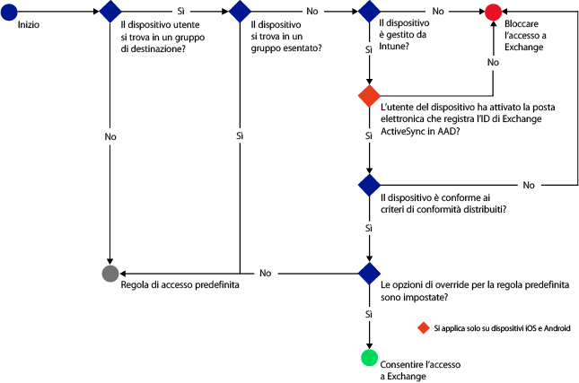
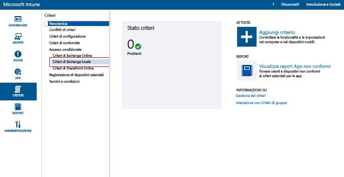
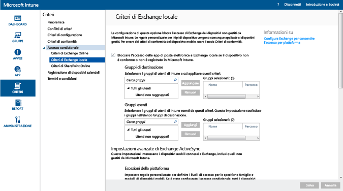

---
# required metadata

title: Limitare l'accesso alla posta elettronica per Exchange locale e l'ambiente legacy Exchange Online dedicato | Microsoft Intune
description:
keywords:
author: karthikaraman
manager: jeffgilb
ms.date: 04/28/2016
ms.topic: article
ms.prod:
ms.service: microsoft-intune
ms.technology:
ms.assetid: a55071f5-101e-4829-908d-07d3414011fc

# optional metadata

#ROBOTS:
#audience:
#ms.devlang:
ms.reviewer: chrisgre
ms.suite: ems
#ms.tgt_pltfrm:
#ms.custom:

---

# Limitare l'accesso alla posta elettronica per Exchange locale e l'ambiente legacy Exchange Online dedicato con Intune

Se si dispone di un ambiente Exchange Online dedicato ed è necessario definire se si trova nell'ambiente di configurazione nuovo o legacy, contattare l'account manager.

Per controllare l'accesso alla posta elettronica per Exchange locale o per l'ambiente legacy Exchange Online dedicato, configurare l'accesso condizionale per Exchange locale in Intune.
Per altre informazioni sul funzionamento dell'accesso condizionale, leggere l'articolo [Limitare l'accesso alla posta elettronica e ai servizi di Office 365]( restrict-access-to-email-and-o365-services-with-microsoft-intune.md).

**Prima** di configurare l'accesso condizionale, verificare quanto segue:

-   La versione di Exchange deve essere **Exchange 2010 o successiva**. È supportato un array del server Accesso client di Exchange Server.

-   È necessario usare **On-premises Exchange Connector** che connette [!INCLUDE[wit_nextref](../includes/wit_nextref_md.md)] a Microsoft Exchange locale. Questo connettore consente di gestire i dispositivi attraverso la console di [!INCLUDE[wit_nextref](../includes/wit_nextref_md.md)]. Per informazioni dettagliate sul connettore, vedere [Install the Intune on-premises Exchange Connector](intune-on-premises-exchange-connector.md) (Installare On-premises Exchange Connector).

    -   On-premises Exchange Connector, disponibile nella console di Intune, è specifico del tenant di Intune e non può essere usato con un altro tenant. È necessario anche assicurarsi che Exchange Connector per il tenant sia installato **in un solo computer**.

        Questo connettore deve essere scaricato dalla console di amministrazione di Intune.  Per una procedura dettagliata sulla configurazione di On-premises Exchange Connector, vedere [Install the Intune on-premises Exchange Connector](intune-on-premises-exchange-connector.md) (Installare Intune On-premises Exchange Connector).

    -   Il connettore può essere installato in qualsiasi computer, purché sia in grado di comunicare con il server di Exchange.

    -   Questo connettore supporta l'**ambiente CAS di Exchange**. Anche se è tecnicamente possibile, non è consigliabile installare il connettore direttamente nel server CAS di Exchange perché aumenta il carico sul server.
    Quando si configura il connettore, è necessario configurarlo in modo che comunichi con uno dei server CAS di Exchange.

-   È necessario configurare **Exchange ActiveSync** per l'autenticazione basata su certificati o l'immissione di credenziali utente.

Quando i criteri per l'accesso condizionale sono stati configurati e indirizzati a un utente, prima che un utente possa connettersi alla posta elettronica, il **dispositivo** in uso deve:

-  Essere **registrato** con [!INCLUDE[wit_nextref](../includes/wit_nextref_md.md)] o essere un PC aggiunto a un dominio.

-  Essere **registrato in Azure Active Directory**. Inoltre, l'ID client Exchange ActiveSync deve essere registrato con Azure Active Directory.

  Il servizio AAD DRS verrà attivato automaticamente per i clienti di Intune e Office 365. I clienti che hanno già distribuito il servizio di registrazione dei dispositivi di ADFS non visualizzeranno i dispositivi registrati in Active Directory locale. **Ciò non si applica ai PC Windows e ai dispositivi Windows Phone**.

-   Essere **compatibile** con i criteri di conformità di [!INCLUDE[wit_nextref](../includes/wit_nextref_md.md)] distribuiti per il dispositivo.

L'immagine seguente illustra il flusso usato dai criteri di accesso condizionale perché Exchange locale possa valutare se consentire o bloccare i dispositivi.

 Se un criterio di accesso condizionale non viene soddisfatto, quando l'utente tenta di eseguire l'accesso, viene visualizzato uno dei seguenti messaggi:

- Se il dispositivo non è registrato con [!INCLUDE[wit_nextref](../includes/wit_nextref_md.md)] oppure non è registrato in Azure Active Directory, viene visualizzato un messaggio contenente istruzioni su come installare l'app Portale aziendale, eseguire la registrazione e attivare la posta elettronica. Questo processo associa anche l'ID Exchange ActiveSync del dispositivo con il record del dispositivo in Azure Active Directory.

-   Se il dispositivo non è conforme, viene visualizzato un messaggio che indirizza l'utente al sito Web del portale aziendale o all'app Portale aziendale di [!INCLUDE[wit_nextref](../includes/wit_nextref_md.md)] dove sono disponibili informazioni sul problema e su come risolverlo.

## Supporto per dispositivi mobili
-   Windows Phone 8 e versioni successive

-   App di posta elettronica nativa in iOS

-   App di posta elettronica nativa in Android versione 4 o successiva
> [!NOTE] L'app di Microsoft Outlook per Android e iOS non è supportata.

## Supporto per PC

L'applicazione **Posta elettronica** in Windows 8 e versioni successive (se registrata con [!INCLUDE[wit_nextref](../includes/wit_nextref_md.md)])

##  Configurare i criteri di accesso condizionale

1.  Nella [console di amministrazione di Microsoft Intune](https://manage.microsoft.com) scegliere **Criteri** > **Accesso condizionale** > **Criteri di Exchange locale**.

2.  Configurare i criteri con le impostazioni richieste: 

  - **Bloccare l'accesso delle app di posta elettronica a Exchange locale se il dispositivo non è conforme o non è registrato in Microsoft Intune:** quando si seleziona questa opzione, ai dispositivi non gestiti da [!INCLUDE[wit_nextref](../includes/wit_nextref_md.md)] o non compatibili con i criteri di conformità non è consentito l'accesso ai servizi di Exchange.

  - **Override regola predefinita - Consenti sempre l'accesso a Exchange ai dispositivi registrati e conformi:** quando si seleziona questa opzione, i dispositivi registrati in Intune e conformi ai criteri di conformità possono accedere a Exchange.  
  Questa regola sostituisce la **regola predefinita**, ossia anche se si definisce per la **regola predefinita** l'impostazione per la quarantena o il blocco dell'accesso, i dispositivi registrati e conformi potranno accedere a Exchange.

  - **Gruppi di destinazione:** selezionare i gruppi di utenti di [!INCLUDE[wit_nextref](../includes/wit_nextref_md.md)] che devono registrare il proprio dispositivo con [!INCLUDE[wit_nextref](../includes/wit_nextref_md.md)] per poter accedere a Exchange.

  - **Gruppi di esenzione**: selezionare i gruppi di utenti di [!INCLUDE[wit_nextref](../includes/wit_nextref_md.md)] esclusi dai criteri di accesso condizionale. Gli utenti in questo elenco saranno esenti anche se sono inclusi nell'elenco **Gruppi di destinazione**.

  - **Eccezioni della piattaforma:** scegliere **Aggiungi regola** per configurare una regola che definisce i livelli di accesso per gruppi e modelli specificati di dispositivi mobili. Poiché questi dispositivi possono essere di qualsiasi tipo, possono essere configurati anche i tipi di dispositivo non supportati da [!INCLUDE[wit_nextref](../includes/wit_nextref_md.md)].

  - **Regola predefinita:** per un dispositivo non soggetto a nessun'altra regola, è possibile scegliere di consentire l'accesso a Exchange, bloccarlo o metterlo in quarantena. Quando si imposta la regola per consentire l'accesso, per i dispositivi registrati e conformi, l'accesso alla posta elettronica viene concesso automaticamente per i dispositivi iOS, Windows e Samsung KNOX. L'utente finale non deve eseguire alcuna procedura per ottenere l'accesso alla posta elettronica.  Nei dispositivi Android che non eseguono Samsung KNOX, gli utenti finali visualizzeranno un messaggio di posta elettronica di quarantena che include una procedura guidata per verificare la conformità e la registrazione prima di poter accedere alla posta elettronica. Se si definisce l'impostazione per la quarantena o il blocco dell'accesso, viene bloccato l'accesso a Exchange per tutti i dispositivi, indipendentemente dalla registrazione a Intune. Per impedire che i dispositivi registrati e conformi siano interessati da questa regola, selezionare **Override regola predefinita**.
>[!TIP]
>Se si intende bloccare tutti i dispositivi prima di concedere l'accesso alla posta elettronica, selezionare la regola per il blocco dell'accesso o la quarantena. La regola predefinita verrà applicata a tutti i tipi di dispositivo, quindi avrà effetto anche sui tipi configurati come eccezioni di piattaforma e che non sono supportati da [!INCLUDE[wit_nextref](../includes/wit_nextref_md.md)].

  - **Notifica utente:** oltre al messaggio di posta elettronica di notifica inviato da Exchange, Intune invia un messaggio di posta elettronica che contiene i passaggi per sbloccare il dispositivo. È possibile modificare il messaggio predefinito per personalizzarlo in base alle proprie esigenze. Poiché il messaggio di posta elettronica di notifica di Intune contenente le istruzioni per la correzione viene recapitato alla cassetta postale di Exchange dell'utente, nel caso in cui il dispositivo dell'utente venga bloccato prima della ricezione del messaggio di posta elettronica, è possibile usare un dispositivo sbloccato o un altro metodo per accedere a Exchange e visualizzare il messaggio. Questa opzione è utile soprattutto quando la **regola predefinita** è impostata per il blocco o la quarantena.  In questo caso, l'utente finale dovrà passare al relativo archivio app, scaricare l'app Portale aziendale Microsoft e registrare il dispositivo. Questa opzione è disponibile per i dispositivi iOS, Windows e Samsung KNOX.  Per i dispositivi che non eseguono Samsung KNOX, è necessario inviare il messaggio di posta elettronica di quarantena a un account di posta elettronica alternativo, che quindi l'utente finale dovrà copiare nel dispositivo bloccato per completare la procedura di registrazione e conformità.
  > [!NOTE] Affinché Exchange possa inviare il messaggio di posta elettronica di notifica, è necessario specificare l'account che verrà usato per inviare tale messaggio.
  >
  > Per informazioni dettagliate, vedere [Install the Intune on-premises Exchange Connector](intune-on-premises-exchange-connector.md) (Installare On-premises Exchange Connector).

3.  Al termine, scegliere **Salva**.

-   Non è necessario distribuire i criteri di accesso condizionale perché diventano immediatamente effettivi.

-   Dopo la configurazione di un profilo di Exchange ActiveSync, il blocco del dispositivo potrebbe richiedere da 1 a 3 ore, a meno che non sia gestito da [!INCLUDE[wit_nextref](../includes/wit_nextref_md.md)].

-   Se un utente bloccato registra il dispositivo con [!INCLUDE[wit_nextref](../includes/wit_nextref_md.md)] e risolve il problema di conformità, l'accesso alla posta elettronica verrà sbloccato entro 2 minuti.

-   Se l'utente annulla la registrazione a [!INCLUDE[wit_nextref](../includes/wit_nextref_md.md)], il blocco del dispositivo potrebbe richiedere da 1 a 3 ore.

**Per vedere alcuni scenari di esempio sulla configurazione dei criteri di accesso condizionale per limitare l'accesso dei dispositivi, vedere [Restrict access to email with Microsoft Intune: Example scenarios](restrict-email-access-example-scenarios.md) (Limitare l'accesso alla posta elettronica: scenari di esempio).**

## Passaggi successivi
[Limitare l'accesso a SharePoint Online](restrict-access-to-sharepoint-online-with-microsoft-intune.md)

[Limitare l'accesso a Skype for Business Online](restrict-access-to-skype-for-business-online-with-microsoft-intune.md)

<!--HONumber=Jun16_HO2-->

