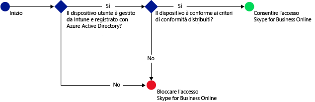
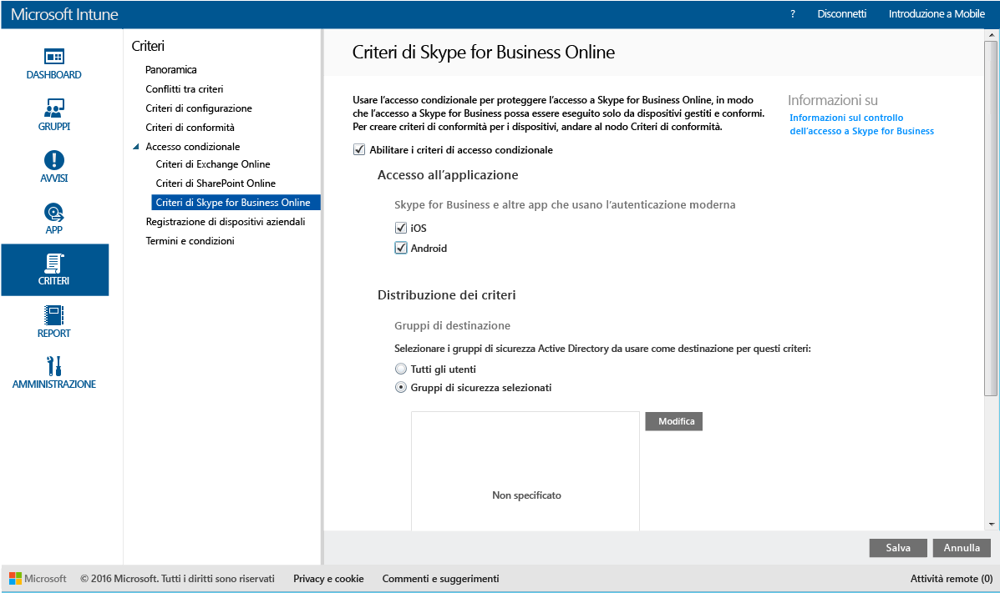

# Limitare l'accesso a Skype for Business Online con Microsoft Intune
Usare i criteri di accesso condizionale per **Skype for Business Online** per controllare l'accesso a Skype for Business Online.
L'accesso condizionale è costituito da due componenti:
- Criteri di conformità che il dispositivo deve soddisfare per essere considerato conforme.
- Criteri di accesso condizionale in cui si specificano le condizioni che il dispositivo deve soddisfare per poter accedere al servizio.
Per altre informazioni sul funzionamento dell'accesso condizionale, leggere l'articolo [Limitare l'accesso alla posta elettronica e ai servizi di Office 365](restrict-access-to-email-and-o365-services-with-microsoft-intune.md).

Quando un utente di destinazione tenta di usare Skype for Business Online sul proprio dispositivo, si verifica quanto segue:

**Prima** di configurare i criteri di accesso condizionale per Skype for Business Online è necessario:
- Avere una **sottoscrizione di Skype for Business Online** e assegnare la licenza di Skype for Business agli utenti.
- Avere una sottoscrizione di **Enterprise Mobility Suite** o **Azure Active Directory Premium**.
-   [Abilitare l'autenticazione moderna](https://docs.microsoft.com/en-us/intune/deploy-use/restrict-access-to-skype-for-business-online-with-microsoft-intune) per Skype for Business Online.
-  Tutti gli utenti finali devono usare **Skype for Business Online**. Se si ha una distribuzione con Skype for Business Online e Skype for Business locale, i criteri di accesso condizionale non verranno applicati agli utenti finali.

    Il dispositivo che necessita dell'accesso a Skype for Business Online deve:

-   Essere un dispositivo **Android** o **iOS**.

-   Essere **registrato** con [!INCLUDE[wit_nextref](../includes/wit_nextref_md.md)].

-   Essere **compatibile** con i criteri di conformità di [!INCLUDE[wit_nextref](../includes/wit_nextref_md.md)] distribuiti.

Lo stato del dispositivo viene archiviato in Azure Active Directory che consente o blocca l'accesso, in base alle condizioni specificate.

Se non viene soddisfatta una condizione, viene visualizzato uno dei due messaggi seguenti quando l'utente esegue l'accesso:

-   Se il dispositivo non è registrato con [!INCLUDE[wit_nextref](../includes/wit_nextref_md.md)] oppure non è registrato in Azure Active Directory, viene visualizzato un messaggio contenente istruzioni su come installare l'app Portale aziendale ed eseguire la registrazione.

-   Se il dispositivo non è conforme, viene visualizzato un messaggio che indirizza l'utente al sito Web del portale aziendale o all'app Portale aziendale di [!INCLUDE[wit_nextref](../includes/wit_nextref_md.md)] dove sono disponibili informazioni sul problema e su come risolverlo.

## Configurare i criteri di accesso condizionale per Skype for Business Online

### Passaggio 1: Configurare i gruppi di sicurezza di Active Directory
Prima di iniziare configurare i gruppi di sicurezza di Azure Active Directory per i criteri di accesso condizionale. È possibile configurare questi gruppi nel **centro di amministrazione di Office 365**. Questi gruppi verranno usati per destinare o escludere gli utenti dai criteri. Per poter accedere alle risorse, un utente di destinazione in un criterio deve usare solo dispositivi conformi.

È possibile specificare due tipi di gruppo da usare per i criteri di Skype for Business:

-   **Gruppi di destinazione**: contiene i gruppi di utenti ai quali si applicano i criteri.

-   **Gruppi di esenzione**: contiene i gruppi di utenti esclusi dai criteri.

Se un utente si trova in entrambi i gruppi, sarà esentato dai criteri.

### Passaggio 2: Configurare e distribuire i criteri di conformità
[Creare](create-a-device-compliance-policy-in-microsoft-intune.md) e [distribuire](deploy-and-monitor-a-device-compliance-policy-in-microsoft-intune.md) i criteri di conformità a tutti i dispositivi interessati dai criteri, ossia tutti i dispositivi usati dagli utenti nei **Gruppi di destinazione**.

> [!NOTE]
> Mentre i criteri di conformità vengono distribuiti nei gruppi di [!INCLUDE[wit_nextref](../includes/wit_nextref_md.md)], i criteri di accesso condizionale sono destinati ai gruppi di sicurezza di Azure Active Directory.

> [!IMPORTANT]
> Se i criteri di conformità non sono stati distribuiti, i dispositivi verranno considerati conformi.

Quando si è pronti, continuare con il **Passaggio 3**.

### Passaggio 3: Configurare i criteri di Skype for Business Online
A questo punto, configurare i criteri in modo che solo i dispositivi gestiti e conformi possano accedere a Skype for Business Online. Questi criteri verranno archiviati in Azure Active Directory.

####
1.  Nella [console di amministrazione di Microsoft Intune](https://manage.microsoft.com) fare clic su **Criteri** > **Accesso condizionale** > **Criteri di Skype for Business Online**.

2.  Selezionare **Abilitare i criteri di accesso condizionale**.

3.  In **Accesso all'applicazione** è possibile scegliere di applicare i criteri di accesso condizionale a:

    -   **iOS**

    -   **Android**

4.  In **Gruppi di destinazione**fare clic su **Modifica** per selezionare i gruppi di sicurezza di Azure Active Directory ai quali verranno applicati i criteri. È possibile scegliere di applicare questa opzione a tutti gli utenti o solo a un gruppo di utenti selezionato.

5.  Facoltativamente, in **Gruppi esentati**fare clic su **Modifica** per selezionare i gruppi di sicurezza di Azure Active Directory esentati da questi criteri.

6.  Al termine, fare clic su **Salva**.

L'accesso condizionale per Skype for Business Online è stato configurato. Non è necessario distribuire i criteri di accesso condizionale perché diventano immediatamente effettivi.

## Monitorare i criteri di conformità e di accesso condizionale
Nell'area di lavoro **Gruppi** è possibile visualizzare lo stato dell'accesso condizionale per i dispositivi.

Selezionare un gruppo qualsiasi di dispositivi mobili e quindi nella scheda **Dispositivi** selezionare uno dei **filtri**seguenti:

* **Dispositivi non registrati con AAD**: si tratta dei dispositivi che non possono accedere a Skype for Business Online.

* **Dispositivi non conformi**: si tratta dei dispositivi che non possono accedere a Skype for Business Online.

* **Dispositivi conformi e registrati con AAD**: si tratta dei dispositivi che possono accedere a Skype for Business Online.

<!--HONumber=Jul16_HO3-->

