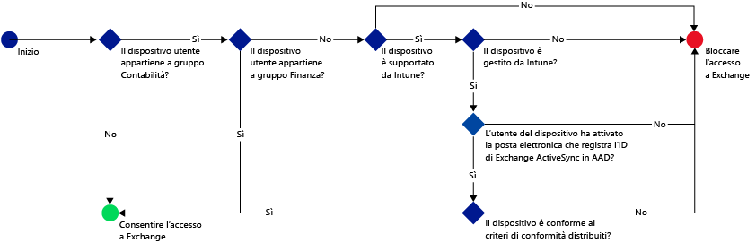
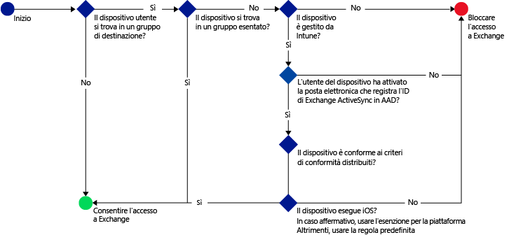
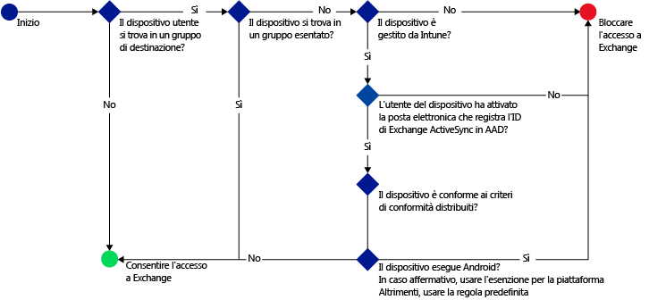

# Limitare l'accesso alla posta elettronica con Microsoft Intune: scenari di esempio

## Impedire agli utenti di usare dispositivi non conformi per accedere a Exchange Online
### Requisiti dello scenario
- L'accesso a Exchange Online per tutti gli utenti nel gruppo di sicurezza di Active Directory **Contabilità** deve essere bloccato se il dispositivo non è conforme ai criteri di conformità distribuiti.
- Se nel gruppo esistono utenti i cui dispositivi non sono supportati da [!INCLUDE[wit_nextref](../includes/wit_nextref_md.md)], è necessario che l'accesso a Exchange Online da parte di questi dispositivi sia bloccato.
- Gli utenti nel gruppo di sicurezza di Active Directory **Finanza** devono essere esclusi dai criteri, anche se sono inclusi nel gruppo di sicurezza **Contabilità**.

A tale scopo, configurare i criteri di accesso condizionale per Exchange Online con le impostazioni seguenti:

-   Selezionare **Abilitare i criteri di accesso condizionale**.

- Selezionare le piattaforme a cui si desidera consentire l'accesso da app con l'autenticazione moderna.
- Per le app di Exchange ActiveSync, selezionare **Blocca i dispositivi non conformi sulle piattaforme supportate da Microsoft Intune** e **Blocca tutti gli altri dispositivi sulle piattaforme non supportate da Microsoft Intune**.
-   Nella sezione **Gruppi di destinazione** in **Gruppi di sicurezza selezionati** scegliere il gruppo di utenti **Contabilità**.

-   Nella sezione **Gruppo di esenzione** in **Gruppi di sicurezza selezionati** scegliere il gruppo di utenti **Finanza**.

Il flusso seguente viene usato per decidere quali dispositivi possono accedere a Exchange Online:

## Tutti i dispositivi iOS che accedono a Exchange locale devono essere gestiti da Intune
### Requisiti dello scenario
- Solo ai dispositivi che eseguono iOS deve essere consentito l'accesso a Exchange locale.
- I dispositivi devono inoltre essere registrati in Intune e soddisfare le regole dei criteri di conformità prima di poter essere usati per accedere a Exchange.

A tale scopo, configurare i criteri di accesso condizionale seguenti per Exchange locale con queste impostazioni:

-   Selezionare l'opzione **Bloccare l'accesso delle app di posta elettronica a Exchange locale se il dispositivo non è conforme o non è registrato in Microsoft Intune**. Selezionando questa opzione, vengono abilitati i criteri di accesso condizionale, che richiedono che tutti i dispositivi debbano essere registrati in Microsoft Intune e debbano soddisfare le regole dei criteri di conformità prima di accedere a Exchange.

-   Per le impostazioni di Exchange Active Sync, creare:

  -   Un'eccezione della piattaforma che consente l'accesso a Exchange ai dispositivi che eseguono iOS.   

  -   Una regola predefinita che specifica che quando un dispositivo non è coperto dalla regola di eccezione della piattaforma, non deve accedere a Exchange. Questa regola consente di accertarsi che ai dispositivi che non eseguono iOS sia impedito l'accesso a Exchange.

Il flusso seguente viene usato per decidere quali dispositivi possono accedere a Exchange:

## I dispositivi Android non possono accedere a Exchange locale
### Requisiti dello scenario
- A tutti i dispositivi Android deve essere impedito l'accesso a Exchange.
- Tutti gli altri dispositivi supportati possono accedere a Exchange perché sono gestiti da [!INCLUDE[wit_nextref](../includes/wit_nextref_md.md)].

A tale scopo, configurare i criteri di accesso condizionale per Exchange locale con le impostazioni seguenti:

-   Selezionare l'opzione **Bloccare l'accesso delle app di posta elettronica a Exchange locale se il dispositivo non è conforme o non è registrato in Microsoft Intune**. Se si seleziona questa opzione, tutti i dispositivi devono essere registrati in Intune e devono soddisfare le regole dei criteri di conformità.

- Per le impostazioni di Exchange Active Sync, creare:
  -   Un'eccezione della piattaforma che blocca l'accesso a Exchange ai dispositivi che eseguono Android. Questa regola consente di accertarsi che per accedere a Exchange non vengano usati i dispositivi Android.

  -   Una regola predefinita che specifica che se un dispositivo non è coperto da altre regole, deve disporre dell'accesso a Exchange. Questa regola predefinita garantisce che i dispositivi che eseguono piattaforme diverse da Android, ma supportati da Microsoft Intune possano essere usati per accedere a Exchange. Devono tuttavia essere registrati in Intune e soddisfare le regole dei criteri di conformità.

Il flusso seguente viene usato per decidere quali dispositivi possono accedere a Exchange:

<!--HONumber=Jul16_HO3-->

