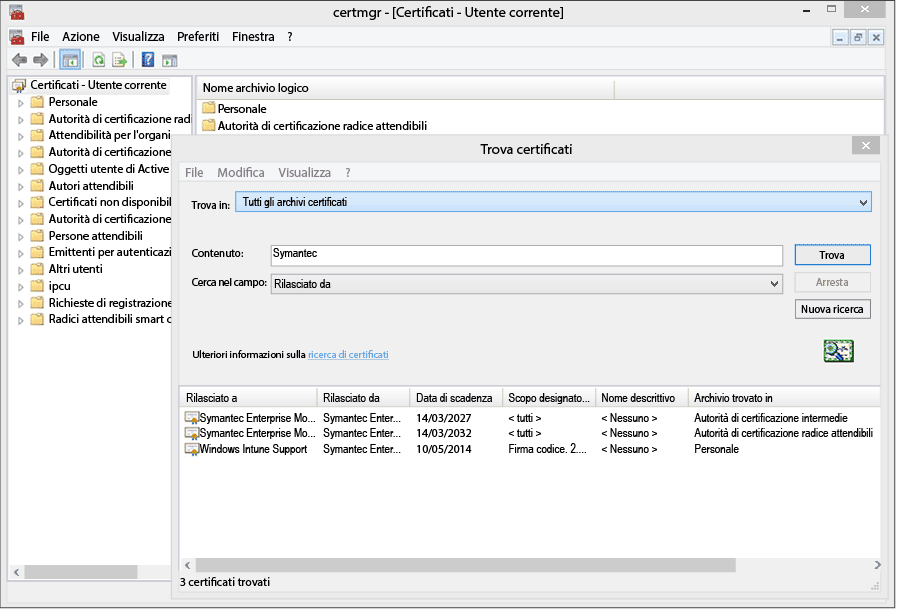
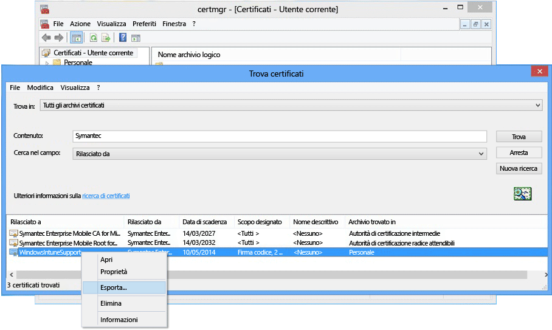

# <a name="sign-line-of-business-apps-so-they-can-be-deployed-to-windows-devices-with-intune"></a>Firmare le app line-of-business per poterle distribuire nei dispositivi Windows con Intune

L'amministratore di Intune ha la possibilità di distribuire app line-of-business (LOB) in dispositivi Windows e Windows 10 Mobile, inclusa l'app Portale aziendale. Per distribuire app con estensione appx o xap nei dispositivi Windows 10 e Windows 10 Mobile oppure per distribuire qualsiasi app LOB in dispositivi Windows 8.1 o Windows Phone 8.1, è necessario ottenere un **certificato di firma codice mobile aziendale Symantec**. Solo il certificato Symantec è considerato trusted per queste app per i rispettivi dispositivi Windows. È possibile usare un'Autorità di certificazione propria per le app di Windows 10 e le app universali. Questo certificato è necessario al fine di:

-   Firmare l'app Portale aziendale per la distribuzione in PC Windows, dispositivi Windows 10 Mobile e dispositivi Windows Phone

-   Firmare applicazioni line-of-business dell'azienda così che Intune possa distribuirle in dispositivi Windows

La procedura seguente consente di ottenere il certificato necessario e di firmare le app. È necessario disporre di un account Windows Phone Dev Center e acquistare un certificato Symantec.


1. **Iscriversi a Windows Phone Dev Center**<br>
   Iscriversi a [Windows Phone Dev Center](http://go.microsoft.com/fwlink/?LinkId=268442) utilizzando le informazioni sull'account aziendale durante l'accesso per l'acquisto dell'account aziendale. La richiesta di certificato di firma codice deve essere preventivamente autorizzata da un responsabile dell'azienda.

2. **Ottenere un certificato aziendale Symantec.**<br>
  Acquistare un certificato dal [sito Web Symantec](http://go.microsoft.com/fwlink/?LinkId=268441) utilizzando l’ID Symantec. Dopo aver acquistato il certificato, l'approvatore aziendale nominato nell'account Windows Phone Dev Center riceverà un messaggio di posta elettronica che richiede l'approvazione della richiesta del certificato. Per altre informazioni sui requisiti del certificato Symantec, vedere l'articolo relativo ai [motivi per i quali Windows Phone richiede un certificato Symantec](https://technet.microsoft.com/en-us/library/dn764959.aspx#BKMK_Symantec). Domande frequenti sulla registrazione dei dispositivi Windows.

3.  **Importare certificati**<br>
    Dopo che la richiesta è stata approvata, si riceve un messaggio di posta elettronica contenente le istruzioni per l'importazione dei certificati. Seguire le istruzioni nel messaggio di posta elettronica per importare i certificati.

4.  **Verificare i certificati importati**<br>
    Per verificare che i certificati siano stati importati correttamente, andare nello snap-in **Certificati**, fare clic con il pulsante destro del mouse su **Certificati** e selezionare **Trova certificati**. Nel campo **Contiene** immettere "Symantec", quindi fare clic su **Trova ora**. I certificati importati dovrebbero essere visualizzati nei risultati.

    

5. **Esportare un certificato di firma**<br>
    Dopo aver verificato che i certificati sono presenti, è possibile esportare il file con estensione pfx per firmare il portale aziendale. Selezionare il certificato Symantec con "firma codice" in **Scopo designato**. Fare clic con il pulsante destro del mouse sul certificato della firma del codice e selezionare **Esporta**.

    

    In **Esportazione guidata certificati**selezionare **Sì, esporta la chiave privata** e fare clic su **Avanti**. **Selezionare Scambio informazioni personali - PKCS #12 (.PFX)** e selezionare **Se possibile, includi tutti i certificati per percorso certificazione**. Completare la procedura guidata. Per altre informazioni, vedere la sezione [Esportare un certificato con la chiave privata](http://go.microsoft.com/fwlink/?LinkID=203031).

6.  **Caricare l'app in Intune**<br>
    Caricare il file dell'app firmato e il certificato di firma del codice per rendere l'app disponibile agli utenti finali.

    1.  Nella [console di amministrazione di Intune](http://manage.microsoft.com) fare clic su **Amministrazione** &gt; **Windows Phone**.

    2.  Fare clic su **Carica file app firmato** e accedere con l'ID amministratore di Intune.

    3.  Aggiungere il file di certificato (estensione pfx) esportato in **Certificato di firma codice** e creare una password per il certificato.

    4.  Completare la procedura guidata.

## <a name="example-download-sign-and-deploy-the-company-portal-app-for-windows-devices"></a>Esempio: scaricare, firmare e distribuire l'app Portale aziendale per dispositivi Windows

È possibile distribuire l'app Portale aziendale in dispositivi Windows, inclusi dispositivi Windows Phone e Windows 10 Mobile, con Intune invece di eseguire l'installazione da Windows Store. È necessario scaricare l'app Portale aziendale e firmarla con il certificato.  Questa operazione è necessaria solo se gli utenti non utilizzano lo Store aziendale e si desidera distribuire Portale aziendale nei dispositivi Windows Phone 8.1.


1.  **Scaricare Portale aziendale**

    Per distribuire l'app Portale aziendale con Intune, è possibile scaricare l'[app Portale aziendale di Microsoft Intune per Windows Phone 8.1](http://go.microsoft.com/fwlink/?LinkId=615799) dall'Area download ed eseguire il file autoestraente (estensione exe). Questo file contiene due file:

    -   CompanyPortal.appx: app di installazione di Portale aziendale per Windows Phone 8.1

    -   WinPhoneCompanyPortal.ps1: uno script di PowerShell che è possibile usare per firmare il file dell’app Portale aziendale in modo che possa essere distribuita ai dispositivi Windows Phone 8.1

    In alternativa, è possibile scaricare Portale aziendale di Windows Phone 8.1 (pacchetto con licenza offline) da [Windows Store per le aziende](http://businessstore.microsoft.com/). L'app Portale aziendale dovrà essere acquisita con una licenza offline e il pacchetto appropriato dovrà essere scaricato per l'uso offline. Le voci per la piattaforma Windows 8 e Windows Phone 8 nella selezione fanno riferimento alle controparti 8.1.

2.  **Scaricare Windows Phone SDK** Scaricare Windows Phone 8.0 SDK (http://go.microsoft.com/fwlink/?LinkId=615570) e installare l'SDK nel computer. Questo SDK è necessario per generare un token di registrazione applicazione.

3.  **Generare un file AETX** Generare un file token di registrazione dell'applicazione con estensione aetx dal file PFX Symantec usando AETGenerator.exe, incluso nel Windows Phone 8.0 SDK. Per istruzioni su come creare un file AETX, vedere [Come generare un token di registrazione dell’applicazione per Windows Phone](https://msdn.microsoft.com/library/windows/apps/jj735576.aspx)

4.  **Scaricare il Windows SDK per Windows 8.1** Scaricare e installare il [Windows Phone SDK](http://go.microsoft.com/fwlink/?LinkId=613525) (http://go.microsoft.com/fwlink/?LinkId=613525). Si noti che lo script di PowerShell incluso con l'app Portale aziendale usa il percorso di installazione predefinito, `${env:ProgramFiles(x86)}\Windows Kits\8.1`. Se si esegue l’installazione in un altro percorso, è necessario includere il percorso in un parametro del cmdlet.

5.  **Firmare il codice dell'app con PowerShell** Come amministratore, aprire **Windows PowerShel**l sul computer host installato con il Windows SDK, il certificato di firma codice mobile aziendale Symantec, accedere al file Sign-WinPhoneCompanyPortal.ps1 ed eseguire lo script.

    **Esempio 1**

    ```
    .\Sign-WinPhoneCompanyPortal.ps1 -InputAppx 'C:\temp\CompanyPortal.appx' -OutputAppx 'C:\temp\CompanyPortalEnterpriseSigned.appx' -PfxFilePath 'C:\signing\cert.pfx' -PfxPassword '1234' -AetxPath 'C:\signing\cert.aetx'
    ```
    In questo esempio viene firmato il file CompanyPortal.appx in C:\temp\ e viene prodotto il file CompanyPortalEnterpriseSigned.appx. Viene utilizzata la password PFX 1234 e l'ID dell'editore viene letto dal file PFX. Viene anche letto l’ID aziendale dal file cert.aetx.

    **Esempio 2**

    ```
    .\Sign-WinPhoneCompanyPortal.ps1 -InputAppx 'C:\temp\CompanyPortal.appx' -OutputAppx 'C:\temp\CompanyPortalEnterpriseSigned.appx' -PfxFilePath 'C:\signing\cert.pfx' -PfxPassword '1234' -PublisherId 'OID.0.9.2342.19200300.100.1.1=1000000001, CN="Test, Inc.", OU=Test 1' -EnterpriseId 1000000001
    ```
    In questo esempio viene firmato il file CompanyPortal.appx in C:\temp\ e viene prodotto il file CompanyPortalEnterpriseSigned.appx. Viene utilizzata la password PFX 1234 e l'ID dell'editore specificato.

    **Parametri:**

    -   `-InputAppx` : il percorso locale del file CompanyPortal.appx tra virgolette singole. Ad esempio 'C:\temp\CompanyPortal.appx'

    -   `-OutputAppx` : il percorso locale e il nome file per l’app Portale aziendale firmata tra virgolette singole. Ad esempio 'C:\temp\CompanyPortal.appx'

    -   `-PfxFilePath` : il percorso locale e il nome file per il file PFX esportato del certificato di Symantec. Ad esempio, 'C:\signing\cert.pfx'

    -   `-PfxPassword` : la password usata per firmare il file PFX tra virgolette singole. Ad esempio  '1234'

    -   `-AetxPath` : il percorso locale del file con estensione aetx usato per leggere l'ID aziendale, se l'argomento 'EnterpriseId' non è definito. È necessario specificare questo argomento oppure EnterpriseId. Ad esempio, 'C:\signing\cert.pfx'

    -   `-PublisherId`: l'ID autore dell'azienda. Se assente, viene usato il campo 'Subject' del certificato di firma codice mobile aziendale Symantec . Ad esempio, 'OID.0.9.2342.19200300.100.1.1=1000000001, CN = "Test, Inc.", OU = Test 1'

    -   `-SdkPath`: il percorso della cartella radice di Windows SDK per Windows 8.1. Questo argomento è facoltativo e l’impostazione predefinita è ${env:ProgramFiles(x86)} \Windows Kits\8.1.

    -   `-EnterpriseId`: l'ID azienda. È necessario specificare questo argomento oppure 'AetxPath'. Se questo argomento non viene specificato, l'ID azienda viene letto dal file AETX. Ad esempio, 1000000001.

6.  Distribuire l’app Portale aziendale di Windows Phone 8.1 (SSP.appx). Per istruzioni, vedere [Distribuire app in Microsoft Intune](deploy-apps-in-microsoft-intune.md).

## <a name="how-to-renew-the-symantec-enterprise-code-signing-certificate"></a>Come rinnovare il certificato di firma codice aziendale Symantec

Il certificato Symantec usato per distribuire le app per dispositivi mobili Windows e Windows Phone deve essere rinnovato periodicamente.

1.  Attendere il messaggio di posta elettronica di rinnovo inviato da Symantec circa 14 giorni prima della scadenza del certificato. Questo messaggio di posta elettronica contiene le indicazioni di Symantec per il rinnovo del certificato aziendale.

    Per altre informazioni sui certificati Symantec, visitare [www.symantec.com](http://www.symantec.com) o chiamare il numero 1-877-438-8776 o 1-650-426-3400.

2.  Visitare il sito Web (ad esempio: [hhttps://products.websecurity.symantec.com/orders/enrollment/microsoftCert.do](https://products.websecurity.symantec.com/orders/enrollment/microsoftCert.do)) e accedere con l’ID dell’editore Symantec e l’indirizzo di posta elettronica associato al certificato. Ricordare di usare lo stesso computer in cui sarà scaricato il certificato per avviare il rinnovo.

3.  Una volta approvato e pagato il rinnovo, scaricare il certificato.

### <a name="how-to-install-the-updated-certificate-for-line-of-business-lob-apps"></a>Come installare il certificato aggiornato per le app line-of-business (LOB)

1.  Firmare la versione più recente dell'app line-of-business.

2.  Aprire la [console di amministrazione di Intune](https://admin.manage.microsoft.com) (https://admin.manage.microsoft.com), passare ad **Amministrazione** &gt; **Gestione dei dispositivi mobili** &gt; **Windows Phone** e fare clic su **Carica app firmata**.

3.  Caricare il portale aziendale appena firmato. Saranno necessari il file SSP.xap appena firmato e il nuovo file PFX ricevuto da Symantec oppure il token di registrazione dell'applicazione creato con questo nuovo file PFX.

4.  Una volta completato il caricamento, rimuovere la versione precedente di Portale aziendale attraverso l’area di lavoro **Software**  .

5.  Firmare tutte le app line-of-business aziendali nuove e aggiornate usando il nuovo certificato. Le applicazioni esistenti non devono essere firmate e distribuite di nuovo.


<!--HONumber=Nov16_HO3-->


