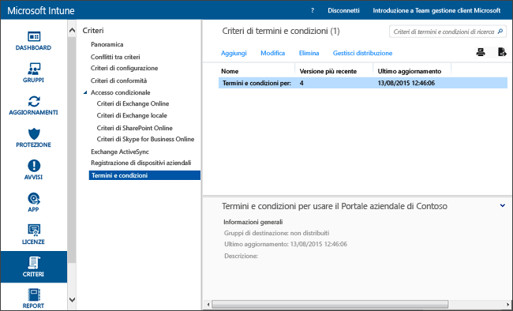

# Impostazioni dei criteri relativi termini e condizioni in Microsoft Intune
È possibile distribuire termini e condizioni di Intune a gruppi di utenti per spiegare in che modo la registrazione, l'accesso alle risorse di lavoro e l'uso dell'app Portale aziendale influiscono su dispositivi e utenti. Gli utenti dovranno quindi accettare i termini e le condizioni prima di poter usare il portale aziendale per registrare le app e accedere al lavoro.

È possibile creare e distribuire più criteri contenenti termini e condizioni diversi. È anche possibile creare versioni degli stessi termini e condizioni in lingue diverse e distribuirle ai gruppi appropriati.

## Creare un criterio relativo a termini e condizioni

1.  Nella [console di amministrazione di Microsoft Intune](http://manage.microsoft.com) fare clic su **Criteri** &gt; **Termini e condizioni**.

    

2.  Fare clic su **Aggiungi** per creare un nuovo criterio relativo ai termini e alle condizioni.

    È anche possibile **modificare** o **eliminare** un criterio esistente.

3.  Nella pagina **Crea termini e condizioni** specificare le informazioni seguenti:

    -   **Nome**: nome di criterio univoco visualizzato nella console di Intune

    -   **Descrizione**: dettagli che consentono di identificare il criterio nella console di Intune

    -   **Titolo**: titolo visualizzato agli utenti nel portale aziendale

    -   **Testo in cui vengono spiegate le implicazioni dell'accettazione da parte dell'utente**: etichetta visualizzata dagli utenti relativa all'accettazione. **Esempio**: "Accetto i termini e le condizioni".

4.  Al termine, fare clic su **Salva**. Il nuovo criterio viene visualizzato nel nodo **Termini e condizioni** dell'area di lavoro **Criteri**.

## Distribuire un criterio relativo a termini e condizioni

1.  Nella [console di amministrazione di Microsoft Intune](http://manage.microsoft.com) fare clic su **Criteri** &gt; **Termini e condizioni**.

2.  Nell'elenco **Criteri di termini e condizioni** selezionare il criterio da distribuire, quindi fare clic su **Gestisci distribuzione**.

3.  Nella finestra di dialogo **Gestisci distribuzione** selezionare i gruppi di utenti a cui distribuire i criteri e fare clic su **OK**.

    Quando gli utenti di destinazione accedono al portale aziendale, Intune visualizza i termini e le condizioni che sono state distribuite. Gli utenti devono accettare questi termini prima di poter accedere alle risorse aziendali.

## Monitorare un criterio relativo a termini e condizioni

1.  Nella [console di amministrazione di Microsoft Intune](http://manage.microsoft.com) fare clic su **Criteri** &gt; **Termini e condizioni**.

2.  Nella finestra **Crea nuovo report** fare clic su **Visualizza report**. Verrà aperto un report che elencherà in dettaglio gli utenti che hanno accettato i termini e le condizioni distribuite.

### Aggiornamenti e controllo della versione per termini e condizioni
Quando si modifica un criterio esistente relativo a termini e condizioni, è possibile scegliere il comportamento durante la distribuzione del criterio. Usare la procedura seguente per aggiornare i criteri esistenti relativi a termini e condizioni.

## Come gestire più versioni di termini e condizioni

1.  Nella [console di amministrazione di Microsoft Intune](http://manage.microsoft.com) fare clic su **Criteri** &gt; **Termini e condizioni**.

2.  Selezionare il criterio relativo ai termini e alle condizioni da modificare, quindi fare clic su **Modifica**.

3.  Nella pagina **Modificare i termini e le condizioni** apportare le modifiche necessarie, quindi specificare se questa nuova versione dei termini e delle condizioni deve essere accettata da tutti gli utenti oppure se verrà visualizzata solo dai nuovi utenti.

    È consigliabile incrementare il numero di versione e richiedere l'accettazione ogni volta che si apportano modifiche significative al criterio relativo a termini e condizioni. Non modificare il numero di versione corrente se, ad esempio, si correggono errori di digitazione o si modifica la formattazione.

### Vedere anche
[Gestire impostazioni e funzionalità nei dispositivi con i criteri di Microsoft Intune](manage-settings-and-features-on-your-devices-with-microsoft-intune-policies.md)

<!--HONumber=Jun16_HO4-->

