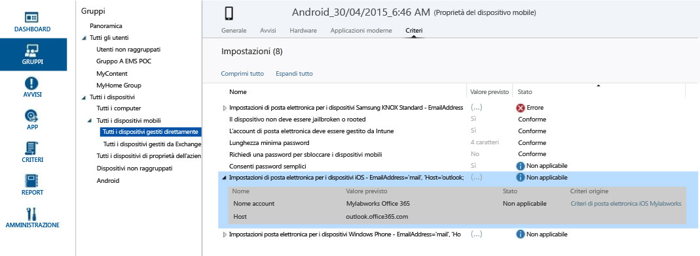

# Creare gruppi per gestire utenti e dispositivi con Microsoft Intune

Per creare e gestire gruppi, usare l'area di lavoro **Gruppi** nella console di amministrazione Microsoft Intune. La pagina **Panoramica gruppi** contiene un riepilogo dello stato che consente di identificare e definire le priorità dei problemi che richiedono un'attenzione per:

-   Avvisi
-   Aggiornamenti software
-   Endpoint Protection
-   Criteri
-   Gestione software

Inoltre, la gerarchia dei gruppi viene visualizzata con i riepiloghi dello stato che consentono di identificare e risolvere i problemi per i membri di un gruppo selezionato.

> [!TIP]
> Quando si crea no gruppi di considerare la modalità di applicazione dei criteri. Ad esempio, si potrebbe disporre di criteri specifici per i sistemi operativi per dispositivi e i criteri specifici per ruoli diversi all'interno dell'organizzazione o nelle unità organizzative che sono già state definite nell’Active Directory. Alcuni considerano utile disporre di gruppi di dispositivi specifici di Windows, iOS e Android, nonché gruppi di utenti per ogni ruolo dell'organizzazione.
>
> È opportuno creare un criterio predefinito che si applica a tutti i gruppi e i dispositivi, per stabilire i requisiti di conformità di base della società. Quindi creare criteri più specifici per le categorie più ampie di criteri di posta elettronica di utenti e dispositivi, ad esempio, per ciascuno dei sistemi operativi di dispositivo.
>
> Prestare attenzione ai criteri di denominazione in modo che sia possibile identificare facilmente in un secondo momento. Ad esempio, un nome descrittivo corretto del criterio è **WP criteri di posta elettronica per l'intera azienda**.
>
> Ogni volta che è possibile creare un criterio restrittivo sarà poi importante comunicarlo agli utenti, così che dopo aver creato gruppi più generali e criteri, si deve prestare attenzione a come creare gruppi più piccoli in modo che sia possibile ridurre le comunicazioni non necessarie.

## Creare un gruppo di dispositivi

1.  Nella console di amministrazione di Intune scegliere **Gruppi** &gt; **Panoramica** &gt; **Crea gruppo**.

2.  Specificare un nome e una descrizione facoltativa del gruppo e selezionare un gruppo di dispositivi come gruppo padre. Scegliere **Avanti**.

3.  Nella pagina **Definisci criteri appartenenza** selezionare il tipo di dispositivi che il gruppo includerà. Le opzioni aggiuntive per configurare il gruppo dipendono dal tipo di dispositivi selezionati:

    -   **Computer:** specificare se includere tutti i membri del gruppo padre, le unità organizzative (OU, Organizational Unit) e i domini da includere o escludere. Le informazioni sulle unità organizzative e sul dominio per un computer si possono trovare nell'inventario.

    -   **Dispositivi mobili:** specificare se includere solo i dispositivi mobili gestiti da Intune, quelli gestiti da Exchange ActiveSync o entrambe le opzioni.

    -   **Tutti i dispositivi:** questa opzione include tutti i dispositivi senza esclusioni in base ai criteri.

4.  Nella pagina **Definisci appartenenza diretta** , includere o escludere i singoli dispositivi specificati facendo clic su **Sfoglia**. Se si usa l'opzione di selezionare i dispositivi che non sono nel gruppo padre specificato, quei dispositivi verranno aggiunti automaticamente al gruppo padre.

5.  Nella pagina **Riepilogo** esaminare le azioni che verranno eseguite. Scegliere **Fine**.

Per trovare il gruppo appena creato, andare nell'elenco **Gruppi** nell'area di lavoro **Gruppi** nel gruppo padre. Da qui è possibile inoltre modificare o eliminare il gruppo.

## Creare un gruppo di utenti

1.  Nella console di amministrazione di Intune scegliere **Gruppi** &gt; **Panoramica** &gt; **Crea gruppo**.

2.  Specificare un nome e una descrizione facoltativa del gruppo e selezionare un gruppo di utenti come gruppo padre. Scegliere **Avanti**.

3.  Nella pagina **Definisci criteri appartenenza** , specificare se includere tutti i membri del gruppo padre o iniziare con un gruppo vuoto.  È possibile quindi includere o escludere i membri in base ai **gruppi di sicurezza** degli utenti che si configurano manualmente nell'[interfaccia di amministrazione di Office 365](http://go.microsoft.com/fwlink/?LinkId=698854) o che si sincronizzano da Active Directory locale. Se cambia l'appartenenza di un gruppo di sicurezza, è possibile modificare anche l'appartenenza dei gruppi di utenti che si basa su quel gruppo di sicurezza.

    > [!IMPORTANT]
    > Attualmente, se il gruppo include i membri da specifici gruppi di sicurezza o gestione e si escludono i membri da gruppi specifici, i membri inizialmente inclusi verranno rimossi. Per creare un gruppo in cui siano presenti membri inclusi ed esclusi, è consigliabile creare innanzitutto un gruppo padre con i membri inclusi e quindi creare un elemento figlio di tale gruppo in cui siano elencati i membri esclusi. È quindi possibile usare tale gruppo figlio nel modo opportuno per i criteri, i profili e la distribuzione di app di Intune.

    > [!NOTE]
    > Nel portale di gestione di Azure è possibile creare un gruppo in base al responsabile a cui gli utenti fanno riferimento. Il gruppo sarà dinamico e verrà modificato man mano che i dipendenti vengono aggiunti o rimossi dal team del responsabile in Azure Active Directory. La procedura per la creazione di un gruppo di Azure basato su un responsabile è descritta in [Uso di attributi per la creazione di regole avanzate](https://azure.microsoft.com/en-us/documentation/articles/active-directory-accessmanagement-groups-with-advanced-rules/) nella sezione denominata **Per configurare un gruppo come gruppo "Manager"**.

4.  Nella pagina **Definisci appartenenza diretta** , includere o escludere i singoli utenti specificati facendo clic su **Sfoglia**. Se si usa l'opzione di selezionare gli utenti che non sono nel gruppo padre specificato, quei dispositivi verranno aggiunti automaticamente al gruppo padre. Nella parte inferiore della finestra di dialogo **Seleziona membri** è possibile trovare l'opzione per l'aggiunta manuale di un utente. Ciò è utile se si desidera aggiungere un utente che non dispone ancora di un dispositivo registrato.

5.  Nella pagina **Riepilogo** esaminare le azioni che verranno eseguite. Scegliere **Fine**.

Per trovare il gruppo appena creato, andare nell'elenco **Gruppi** nell'area di lavoro **Gruppi** nel gruppo padre. Da qui è possibile inoltre modificare o eliminare il gruppo.

> [!TIP]
> I Gruppi di sicurezza sono un'ottima risorsa per il popolamento dei gruppi di utenti. Poiché i gruppi di sicurezza definiscono chi ha accesso a quali risorse, tali gruppi possono essere convertiti perfettamente in gruppi di utenti di Intune. I gruppi di sicurezza sincronizzati da Active Directory in Azure Active Directory, o creati direttamente in Azure Active Directory con l'interfaccia di amministrazione di Office 365 o il portale di amministrazione di Azure, sono tutti disponibili per la creazione di gruppi di utenti in Intune.

## Personalizzare le visualizzazioni per i ruoli di amministratore
Le visualizzazioni di gruppi filtrati consentono di personalizzare la visualizzazione che gli amministratori possono vedere in base al proprio ruolo e limitare i gruppi che ogni amministratore IT può gestire. Questa impostazione può essere utile nei casi seguenti:

-   Gli amministratori IT devono solo distribuire elementi a utenti e dispositivi specifici.

-   Si vuole che per ogni amministratore IT vengano visualizzati solo i gruppi di dispositivi e utenti pertinenti.

È possibile configurare le visualizzazioni di gruppi filtrati per gli amministratori del servizio nella console di amministrazione di Intune. Per informazioni dettagliate, vedere [Informazioni preliminari per l'uso di Microsoft Intune](/intune/get-started/what-to-know-before-you-start-microsoft-intune).

Dopo la configurazione delle visualizzazioni di gruppi filtrati per un amministratore del servizio, quest'ultimo:

-   Può visualizzare e selezionare solo i gruppi specificati quando distribuisce software o criteri oppure quando usa i report

-   Non riceve informazioni sullo stato nelle pagine seguenti della console di amministrazione:

    -   **Panoramica sistema**

    -   **Panoramica gruppi**

    -   **Panoramica Endpoint Protection**

    -   **Panoramica avvisi**

    -   **Panoramica software**

    -   **Panoramica criteri**

### Configurare le visualizzazioni di gruppi filtrati

1.  Nella console di amministrazione di Microsoft Intune scegliere **Amministrazione** &gt; **Gestione amministratori** &gt; **Amministratori del servizio**.

2.  Selezionare l'amministratore del servizio per il quale filtrare i gruppi e quindi fare clic su **Gestisci gruppi**.

3.  Nella finestra di dialogo **Seleziona i gruppi visualizzabili dall'amministratore del servizio** aggiungere i gruppi cui l'amministratore del servizio selezionato potrà accedere e quindi fare clic su **OK**.

Dopo aver configurato le visualizzazioni di gruppi filtrati, l'amministratore IT sarà in grado di visualizzare e selezionare solo i gruppi selezionati.

## Gestione dei gruppi
Dopo aver creato i gruppi, si continuerà a gestirli in base alle esigenze dell'organizzazione.

È possibile modificare il gruppo per modificare il nome e la descrizione e che appartiene al gruppo.

È possibile eliminare un gruppo che non è più necessario per l'organizzazione. La cancellazione di un gruppo non elimina gli utenti che appartengono a tale gruppo.

## Passaggi successivi

### Controllare la progettazione
Dopo aver impostato i gruppi e i criteri, controllare le implicazioni pratiche di progettazione esaminando il **Valore previsto** e lo **Stato**.

1. Selezionare qualsiasi dispositivo da un gruppo di dispositivi e visualizzare le categorie di informazioni nella parte superiore della schermata.
2. Selezionare **criteri** . Verrà visualizzato qualcosa di simile a questa schermata delle impostazioni di criteri di un dispositivo Android.

Ogni criterio dispone di un **previsto valore** e **stato**. Il valore previsto è quello che si intende ottenere quando si assegnano i criteri. Lo stato è ciò che effettivamente si ottiene quando tutti i criteri applicati al dispositivo, oltre alle restrizioni e ai requisiti di hardware e del sistema operativo, vengono considerati insieme.  Nella schermata è possibile visualizzare due chiari esempi:

-   **Consentire password semplici** è impostato su **Sì**, come illustrato nella colonna **del valore previsto** ma lo **stato** è **non applicabile**. Infatti, le password semplici non sono supportate per i dispositivi Android.

-   Analogamente, l'elemento dei criteri espanso, **Impostazioni posta elettronica per i dispositivi iOS**, non viene applicato al dispositivo, visto che è un dispositivo Android.

> [!NOTE]
> Tenere presente che quando due criteri con livelli di restrizione diversi vengono applicati allo stesso dispositivo o utente, viene di fatto applicato il criterio più restrittivo.

<!--HONumber=Jul16_HO3-->

