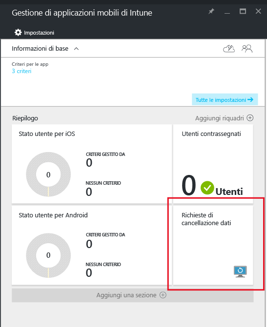

# Cancellare i dati dell'app aziendale gestita con Microsoft Intune
Quando un dispositivo viene smarrito o rubato, o se il dipendente lascia l'azienda, è necessario assicurarsi di rimuovere dal dispositivo i dati delle app aziendali. Tuttavia, potrebbe non essere necessario rimuovere i dati personali sul dispositivo, soprattutto se si tratta di un dispositivo di proprietà del dipendente.

Per rimuovere selettivamente i dati delle app aziendali, creare una richiesta di cancellazione attenendosi alla procedura descritta in questa sezione, **Creare una richiesta di cancellazione**, nel presente argomento.  Una volta completata la richiesta, i dati aziendali verranno rimossi dall'app alla successiva esecuzione dell'applicazione nel dispositivo.
>[!NOTE]
> I contatti sincronizzati direttamente dall'app alla Rubrica nativa vengono rimossi. Tutti i contatti sincronizzati dalla Rubrica nativa a un'altra origine esterna non possono essere cancellati. Attualmente questa opzione è disponibile solo per l'app Microsoft Outlook.

## Creare una richiesta di cancellazione

1.  Nel pannello **Gestione di applicazioni mobili di Intune** scegliere il riquadro **Richieste di cancellazione dati** .

    

2.  Scegliere **Nuova richiesta di cancellazione dati**.

    

3.  Nel pannello **Nuova richiesta di cancellazione dati** scegliere **Utente** per aprire il pannello **Utente** e selezionare l'utente di cui cancellare i dati dell'app.

4.  Scegliere **Dispositivo**.  Si apre il pannello **Dispositivo** che elenca tutti i dispositivi associati all'utente selezionato.  Selezionare il dispositivo da cancellare.

5.  Si torna al riquadro **Nuova richiesta di cancellazione dati**. Scegliere **OK** per eseguire una richiesta di cancellazione. Il servizio crea e tiene traccia di una richiesta di cancellazione dati separata per ogni app protetta nel dispositivo.

## Monitorare le richieste di cancellazione dati
Il pannello **Gestione di applicazioni mobili di Intune** contiene un report di riepilogo per il riquadro **Richiesta di cancellazione dati** .  Visualizza lo stato generale e include il numero di richieste in sospeso e gli errori. È possibile ottenere altre informazioni seguendo i passaggi descritti di seguito:

1.  Nel pannello **Gestione di applicazioni mobili di Intune** scegliere il riquadro **Richiesta di cancellazione dati** per aprire il pannello **Richiesta di cancellazione dati** .

2.  Nel pannello **Richiesta di cancellazione dati** è possibile visualizzare l'elenco delle richieste raggruppate in base agli utenti.  Poiché il sistema crea una richiesta di cancellazione dati per ciascuna applicazione protetta in esecuzione nel dispositivo, è possibile visualizzare più richieste per un utente.  Lo stato indica se una richiesta di cancellazione dati è ancora **in sospeso**, **non riuscita**o **completata**.

### Vedere anche
[Proteggere i dati delle app usando i criteri di gestione delle app per dispositivi mobili ](protect-app-data-using-mobile-app-management-policies-with-microsoft-intune.md)

[Uso del portale di Azure](azure-portal-for-microsoft-intune-mam-policies.md)

<!--HONumber=Jul16_HO3-->

