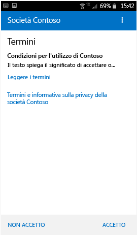
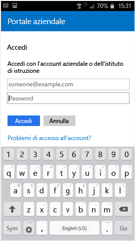

# Registrare il dispositivo Android in Intune

Se l'azienda o l'istituto di istruzione usa Microsoft Intune, è possibile registrare il dispositivo Android per poter accedere a posta elettronica, file e altre risorse aziendali. La registrazione dei dispositivi consente al reparto IT di gestire e proteggere le risorse di aziende o istituti di istruzione, offrendo al tempo stesso la possibilità di scegliere il dispositivo più adatto per svolgere il proprio lavoro. Per altre informazioni sulla registrazione, vedere [What happens when I install and Company Portal app and enroll my device?](what-happens-if-you-install-the-Company-Portal-app-and-enroll-your-device-in-intune-android.md) (Che cosa succede quando si installa l'app Portale aziendale e si registra il dispositivo?).

Queste istruzioni sono valide per la registrazione di dispositivi Android Samsung Knox e Android nativi, esclusi i dispositivi Samsung Knox. Per sapere se il dispositivo è di tipo Samsung Knox, andare in **Impostazioni** &gt; **Informazioni sul dispositivo**. Se non viene visualizzata la versione Knox, significa che il dispositivo è un dispositivo Android nativo.

Prima o dopo la registrazione potrebbe essere necessario scegliere la categoria che descrive meglio come viene usato il dispositivo. L'amministratore IT usa questa categoria per determinare a quali app ha accesso l'utente.

Se si verifica un errore durante la registrazione del dispositivo in Intune, è possibile [inviare gli errori di registrazione all'amministratore IT](send-enrollment-errors-to-your-it-administrator-android.md).

**Per registrare il dispositivo Android:**

1.  Installare l'app Portale aziendale di Intune da [Google Play](http://play.google.com/store/apps/details?id=com.microsoft.windowsintune.companyportal).

2.  Aprire l'app Portale aziendale di Microsoft Intune.

3.  Nella **schermata iniziale** del portale aziendale toccare **Accedi** e quindi accedere con l'account aziendale o dell'istituto di istruzione.

       

4.  Se l'amministratore IT ha impostato i termini e le condizioni aziendali, toccare **ACCETTO** per accettarli.

    

5.  Se si usa Android 6.0 o versione successiva, eseguire questo passaggio. In caso contrario, andare al passaggio successivo. 

    Se l'amministratore IT ha configurato determinati criteri, saranno visualizzati i messaggi seguenti:
    -   **Consentire a Portale aziendale di effettuare e gestire chiamate telefoniche?**

    

    Se viene visualizzato questo messaggio, toccare **CONSENTI**. È consigliabile scegliere questa opzione perché **Microsoft non effettua né gestisce mai le chiamate telefoniche**. Il testo del messaggio è controllato da Google, quindi Microsoft non può modificarlo. Quando si consente l'accesso, il dispositivo può scrivere i registri dei dati nella scheda SD del dispositivo, da dove possono poi essere trasferiti tramite un cavo USB.

    Se si nega l'accesso, il messaggio viene visualizzato di nuovo all'accesso successivo al portale aziendale, ma è possibile disattivare la ricezione di altri messaggi toccando la casella di controllo **Non visualizzare più questo messaggio**.  Se si decide successivamente di consentire l'accesso, andare a **Impostazioni** &gt; **App** &gt; **Portale aziendale** &gt; **Autorizzazioni** &gt; **Telefono**, quindi attivare l'autorizzazione.

    -   **Allow Company Portal to access your contacts? (Consenti al Portale aziendale l'accesso ai contatti?)**

    

    Se viene visualizzato questo messaggio, toccare **CONSENTI**. È consigliabile scegliere questa opzione perché **Microsoft non può mai accedere ai contatti**. Il testo del messaggio è controllato da Google, quindi Microsoft non può modificarlo. Quando si concede l'accesso, si consente solo all'app Portale aziendale di creare, usare e gestire il proprio account aziendale.

    Se si nega l'accesso, il messaggio viene visualizzato di nuovo la volta successiva che si tocca **Invia dati**. È tuttavia possibile disattivare la visualizzazione futura dei messaggi selezionando la casella di controllo **Non visualizzare più questo messaggio**. Se si decide successivamente di consentire l'accesso, andare a **Impostazioni** &gt; **App** &gt; **Portale aziendale** &gt; **Autorizzazioni** &gt; **Archiviazione**, quindi attivare l'autorizzazione.

6.  Accedere all'app Portale aziendale usando l'account e la password aziendale o dell'istituto di istruzione e quindi toccare **Accedi**.

    

7.  Nella schermata **Configurazione dell'accesso aziendale** toccare **INIZIA**.

    

8.  Nella schermata **Perché registrare il dispositivo?** leggere le informazioni sulle operazioni che possono essere eseguite durante la registrazione del dispositivo e quindi toccare **CONTINUA**.

    

9.  Esaminare l'elenco dei dati che l'amministratore IT può o meno visualizzare e quindi toccare **CONTINUA**.

    

10.  Nella schermata **Operazioni successive** leggere cosa accade durante la registrazione, quindi toccare **REGISTRA**.

    

11.  Nella schermata relativa all'**attivazione dell'amministratore del dispositivo** toccare **Attiva**.

    

12.  Seguire le istruzioni per immettere un PIN o una password. Se sul dispositivo è già stato impostato un PIN o una password, questa schermata non verrà visualizzata o verrà richiesto di immettere un nuovo PIN o una nuova password.

    

13.  Seguire le istruzioni seguenti relative al tipo di dispositivo in uso, ossia Android nativo o Samsung Knox. Per sapere se il dispositivo è di tipo Samsung Knox, andare in **Impostazioni** &gt; **Informazioni sul dispositivo**. Se non viene visualizzata la versione Knox, significa che il dispositivo è un dispositivo Android nativo.

    -   Dispositivo nativo, non Samsung Knox: nella schermata **Name the certificate** (Assegna nome al certificato) toccare **OK** per accettare il certificato predefinito.

    

    -   Dispositivo Samsung Knox: accettare l'informativa sulla privacy e toccare **CONFERMA**.

    

    Mentre Intune registra il dispositivo, viene visualizzato il messaggio seguente.

    

14. Quando viene visualizzata la schermata **Configurazione dell'accesso aziendale** toccare **CONTINUA**. Se viene visualizzato un messaggio che indica che il dispositivo non è conforme, seguire le istruzioni per risolvere il problema e quindi toccare **CONTINUA**.

      

11. Nella schermata **Configurazione dell'accesso aziendale completato** toccare **FINE**. Il dispositivo è ora registrato.

    

Prima di installare app aziendali, andare in **Impostazioni** &gt; **Sicurezza** e attivare **Origini sconosciute**. Se non si attiva questa opzione prima di installare le app, viene visualizzato un messaggio che indica che l'installazione è bloccata per motivi di sicurezza che impediscono di installare nel dispositivo app ottenute da origini sconosciute. È possibile toccare **Impostazioni** nella finestra di dialogo di errore per visualizzare l'opzione **Origini sconosciute**.

Serve ancora assistenza? Contattare l'amministratore IT. Per informazioni sul contatto vedere il [sito Web del portale aziendale](http://portal.manage.microsoft.com).

### Vedere anche
[Uso del dispositivo Android con Intune](using-your-android-device-with-intune.md)

<!--HONumber=Jun16_HO4-->

