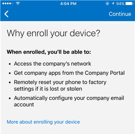
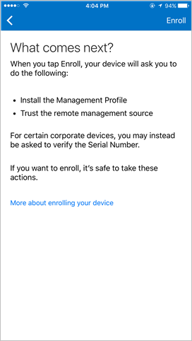
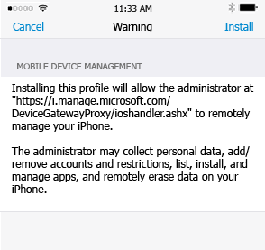

# Registrare il dispositivo iOS in Intune

Se l'azienda o l'istituto di istruzione usa Microsoft Intune, è possibile registrare il dispositivo iOS per poter accedere a posta elettronica, file e altre risorse aziendali. La registrazione dei dispositivi consente al reparto IT di gestire e proteggere le risorse di aziende o istituti di istruzione, offrendo al tempo stesso la possibilità di scegliere il dispositivo più adatto per svolgere il proprio lavoro. Per altre informazioni sulla registrazione , vedere [What happens if you install the Company Portal app and enroll your device in Intune?](what-happens-if-you-install-the-company-portal-app-and-enroll-your-device-in-intune-ios.md) (Che cosa avviene quando si installa l'app Portale aziendale e si registra il dispositivo in Intune).

Se si sta registrando un dispositivo Mac OS X, vedere [Registrare il dispositivo Mac OS X in Intune](enroll-your-device-in-intune-mac-os-x.md).

**Per registrare il dispositivo iOS:**

1.  Seguire la procedura in [Install and sign in to the Intune Company Portal app](install-and-sign-in-to-the-intune-company-portal-app-ios.md) (Installare e accedere all'app Portale aziendale di Intune).

2. Nella pagina **Configurazione dell'accesso aziendale** toccare **Inizia**.

     

3. Nella schermata **Perché registrare il dispositivo?** leggere le informazioni sulle operazioni che possono essere eseguite durante la registrazione del dispositivo e quindi toccare **Continua**.

     

4. Esaminare l'elenco dei dati che l'amministratore IT può o meno visualizzare nel dispositivo registrato e toccare **Continua**.

     

5.  Nella schermata **Operazioni successive** leggere cosa accade durante la registrazione, quindi toccare **Registra**.

     

6.  Nella schermata **Installa profilo** toccare **Installa** e, se richiesto, immettere il passcode.

     
  
7.  Toccare **Installa**.

        

8.  Toccare **Installa** per indicare che il messaggio di avviso è stato letto.

     

9.  Toccare **Attendibilità**.

     

10.  Quando la schermata cambia a indicare che il profilo è stato installato, toccare **Fine**.

     

    Viene visualizzato un messaggio che indica la registrazione in corso del dispositivo.

11.  Quando viene visualizzato un messaggio che chiede se si vuole aprire la pagina nel Portale aziendale, toccare **Apri**.

     

12. Nella schermata **Company Access Setup** (Configurazione accesso aziendale) toccare **Continua**. Se l'amministratore IT ha impostato altri requisiti di sicurezza, ad esempio la necessità di impostare una password, seguire le istruzioni visualizzate fino a soddisfare tutti i requisiti di conformità, tornare alla schermata Configurazione dell'accesso aziendale e quindi toccare **Continua**.

     

13. Toccare **Fine**. 

     

Il dispositivo è ora registrato in Intune e si riapre l'app Portale aziendale.

Serve ancora assistenza? Contattare l'amministratore IT. Per informazioni sul contatto vedere il [sito Web del portale aziendale](http://portal.manage.microsoft.com).

### Vedere anche
[Using your iOS or Mac OS X device with Intune](using-your-ios-or-mac-os-x-device-with-intune.md)

<!--HONumber=Jul16_HO3-->

