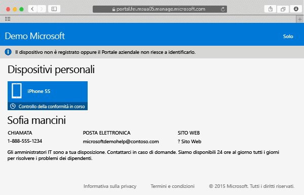
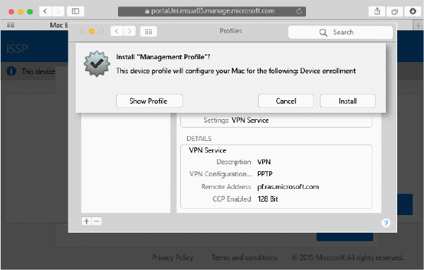

---
# required metadata

title: Registrare il dispositivo Mac OS X in Intune | Microsoft Intune
description:
keywords:
author: Staciebarker
manager: jeffgilb
ms.date: 04/28/2016
ms.topic: article
ms.prod:
ms.service: microsoft-intune
ms.technology:
ms.assetid: 58eb0e7a-1321-4c66-a281-88fb01e72c1c

# optional metadata

ROBOTS:
#audience:
#ms.devlang:
ms.reviewer: jeffgilb
ms.suite: ems
#ms.tgt_pltfrm:
#ms.custom:

---

# Registrare il dispositivo Mac OS X in Intune

La registrazione del dispositivo Mac OS X in Intune consente di accedere a rete, posta elettronica e file aziendali e di ottenere le relative app. Per altre informazioni su cosa avviene quando si registra il dispositivo, vedere [What happens if you install the Company Portal app and enroll your device in Intune?](what-happens-if-you-install-the-company-portal-app-and-enroll-your-device-in-intune-ios.md) (Che cosa avviene quando si installa l'app Portale aziendale e si registra il dispositivo in Intune).

Se si sta registrando un dispositivo iOS, vedere [Registrare il dispositivo iOS in Intune](enroll-your-device-in-intune-ios.md).

Per registrare il dispositivo Mac OS X:

1.  Aprire il [sito Web del portale aziendale](https://portal.manage.microsoft.com) con un browser Safari e toccare la barra di notifica.

2.  Toccare **Il dispositivo non è registrato oppure il Portale aziendale non riesce a identificarlo**.

     

3.  Toccare **Installa** per iniziare la registrazione del dispositivo.

     

4.  Nella finestra di dialogo per **installare il profilo di gestione** toccare **Installa**. Se viene visualizzata una finestra di dialogo in cui viene richiesto di immettere le credenziali, immettere il nome utente e la password e quindi toccare **Continua** &gt; **Installa**.

     

    Al termine della registrazione, verrà visualizzata una pagina con il profilo di gestione che mostra che il profilo è stato verificato.

     

### Vedere anche
[Using your iOS or Mac OS X device with Intune](using-your-ios-or-mac-os-x-device-with-intune.md)

<!--HONumber=May16_HO2-->

