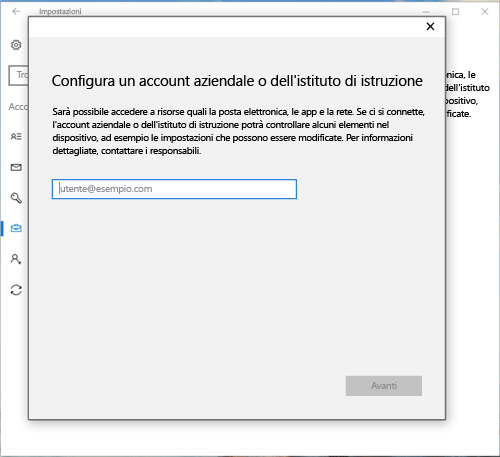
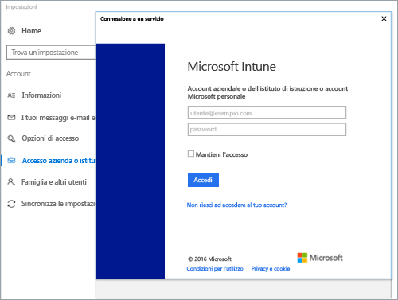
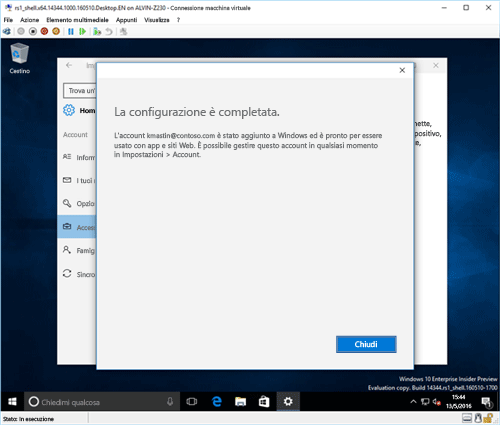
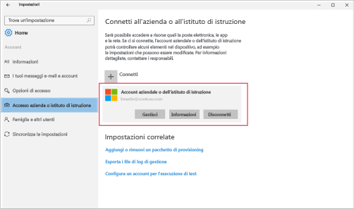

# Registrare il dispositivo Windows 10 in Intune

<iframe src="https://channel9.msdn.com/Series/IntuneEnrollment/Windows-Enrollment/player" width="960" height="540" allowFullScreen frameBorder="0"></iframe>

1.  Toccare **Accedi all'azienda o all'istituto di istruzione** e quindi **Connetti**.

    

2.  Immettere l'indirizzo di posta elettronica dell'azienda o dell'istituto di istruzione e toccare **Avanti**.

    

3. Accedere a Intune con l'account aziendale o dell'istituto di istruzione.

    

    Verrà visualizzato un messaggio che indica che la società o l'istituto di istruzione sta registrando il dispositivo.

4. Quando viene visualizzata la schermata **La configurazione è completata**, toccare **Chiudi**. La procedura è stata completata.

  

5. Se si vuole verificare che la connessione sia corretta, tornare a **Impostazioni** dove si dovrebbe ora visualizzare l'account aziendale o dell'istituto di istruzione.

    

Se i passaggi precedenti sono stati seguiti, ma non è ancora possibile accedere ai file e agli account di posta elettronica aziendali o dell'istituto di istruzione, seguire i passaggi in [Passaggi di risoluzione dei problemi da seguire se si visualizza Accedi all'azienda o all'istituto di istruzione](troubleshoot-your-windows-10-device-windows.md#troubleshooting-steps-to-follow-if-you-see-access-work-or-school).

<!--HONumber=Dec16_HO2-->

