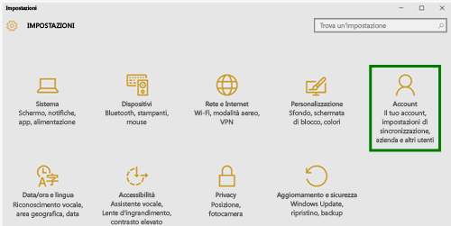
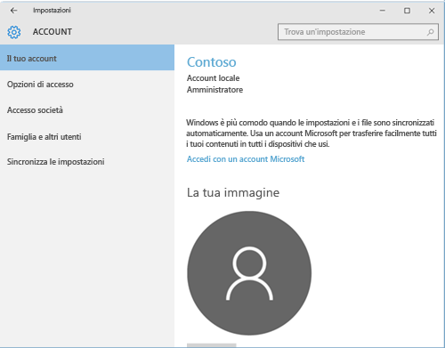
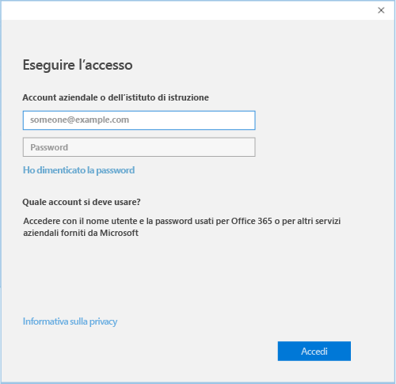

# Registrare il dispositivo Windows 10 in Intune

1.  Aprire l'app **Impostazioni** di Windows. Passare al **menu Start** e selezionare il pulsante **Impostazioni**. È anche possibile cercare "impostazioni" nella barra di ricerca.

2. Selezionare **Account**.

    

3. Selezionare **Il tuo account**.

    

4. Selezionare **Aggiungi un account aziendale o dell'istituto di istruzione**.

    

5. Accedere con le credenziali aziendali o dell'istituto di istruzione.

    

Non è ancora possibile accedere agli indirizzi di posta elettronica, ai file o ad altri dati aziendali o dell'istituto di istruzione? Provare a risolvere i problemi di accesso tramite la [risoluzione dei problemi relativi all'account](troubleshoot-your-windows-10-device-windows.md#troubleshooting-steps-to-follow-if-you-see-your-account). Se il problema persiste, è necessario contattare l'amministratore IT per assistenza.

Un modo semplice per ottenere assistenza dall'amministratore IT è tramite le informazioni di contatto disponibili nell'app Portale aziendale, che consente anche di cercare e scaricare le app consigliate e richieste per le attività quotidiane. È possibile che l'app Portale aziendale sia già installata nel dispositivo. Un modo rapido per verificarlo consiste nel cercare __Portale aziendale__ nell'elenco __Tutte le app__.

Se l'app Portale aziendale non è visualizzata nell'elenco di app, seguire questa procedura per installarla.

1. Selezionare **Start** > **Store**.

2. Selezionare **Cerca** e quindi digitare **portale aziendale**.

3. Nell'elenco dei risultati selezionare **Portale aziendale** > **Installa**.

4. Selezionare **Installa** o **Gratuito**. Non esiste alcuna differenza tra queste due opzioni per l'utente. L'opzione visualizzata dipende da come l'organizzazione ha configurato l'app Portale aziendale.

