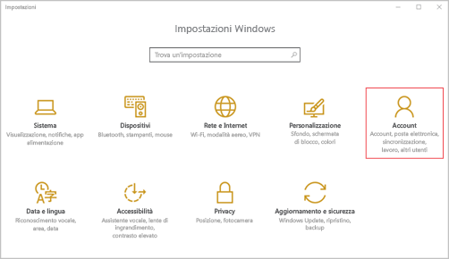

# Registrare il dispositivo Windows 10 Mobile o Windows 10 Desktop in Intune

Se l'azienda o l'istituto di istruzione usa Microsoft Intune, è possibile registrare i dispositivi per poter accedere a posta elettronica, file e altre risorse aziendali. La registrazione dei dispositivi consente all'azienda di proteggere i suoi dati. Per altre informazioni sulla registrazione, vedere [What happens if you install the Company Portal app and enroll your device in Intune?](what-happens-if-you-install-the-company-portal-app-and-enroll-your-device-in-intune-windows.md) (Che cosa avviene quando si installa l'app Portale aziendale e si registra il dispositivo in Intune?) e [What your IT administrator can and can't see on your device](what-can-your-it-administrator-see-when-you-enroll-your-device-in-intune-windows.md) (Che cosa può o non può vedere l'amministratore IT nel dispositivo?).

Per registrare il dispositivo Windows 10 Mobile o Windows 10:

1.  Passare a Windows **Impostazioni** e quindi toccare **Account**.

    

2.  Esaminare le due schermate seguenti e trovare quella simile a quanto viene visualizzato sul dispositivo. Seguire i passaggi corrispondenti alla schermata visualizzata sul dispositivo.

    Se si visualizza questa schermata, attenersi alle istruzioni in [Passaggi da seguire se si visualizza Accedi all'azienda o all'istituto di istruzione](#steps-to-follow-if-you-see-access-work-or-school).

    

    Se si visualizza questa schermata, seguire i passaggi in [Passaggi da seguire se si visualizza Il tuo account](#steps-to-follow-if-you-see-your-account).

    

## Passaggi da seguire se si visualizza Accedi all'azienda o all'istituto di istruzione

1.  Toccare **Accedi all'azienda o all'istituto di istruzione**.

    

2.  Immettere l'indirizzo di posta elettronica dell'azienda o dell'istituto di istruzione e toccare **Avanti**.

    

3. Accedere a Intune con l'account aziendale o dell'istituto di istruzione.

    

    Verrà visualizzato un messaggio che indica che la società o l'istituto di istruzione sta registrando il dispositivo.

4. Quando viene visualizzata la schermata **La configurazione è completata**, toccare **Chiudi**. La procedura è stata completata.

  

5. Se si vuole verificare che la connessione sia corretta, tornare a **Impostazioni** dove si dovrebbe ora visualizzare l'account aziendale o dell'istituto di istruzione.

    

Se i passaggi precedenti sono stati seguiti, ma non è ancora possibile accedere ai file e agli account di posta elettronica aziendali o dell'istituto di istruzione, seguire i passaggi in [Passaggi di risoluzione dei problemi da seguire se si visualizza Accedi all'azienda o all'istituto di istruzione](troubleshoot-your-windows-10-device-windows.md#troubleshooting-steps-to-follow-if-you-see-access-work-or-school).

## Passaggi da seguire se si visualizza Il tuo account

1.  Passare a **Impostazioni** Windows e toccare **Account**.

    

2.  Toccare **Account**.

    

3.  Toccare **Aggiungi un account aziendale o dell'istituto di istruzione**.

    

4.  Accedere con le credenziali aziendali o dell'istituto di istruzione.

    

Se i passaggi precedenti sono stati eseguiti, ma non è ancora possibile accedere agli indirizzi di posta elettronica, ai file e ad altri dati aziendali o dell'istituto di istruzione, provare ad attenersi alle istruzioni in [Passaggi di risoluzione dei problemi da seguire se si visualizza Il tuo account](troubleshoot-your-windows-10-device-windows.md#troubleshooting-steps-to-follow-if-you-see-your-account).

È inoltre consigliabile installare l'app Portale aziendale, che consente di identificare facilmente e ottenere le app aziendali rilevanti per sé e per il proprio ruolo. A seconda di come la società ha configurato Intune, è possibile che l'app del portale aziendale sia stata installata durante il processo di registrazione.

Per verificare se l'app è disponibile, cercare **Portale aziendale** nell'elenco delle app. Se l'app Portale aziendale non è visualizzata nell'elenco di app, seguire questa procedura per installarla.

1.  Toccare **Start** &gt; **Store**.

2.  Toccare **Cerca** e quindi digitare **portale aziendale**.

3.  Nell'elenco dei risultati toccare **Portale aziendale** &gt; **Installa**.

4.  Toccare **Installa** o **Gratuito**. L'opzione visualizzata varia a seconda di come la società ha configurato l'app.

Serve ancora assistenza? Contattare l'amministratore IT. Per informazioni sul contatto vedere il [sito Web del portale aziendale](http://portal.manage.microsoft.com).

<!--HONumber=Aug16_HO5-->

