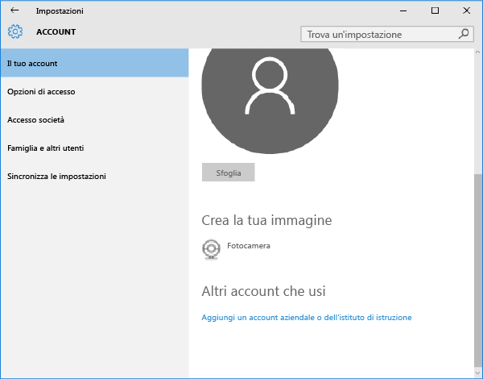

# Registrare il dispositivo Windows 10 Mobile o Windows 10 Desktop in Intune

Se l'azienda o l'istituto di istruzione usa Microsoft Intune, è possibile registrare i dispositivi per poter accedere a posta elettronica, file e altre risorse aziendali. La registrazione dei dispositivi consente all'azienda di proteggere i suoi dati. Per altre informazioni sulla registrazione, vedere [What happens if you install the Company Portal app and enroll your device in Intune?](what-happens-if-you-install-the-company-portal-app-and-enroll-your-device-in-intune-windows.md) (Che cosa avviene quando si installa l'app Portale aziendale e si registra il dispositivo in Intune?) e [What your IT administrator can and can't see on your device](what-can-your-it-administrator-see-when-you-enroll-your-device-in-intune-windows.md) (Che cosa può o non può vedere l'amministratore IT nel dispositivo?).

Per registrare il dispositivo Windows 10 Mobile o Windows 10:

1.  Passare a Windows **Impostazioni** e toccare **Account**.

    

2.  Toccare **Account**.

    

3.  Toccare **Aggiungi un account aziendale o dell'istituto di istruzione**.

    

4.  Accedere con le credenziali aziendali o dell'istituto di istruzione.

    

Se è stata eseguita la procedura sopra descritta, ma non è tuttavia possibile accedere alla posta elettronica, ai file e ad altri dati aziendali o dell'istituto di istruzione, tornare alla schermata **Account** e toccare **Accesso società**.

-   Se viene visualizzato l'account aziendale o dell'istituto di istruzione, la connessione è attiva.

-   In caso contrario, toccare **Connetti** e quindi accedere con le credenziali aziendali o dell'istituto di istruzione.

È inoltre consigliabile installare l'app Portale aziendale, che consente di identificare facilmente e ottenere le app aziendali rilevanti per sé e per il proprio ruolo. A seconda di come la società ha configurato Intune, l'app Portale aziendale potrebbe essere stata installata durante il processo di registrazione. Per verificare se l'app è disponibile, cercare **Portale aziendale** nell'elenco delle app. Se l'app Portale aziendale non è visualizzata nell'elenco di app, seguire questa procedura per installarla.

1.  Toccare **Start** &gt; **Store**.

2.  Toccare **Cerca** e digitare **portale aziendale**.

3.  Nell'elenco dei risultati toccare **Portale aziendale** &gt; **Installa**.

4.  Toccare **Installa** o **Gratuito**. L'opzione visualizzata varia a seconda di come la società ha configurato l'app.

Serve ancora assistenza? Contattare l'amministratore IT. Per informazioni sul contatto vedere il [sito Web del portale aziendale](http://portal.manage.microsoft.com).

### Vedere anche
[Registrare il dispositivo Windows in Intune](enroll-your-device-in-intune-windows.md) 
[Uso del dispositivo Windows con Intune](using-your-windows-device-with-intune.md)

<!--HONumber=Jul16_HO1-->

