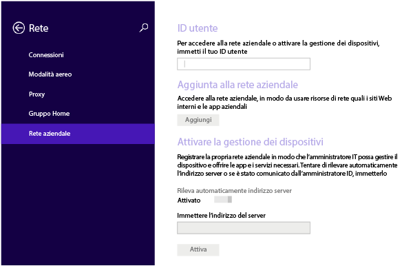
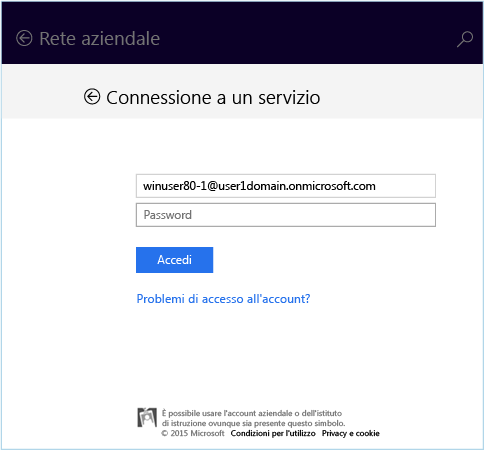
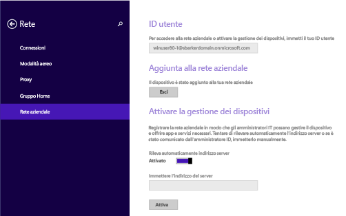
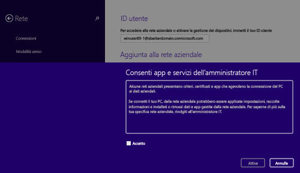
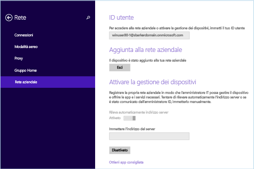

# Registrare il dispositivo Windows 8.1 o Windows RT 8.1 in Intune

Se l'azienda o l'istituto di istruzione usa Microsoft Intune, è possibile registrare i dispositivi per poter accedere a posta elettronica, file e altre risorse aziendali. La registrazione dei dispositivi consente all'azienda di proteggere i suoi dati. Per altre informazioni sulla registrazione, vedere [What happens if you install the Company Portal app and enroll your device in Intune?](what-happens-if-you-install-the-company-portal-app-and-enroll-your-device-in-intune-windows.md) (Che cosa avviene quando si installa l'app Portale aziendale e si registra il dispositivo in Intune?) e [What your IT administrator can and can't see on your device](what-can-your-it-administrator-see-when-you-enroll-your-device-in-intune-windows.md) (Che cosa può o non può vedere l'amministratore IT nel dispositivo?).

Per registrare il dispositivo Windows 8.1 o Windows RT 8.1:

1.  Nel dispositivo toccare **Impostazioni** &gt; **Impostazioni PC** &gt; **Rete** &gt; **Area di lavoro**.

    

2.  Immettere l'indirizzo di posta elettronica aziendale o dell'istituto di istruzione per l'ID utente, se necessario, e quindi toccare **Aggiungi**.

    Se l'ID utente non è necessario, viene usato l'indirizzo di posta elettronica immesso al momento dell'accesso al dispositivo.

3.  Immettere la password della posta elettronica aziendale o dell'istituto di istruzione.

    

4.  Nella sezione per l'**attivazione della gestione dei dispositivi** toccare **Attiva**.

    

5.  Nella finestra di dialogo **Consenti app e servizi dell'amministratore IT** selezionare la casella **Accetto** e toccare **Attiva**.

    

    Al termine della registrazione, verrà visualizzata la schermata seguente.

    

È inoltre consigliabile installare l'app Portale aziendale, che consente di identificare facilmente e ottenere le app aziendali rilevanti per sé e per il proprio ruolo. A seconda di come la società ha configurato Intune, è possibile che l'app Portale aziendale sia stata installata durante il processo di registrazione. Per verificare se l'app è disponibile, cercare **Portale aziendale** nell'elenco delle app. Se l'app Portale aziendale non è visualizzata nell'elenco di app, seguire questa procedura per installarla.

1.  Toccare **Start** &gt; **Store**.

2.  Toccare **Cerca** e quindi digitare **portale aziendale**.

3.  Nell'elenco dei risultati toccare **Portale aziendale**.

4.  Toccare **Installa** o **Gratuito**. L'opzione visualizzata varia a seconda di come la società ha configurato l'app.

Serve ancora assistenza? Contattare l'amministratore IT. Per informazioni sul contatto vedere il [sito Web del portale aziendale](http://portal.manage.microsoft.com).

<!--HONumber=Oct16_HO2-->

