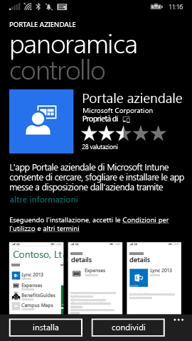
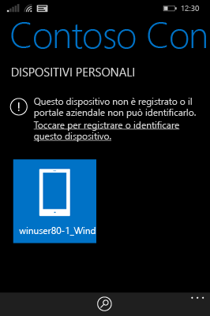

---
# required metadata

title: Registrare il dispositivo Windows Phone 8.1 in Intune | Microsoft Intune
description:
keywords:
author: Staciebarker
manager: jeffgilb
ms.date: 04/28/2016
ms.topic: article
ms.prod:
ms.service: microsoft-intune
ms.technology:
ms.assetid: 4a120c3d-d520-4d48-ae4c-3338ca4e7bde

# optional metadata

#ROBOTS:
#audience:
#ms.devlang:
ms.reviewer: jeffgilb
ms.suite: ems
#ms.tgt_pltfrm:
#ms.custom:

---

# Registrare il dispositivo Windows Phone 8.1 in Intune

Se l'azienda o l'istituto di istruzione usa Microsoft Intune, è possibile registrare i dispositivi per poter accedere a posta elettronica, file e altre risorse aziendali. La registrazione dei dispositivi consente all'azienda di proteggere i suoi dati. Per altre informazioni sulla registrazione , vedere [What happens if you install the Company Portal app and enroll your device in Intune?](what-happens-if-you-install-the-company-portal-app-and-enroll-your-device-in-intune-windows.md) (Cosa avviene quando si installa l'app Portale aziendale e si registra il dispositivo in Intune) e [What your IT administrator can and can't see on your device](what-can-your-it-administrator-see-when-you-enroll-your-device-in-intune-windows.md) (Cosa può e non può visualizzare l'amministratore IT nel dispositivo).

Per registrare il dispositivo Phone 8.1 in Intune, seguire le istruzioni valide per la società o l'istituto di istruzione:

-   [Se la società consente di usare il Portale aziendale di Windows Store](#if-your-company-lets-you-use-the-company-portal-from-the-windows-store)

-   [Se non è consentito accedere a Windows Store dal telefono Windows o se non si ha un account Microsoft](#if-you-are-not-allowed-to-access-the-windows-store-from-your-windows-phone-or-if-you-do-not-have-a-microsoft-account)

## Se la società consente di usare il Portale aziendale di Windows Store
Installare l'app Portale aziendale nel dispositivo:

1.  Toccare **Start** &gt; **Store**.

2.  Toccare **Cerca** e digitare **portale aziendale**.

3.  Nell'elenco dei risultati toccare **Portale aziendale**.

    

4.  Toccare **Portale aziendale**  &gt; **Installa**.

    

Registrare il dispositivo:

1.  Nel dispositivo aprire l'app **Portale aziendale di Microsoft Intune**.

2.  Immettere le credenziali. Se necessario, potrebbe essere visualizzata la richiesta di accettare termini e condizioni aziendali.

3.  Passare a **Dispositivi personali**..

4.  Selezionare **Toccare per registrare o identificare questo dispositivo**..

    

5.  Toccare **Registra il dispositivo**..

    

6.  Toccare **Aggiungi account**..

    

7.  Immettere le informazioni aggiuntive richieste e quindi toccare **accedi** per completare la registrazione. L'account aziendale viene specificato nella pagina **Impostazioni** &gt; **Rete aziendale**.

    

## Se non è consentito accedere a Windows Store dal telefono Windows o se non si ha un account Microsoft

1.  Toccare **Impostazioni** &gt; **Rete aziendale**.

2.  Toccare **aggiungi account** e quindi accedere con l'account aziendale.

3.  Immettere le informazioni aggiuntive richieste e quindi toccare **accedi** per completare la registrazione.

4.  Se viene richiesto di installare l'app aziendale o l'Hub, verificare che la casella corrispondente sia selezionata e quindi toccare **fine**..

Se l'amministratore IT ha configurato l'app Portale aziendale in modo che venga installata durante la registrazione, questa app verrà visualizzata nell'elenco delle app.

### Vedere anche
[Registrare il dispositivo Windows in Intune](enroll-your-device-in-intune-windows.md) 
[Uso del dispositivo Windows con Intune](using-your-windows-device-with-intune.md)

<!--HONumber=May16_HO1-->

