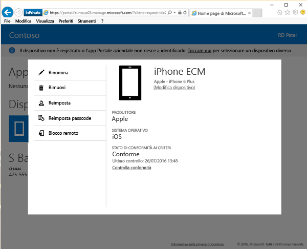

# Bloccare il dispositivo in modalità remota dal sito Web del portale aziendale

Può succedere che i dispositivi vengano persi. Se il dispositivo è stato smarrito o rubato, la prima preoccupazione potrebbe essere il possibile accesso alle informazioni sul dispositivo da parte di qualsiasi utente, ovunque si trovi il dispositivo.

[!INCLUDE[wit_nextref](../includes/end-user-password-guidance.md)]

Per ragioni di sicurezza, è possibile bloccarlo usando l'opzione Blocco remoto sul [sito Web del portale aziendale](http://portal.manage.microsoft.com). L'opzione Blocco remoto funziona per:

* Android
* iOS
* macOS
* Windows 10 Mobile (se per il dispositivo è già stato impostato un passcode)
* Windows Phone 8.1 (se per il dispositivo è già stato impostato un passcode)

## Per usare Blocco remoto per bloccare il dispositivo

1.    Nel [sito Web del portale aziendale](http://portal.manage.microsoft.com) toccare il nome del dispositivo da bloccare.

2.    Toccare **Blocco remoto**.

    

3.    Viene visualizzato un avviso che informa che si sta per bloccare il dispositivo. Toccare **Blocco remoto**. Il sito Web del portale aziendale tenterà di bloccare il dispositivo.

    Dopo aver toccato **Blocco remoto** viene visualizzato il messaggio "Blocco remoto in sospeso".  Quando Blocco remoto ha esito positivo, lo stato passa a "Blocco remoto riuscito."

    Lo stato del blocco remoto viene visualizzato in tre posizioni:

    * L'area delle notifiche del sito Web.
    * La pagina **Dettagli** per il dispositivo.
    * Il riquadro contenente il nome del dispositivo nella sezione **Dispositivi personali** della pagina.

> [!Note]
> Se viene visualizzata la notifica "Blocco remoto non riuscito", attendere qualche minuto e quindi tentare nuovamente di bloccare il dispositivo. Dopo aver iniziato il nuovo tentativo, lo stato diventa nuovamente "Blocco remoto in sospeso". Se il tentativo non funziona, è necessario contattare l'amministratore IT.

Se il dispositivo viene ritrovato e si vuole rimuovere il blocco dopo aver usato Blocco remoto, immettere il passcode.

Serve ancora assistenza? Contattare l'amministratore IT. Per informazioni sul contatto vedere il [sito Web del portale aziendale](http://portal.manage.microsoft.com).

<!--HONumber=Jan17_HO4-->

