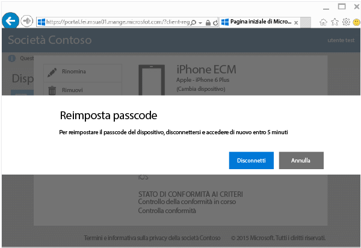
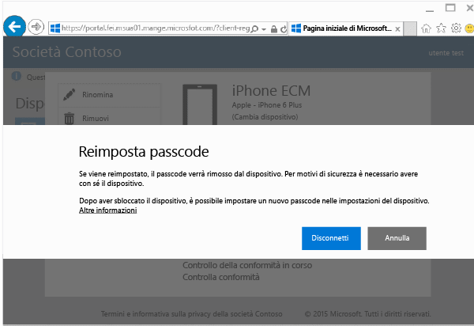

# Reimpostare il passcode del dispositivo dal sito Web del portale aziendale

Se il PIN o la password di un dispositivo registrati in Intune viene smarrita, è possibile usare il [sito Web del portale aziendale](http://portal.manage.microsoft.com) per reimpostarla. È possibile usare il sito Web del portale aziendale per gestire computer e dispositivi registrati in Intune e per svolgere la maggior parte delle attività eseguibili tramite l'app Portale aziendale.

> [!NOTE]
> È possibile che il pulsante **Reimposta passcode** non venga visualizzato nel sito Web del portale aziendale. Ciò dipende da come l'amministratore IT ha configurato Intune. La reimpostazione del passcode non è supportata nei dispositivi Windows 8.1.

Per reimpostare il passcode:

1.  Aprire il [sito Web del portale aziendale](http://portal.manage.microsoft.com) e scegliere il dispositivo di cui si vuole reimpostare il passcode.

2.  Scegliere **Reimposta passcode**.

    

3.  Scegliere **Disconnetti** e quindi accedere di nuovo con le credenziali aziendali o dell'istituto di istruzione. È necessario eseguire l'accesso entro cinque minuti.

    

4.  Scegliere **Reimposta passcode**.

    

    Controllare la tabella per verificare il funzionamento di **Reimposta passcode** con il dispositivo in uso.

    |Piattaforma|Support|
    |------------|-----------|
    |Android|Crea un nuovo passcode alfanumerico temporaneo.|
    |iOS|Rimuove il passcode dal dispositivo e non ne crea uno temporaneo. Se si usa ID tocco, è necessario configurarlo nuovamente sul dispositivo, poiché verrà rimosso quando si reimposta il passcode.|
    |Windows 10 (solo per dispositivi mobili)|Crea un nuovo passcode alfanumerico temporaneo. Windows Hello è supportato.|
    |Windows Phone 8.1|Crea un passcode numerico temporaneo.|
    Dopo aver sbloccato il dispositivo, è possibile impostare un nuovo passcode su **Impostazioni** nel dispositivo.

5.  Per sbloccare il dispositivo e quindi impostare un nuovo passcode o modificare il passcode temporaneo, passare a **Impostazioni** sul dispositivo.

    Per visualizzare una notifica di conferma della reimpostazione della password, fare clic sul flag di notifica nella parte superiore destra del sito Web del portale aziendale.

Serve ancora assistenza? Contattare l'amministratore IT. Per informazioni sul contatto vedere il [sito Web del portale aziendale](http://portal.manage.microsoft.com).

<!--HONumber=Nov16_HO1-->

