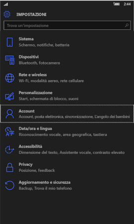
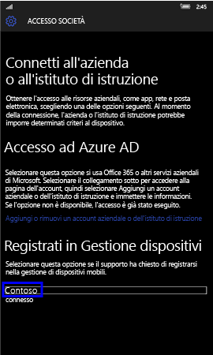
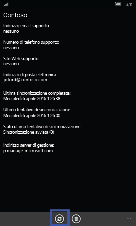
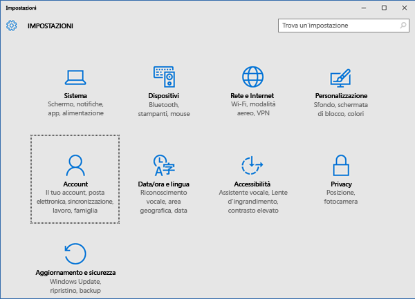
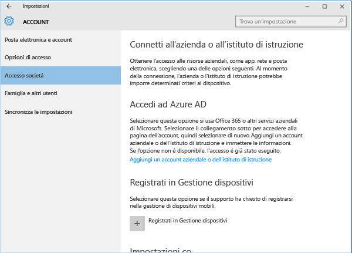
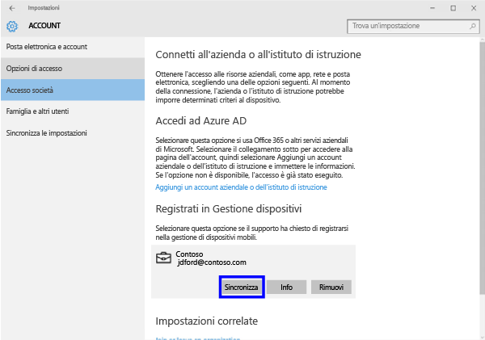
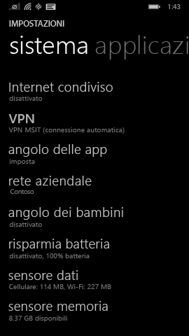
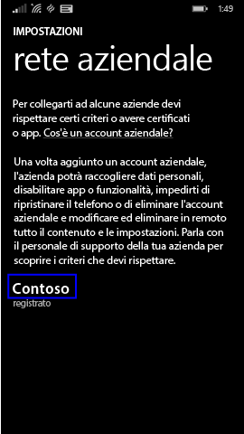

---
# required metadata

title: Sync your device manually (Sincronizzare il dispositivo manualmente) | Microsoft Intune
description:
keywords:
author: Staciebarker
manager: jeffgilb
ms.date: 04/28/2016
ms.topic: article
ms.prod:
ms.service: microsoft-intune
ms.technology:
ms.assetid: 443c6de7-5187-4dc4-b844-6085a0c659bd

# optional metadata

#ROBOTS:
#audience:
#ms.devlang:
ms.reviewer: jeffgilb
ms.suite: ems
#ms.tgt_pltfrm:
#ms.custom:

---

# Sync your device manually (Sincronizzare il dispositivo manualmente)
Se l'installazione dell'app sta richiedendo troppo tempo, attenersi alle seguenti istruzioni per sincronizzare manualmente il dispositivo Windows e accelerare il processo. Sono supportate solo le versioni elencate. Usare il collegamento, incluso nella sezione precedente "In questo articolo", corrispondente al tipo di dispositivo che si possiede:

* [Windows 10 Mobile](#windows-10-mobile)
* [Windows 10 Desktop](#windows-10-desktop)
* [Windows Phone 8.1](#windows-phone-8-1)

## Windows 10 Mobile
Sincronizzare manualmente il dispositivo Windows 10 Mobile per accelerare un'installazione lenta:

1. Accedere a **Tutte le app** > **Impostazioni** > **Account**.

    
    
2. Toccare **Accesso società**.

    
    
3. In **Enroll in to device management** (Registrazione nella gestione dei dispositivi) toccare il nome della società come illustrato di seguito.

    
    
4. Toccare l'icona **Sincronizza**.

    
    
    Nella parte superiore dello schermo viene visualizzato il messaggio "We're synching your account" (Sincronizzazione account in corso). Il pulsante Sincronizza rimane grigio fino al completamento della sincronizzazione del dispositivo.

## Windows 10 Desktop
Sincronizzare manualmente il dispositivo Windows 10 Desktop per accelerare un'installazione lenta:

1. Selezionare il pulsante **Start**, come illustrato di seguito, quindi scegliere **Impostazioni**.

    
    
2. Nella pagina **Impostazioni** selezionare **Account**.
 
    
    
3. Nella pagina **Account** selezionare **Accesso società**.
    
    
    
4. Nella sezione **Enroll in to device management** (Registrazione nella gestione dei dispositivi) fare clic sul nome della società, come illustrato nell'evidenziazione blu in basso.
    
    
   
5. Selezionare il pulsante **Sincronizza**.
    
    
   
   Il pulsante diventa inattivo fino al completamento della sincronizzazione.

## Windows Phone 8.1
Sincronizzare manualmente il dispositivo Windows Phone 8.1 per accelerare un'installazione lenta:

1. Accedere a **Tutte le app** > **Impostazioni** > **azienda**.

    
    
2. Toccare il nome della società, come indicato nell'evidenziazione blu in basso.

    
   
3. Toccare l'icona **Sincronizza**.

    
    
   Nella parte superiore dello schermo viene visualizzato il messaggio "We're synching your account" (Sincronizzazione account in corso) fino al termine della sincronizzazione del dispositivo.

### Vedere anche
[Uso del dispositivo Windows con Intune](using-your-windows-device-with-intune.md)

<!--HONumber=May16_HO3-->

