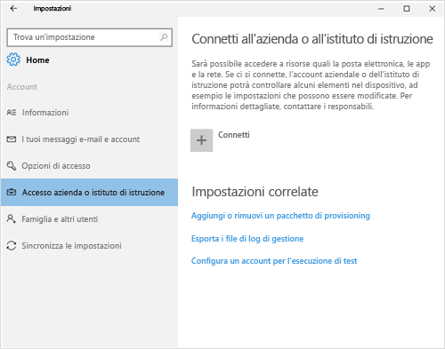
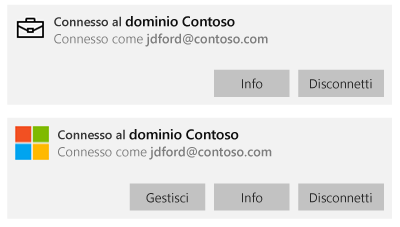
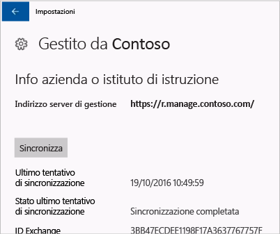

# Sincronizzare il dispositivo Windows manualmente

A volte, il tentativo di installare un'app nel dispositivo Windows può richiedere più tempo del previsto. In questo caso, è possibile provare a sincronizzare manualmente il dispositivo Windows. La sincronizzazione può essere utile per velocizzare l'installazione.

> [!Note]
> L'installazione delle app potrebbe richiedere un po' di tempo se si usa una rete lenta o è in corso il download di contenuto da un numero elevato di dispositivi contemporaneamente.

Le versioni di Windows seguenti supportano la sincronizzazione manuale. Sfortunatamente, se il dispositivo usa una versione diversa di Windows, non è possibile avviare una sincronizzazione manuale.

* [Sincronizzazione in Windows 10 Desktop](#windows-10-desktop)
* [Sincronizzazione in Windows 10 Mobile](#windows-10-mobile)
* [Sincronizzazione in Windows Phone 8.1](#windows-phone-81)

## Windows 10 Desktop
Esistono più versioni di Windows 10, quindi esistono sono due procedure distinte. Per determinare quale procedura eseguire, esaminare gli screenshot e quindi eseguire la procedura con un aspetto simile a quanto visualizzato sul dispositivo.

1. Scegliere **Start** e quindi scegliere **Impostazioni**.

    

2. Nella pagina **Impostazioni** scegliere **Account**.

    

3. Esaminare le due schermate seguenti e trovare quella simile a quanto viene visualizzato sul dispositivo. Seguire i passaggi corrispondenti alla schermata visualizzata sul dispositivo.

    Se si visualizza questa schermata, in cui compare "Accedi all'azienda o all'istituto di istruzione", attenersi alle istruzioni in [Passaggi da seguire se si visualizza Accedi all'azienda o all'istituto di istruzione](#steps-to-follow-if-you-see-access-work-or-school).

    

    Se si visualizza questa schermata, in cui compare "Accesso società", seguire i passaggi in [Passaggi da seguire se si visualizza Accesso società](#steps-to-follow-if-you-see-your-account).

    

### Passaggi da seguire se si visualizza Accedi all'azienda o all'istituto di istruzione

1. Nella pagina **Account** scegliere **Accedi all'azienda o all'istituto di istruzione**.

    

2. Scegliere l'account aziendale o dell'istituto di istruzione. A seconda della configurazione eseguita dall'amministratore IT, è possibile che vengano visualizzati due account simili all'esempio illustrato di seguito. Accanto a un account è visibile l'icona Sincronia file e accanto all'altro è presente il logo Microsoft.

    - Se è visualizzato l'account con Sincronia file, selezionarlo e cercare il pulsante **Informazioni** sotto di esso.
    - Se è visualizzato solo l'account con il logo Microsoft, selezionarlo e cercare il pulsante **Informazioni** sotto di esso.

    

3. Scegliere il pulsante **Info**. Verrà visualizzata una finestra di dialogo simile all'esempio illustrato di seguito.

    

4. Scegliere il pulsante **Sincronizza**. Il dispositivo verrà sincronizzato con Intune.

### Passaggi da seguire se si visualizza Accesso società

1. Nella pagina **Account** scegliere **Accesso società**.

    

2. Nella sezione **Registrati per la gestione dispositivi** fare clic sul nome della società, come illustrato nell'evidenziazione blu in basso.

    

3. Scegliere il pulsante **Sincronizza**.

    

   Il pulsante diventa inattivo fino al completamento della sincronizzazione.

   ## Windows 10 Mobile
   Sincronizzare manualmente il dispositivo Windows 10 Mobile per accelerare un'installazione lenta:

   1. Accedere a **Tutte le app** > **Impostazioni** > **Account**.

       

   2. Scegliere **Accesso società**.

       

   3. In **Registrati per la gestione dispositivi** scegliere il nome della società.

       

   4. Scegliere l'icona **Sincronizza**.

       

       Nella parte superiore dello schermo viene visualizzato il messaggio "We're synching your account" (Sincronizzazione account in corso). Il pulsante **Sincronizza** resta disattivato fino al completamento della sincronizzazione del dispositivo.

## Windows Phone 8.1
Sincronizzare manualmente il dispositivo Windows Phone 8.1 per accelerare un'installazione lenta:

1. Accedere a **Tutte le app** > **Impostazioni** > **azienda**.

    

2. Scegliere il nome della propria società.

    

3. Scegliere l'icona **Sincronizza**.

    

   Nella parte superiore dello schermo viene visualizzato il messaggio "We're synching your account" (Sincronizzazione account in corso) fino al termine della sincronizzazione del dispositivo.

Serve ancora assistenza? Contattare l'amministratore IT. Per informazioni sul contatto vedere il [sito Web del portale aziendale](http://portal.manage.microsoft.com).

