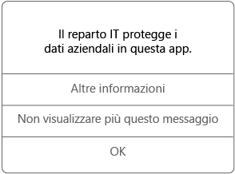

# Usare le app gestite nel dispositivo Android

Le app gestite sono app che l'amministratore IT può configurare per proteggere i dati aziendali ai quali è possibile accedere nell'app. Quando si accede ai dati aziendali in un'app gestita su un dispositivo Android, è possibile notare che il funzionamento dell'app è leggermente diverso rispetto a quello previsto. Ad esempio, potrebbero non essere consentite le operazioni di copia e incolla dei dati aziendali protetti oppure il salvataggio dei dati in determinati percorsi.

Diverse app gestite possono anche interagire tra loro nel dispositivo per consentire di eseguire le attività giornaliere mantenendo protetti i dati aziendali. Ad esempio, se si apre un file aziendale in un'app gestita che richiede un'altra app gestita per visualizzare il file, questa seconda app viene aperta automaticamente. Se un'app necessaria non è disponibile, alcune azioni, come l'apertura di un documento o l'accesso a un collegamento Web in un documento gestito, potrebbero non essere disponibili.

Quando si accede ai dati aziendali in un'app gestita, viene visualizzato un messaggio simile a quello riportato di seguito, che indica che l'app che si sta aprendo è gestita.

## Come si ottengono le app gestite?
Le app gestite possono essere installate in due modi:

-   Quando il dispositivo viene registrato in Microsoft Intune, è possibile installare l'app dall'app Portale aziendale o dal sito Web del portale aziendale oppure l'installazione nel dispositivo può essere eseguita dall'amministratore IT. Per altre informazioni sulla registrazione, vedere [Registrare il dispositivo in Intune](enroll-your-device-in-Intune-android.md).

-   L'app viene installata da Play Store, quindi l'utente accede con l'account utente aziendale gestito da Intune.

## Cosa può gestire l'amministratore IT in un'app?
Di seguito sono riportati alcuni esempi di opzioni che l'amministratore IT può gestire in un'app e che possono influenzare le interazioni con i dati aziendali nel dispositivo:

-   Accesso a specifici siti Web

-   Trasferimenti di dati tra applicazioni

-   Salvataggio di file

-   Operazioni di copia e incolla

-   Requisiti di accesso PIN

-   Account di accesso con le credenziali aziendali

-   Possibilità di eseguire il backup nel cloud

-   Possibilità di acquisire screenshot

-   Requisiti di crittografia dati

Di seguito sono riportate alcune app comuni che il reparto IT potrebbe gestire:

-   Intune Managed Browser

-   Visualizzatore di immagini di Intune

-   Visualizzatore PDF di Intune

-   Lettore AV di Intune

-   Microsoft Word, Excel, PowerPoint

Per altre informazioni sulle app gestite nel dispositivo contattare l'amministratore IT. Per informazioni sul contatto vedere il [sito Web del portale aziendale](http://portal.manage.microsoft.com).

### Vedere anche
[Uso del dispositivo Android con Intune](using-your-android-device-with-intune.md)

<!--HONumber=Aug16_HO4-->

