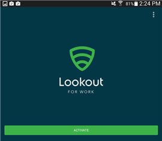
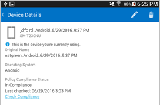

# Richiesta di installare Lookout for Work

Se viene visualizzato il messaggio "L'app Lookout for Work non è installata e attivata" illustrato di seguito, significa che l'amministratore IT richiede di installare l'app Lookout for Work che consente di proteggere il dispositivo mediante la ricerca di potenziali minacce alla protezione.

**Operazioni da eseguire per risolvere il problema:**

1.  Trascinare verso il basso la parte superiore della schermata per aprire la barra Notifiche e quindi toccare **Applicazione richiesta - Installa Lookout for Work da Play Store**.

    

    Viene visualizzata la pagina di installazione di Lookout for Work in Play Store.

2.  Installare Lookout for Work e toccare **ACCETTA** per consentire a Lookout for Work di accedere al dispositivo.

    

3. Aprire Lookout for Work e toccare **Activate**.

    

4. Toccare **Sign in with a work account** e immettere l'account usato per accedere all'e-mail di lavoro o scuola, ai file e ad altri dati.

    

5. Selezionare l'account usato per accedere all'e-mail e ai file di lavoro o scuola e quindi toccare **ADD ACCOUNT**.

    

6. Toccare **Accept** per autorizzare Lookout for Work a eseguire l'accesso e leggere il profilo.

    

    Viene visualizzata una schermata che mostra la connessione di Lookout for Work a Lookout Security Cloud.

7. Rivedere le informazioni sulla protezione del dispositivo offerta da Lookout e quindi toccare **OK**.

    

    Quando viene visualizzata la schermata seguente, significa che Lookout è stato installato ed è connesso.

    

    Lookout for Work avvia immediatamente una ricerca delle minacce alla protezione nel dispositivo. Se non viene trovata alcuna minaccia, viene visualizzata la schermata seguente.

    

    La schermata Dettagli dispositivo nel portale aziendale indicherà ora la conformità ai requisiti di sicurezza della società.

    

    Se Lookout for Work trova una minaccia alla protezione nel dispositivo, verranno visualizzate le istruzioni per la risoluzione del problema.

Serve ancora assistenza? Contattare l'amministratore IT. Per informazioni sul contatto vedere il [sito Web del portale aziendale](http://portal.manage.microsoft.com).

<!--HONumber=Sep16_HO2-->

