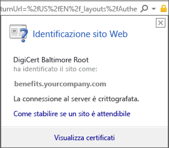
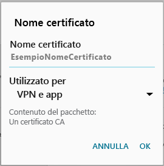

# Manca un certificato necessario per il dispositivo

## Manca un certificato necessario per il dispositivo generalmente installato nel telefono
Se il dispositivo Android non è registrato in Intune e manca un certificato solitamente installato nel telefono, non sarà possibile accedere all'app Portale aziendale Android. Quando si tenta di accedere, verrà visualizzato il messaggio seguente:

Per risolvere questo problema e ottenere il certificato richiesto:

1.  In un browser passare alla [pagina del certificato Digicert](https://www.digicert.com/digicert-root-certificates.htm).

2.  Individuare e scaricare il certificato radice Baltimore CyberTrust (https://www.digicert.com/CACerts/BaltimoreCyberTrustRoot.crt).

3.  Trascinare verso il basso dalla parte superiore per aprire le notifiche e toccare **BaltimoreCyberTrustRoot.crt** nell'elenco delle notifiche.

4.  Nella finestra relativa all'**assegnazione di un nome al certificato**, accettare il nome del certificato predefinito.

5. Verificare che l'uso delle **credenziali** sia impostato su **VPN e app**, quindi fare clic su **OK**.

    

6. Chiudere il browser Web e l'app Portale aziendale.

7. Aprire nuovamente l'app Portale aziendale. Accedere all'app Portale aziendale. Per assistenza, contattare l'amministratore IT.

## Manca un certificato richiesto dall'amministratore IT
Se il dispositivo Android non è registrato in Intune e manca un determinato certificato richiesto dall'amministratore IT, non sarà possibile accedere all'app Portale aziendale Android. Quando si tenta di accedere, verrà visualizzato il messaggio seguente:

>[!NOTE]
> Se è già stato visualizzato un messaggio "Certificato mancante" e sono stati seguiti i passaggi in [Manca un certificato necessario per il dispositivo generalmente installato nel telefono](#your-device-is-missing-a-certificate-that-usually-comes-installed-on-your-phone), la procedura è regolare. In questo caso, si tratta di un messaggio e di un certificato diverso, quindi procedere e seguire i passaggi in questa sezione per ottenere il certificato mancante.

Per risolvere questo problema e ottenere il certificato richiesto, è necessario eseguire due passaggi principali:

- Identificare il certificato mancante cercando in un PC della società o dell'istituto di istruzione.
- Usare il dispositivo per scaricare il certificato mancante da Internet.

### Identificare il certificato mancante cercando in un PC della società o dell'istituto di istruzione

1. In un PC aprire Internet Explorer. Se non si ha un PC da usare per questo scopo, contattare l'amministratore IT. Per le informazioni di contatto dell'amministratore IT, consultare il [sito Web del portale aziendale](http://portal.manage.microsoft.com).

2. Passare al [sito Web del portale aziendale](http://portal.manage.microsoft.com) ed eseguire l'accesso con le credenziali della società o dell'istituto di istruzione.

3. All'estrema destra della barra degli indirizzi del browser, fare clic sul simbolo simile a un lucchetto, come illustrato di seguito. Se non viene visualizzato il simbolo del lucchetto, interrompere la procedura e contattare l'amministratore IT. Il lucchetto indica che l'accesso viene eseguito in modalità sicura. Se quindi non si visualizza tale simbolo, è consigliabile non procedere.

    

4. Fare clic su **Visualizza certificati**.

    

5. Nella finestra di dialogo **Certificato** fare clic sulla scheda **Percorso certificazione** e quindi identificare il certificato che è necessario ottenere da Internet. Il nome del certificato necessario sarà nella stessa posizione di quello evidenziato nella schermata di esempio precedente.

### Scaricare e installare il certificato mancante nel dispositivo mobile Android

1. Con un motore di ricerca come Bing o Google, cercare il nome del certificato mancante identificato nella sezione precedente. Il certificato può avere varie "estensioni", ad esempio "crt" o "pem" e così via.

2. Scaricare il certificato radice dal sito Web.

3. Dopo aver scaricato il certificato, trascinare verso il basso dalla parte superiore del dispositivo per aprire le notifiche e quindi toccare il nome del certificato nell'elenco delle notifiche.

4. Nella finestra di dialogo relativa all'**assegnazione di un nome al certificato**, accettare il nome del certificato predefinito.

5. Verificare che l'uso delle **credenziali** sia impostato su **VPN e app**, quindi fare clic su **OK**.

    

6. Chiudere l'app Portale aziendale.

7. Aprire nuovamente l'app Portale aziendale. Accedere all'app Portale aziendale. Per assistenza, contattare l'amministratore IT.

Se viene visualizzato nuovamente il messaggio "Certificato mancante" illustrato in precedenza e sono già stati seguiti i passaggi precedenti, è probabile che l'amministratore IT debba installare un altro certificato. Contattare l'amministratore IT e fornirgli questo [collegamento](/intune/troubleshoot/troubleshoot-device-enrollment-in-intune#android-certificate-issues), che contiene i passaggi per risolvere il problema.

<!--HONumber=Aug16_HO5-->

