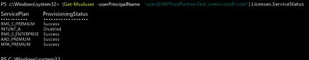

---
# required metadata

title: Gestire le licenze di Intune | Microsoft Intune
description:
keywords:
author: Staciebarker
manager: jeffgilb
ms.date: 04/28/2016
ms.topic: get-started-article
ms.prod:
ms.service: microsoft-intune
ms.technology:
ms.assetid: bb4314ea-88b5-44d3-92ce-4c6aff0587a4

# optional metadata

#ROBOTS:
#audience:
#ms.devlang:
ms.reviewer: jeffgilb
ms.suite: ems
#ms.tgt_pltfrm:
#ms.custom:

---

# Gestire le licenze di Intune
Per poter accedere al servizio Intune o registrare dispositivi nella gestione, un utente deve disporre di una licenza per la relativa sottoscrizione. Gli utenti che dispongono di una licenza fanno parte del gruppo di utenti [!INCLUDE[wit_firstref](../includes/wit_firstref_md.md)]. Questo gruppo include tutti gli utenti che dispongono di una licenza per usare la sottoscrizione. **Ogni licenza utente supporta la registrazione di un massimo di 5 dispositivi**.

## Come vengono assegnate le licenze di Intune
Quando gli account utente vengono sincronizzati da Active Directory locale o aggiunti manualmente alla sottoscrizione per i servizi cloud tramite il portale per gli account, non viene assegnata all'account una licenza di Intune in modo automatico. In un momento successivo, un amministratore tenant di Intune dovrà modificare l'account utente per assegnare una licenza all'utente dal portale per gli account.

Quando la propria sottoscrizione condivide Azure AD con altri servizi cloud associati alla sottoscrizione, l'utente ottiene accesso anche agli utenti aggiunti a quei servizi. Questi utenti non dispongono di una licenza per [!INCLUDE[wit_nextref](../includes/wit_nextref_md.md)] finché non ne viene assegnata una a ciascuno di loro.

> [!TIP]
> Se l'opzione per assegnare o revocare una licenza di [!INCLUDE[wit_nextref](../includes/wit_nextref_md.md)] è disabilitata, è probabile che la sottoscrizione includa opzioni multilicenza, come quelle disponibili quando si usa [Enterprise Mobility Suite](https://www.microsoft.com/en-us/server-cloud/enterprise-mobility/overview.aspx). Per informazioni su come assegnare o revocare le licenze, vedere la documentazione per le proprie opzioni di licenza.

## Assegnare una licenza utente di Intune

Usare il **[!INCLUDE[wit_icp_2](../includes/wit_icp_2_md.md)]** per aggiungere manualmente gli utenti basati su cloud e assegnare licenze ad account utente basati su cloud e account sincronizzati da Active Directory locale ad Azure AD.

1.  Accedere al portale per gli account Intune usando le credenziali di amministratore tenant.

2.  Selezionare l'account utente a cui si desidera assegnare la licenza e la licenza utente di Intune, quindi abilitare la casella di controllo **Microsoft Intune** nelle proprietà dell'account utente.

3.  L'account utente verrà ora aggiunto al gruppo di utenti di Microsoft Intune che concede le autorizzazioni per usare il servizio e registrare i dispositivi nella gestione.

### Usare PowerShell per gestire in modo selettivo le licenze utente di EMS
Le organizzazioni che usano Enterprise Mobility Suite (EMS) di Microsoft potrebbero contenere utenti che necessitano solo di Azure Active Directory Premium o dei servizi di Intune nel pacchetto EMS. È possibile assegnare uno o un sottoinsieme di servizi tramite [i cmdlet di PowerShell per Azure Active Directory](https://msdn.microsoft.com/library/jj151815.aspx). 

Per assegnare in modo selettivo le licenze utente per i servizi EMS, aprire PowerShell come amministratore su un computer dotato del [Modulo di Azure Active Directory per Windows PowerShell](https://msdn.microsoft.com/library/jj151815.aspx#bkmk_installmodule). È possibile installare PowerShell su un computer locale o su un server ADFS.

È necessario creare una nuova definizione dello SKU della licenza da applicare solo ai piani del servizio desiderati. A tale scopo, disabilitare i piani a cui non si desidera applicare la nuova definizione. Ad esempio, è possibile creare una definizione dello SKU che non assegna una licenza di Intune. Per visualizzare un elenco dei servizi disponibili, digitare:
 
    (Get-MsolAccountSku | Where {$_.SkuPartNumber -eq "EMS"}).ServiceStatus 

È possibile eseguire il comando seguente per escludere il piano di servizio di Intune. È possibile usare lo stesso metodo per espandere un intero gruppo di sicurezza o usare filtri più granulari. 

**Esempio 1**
Creare un nuovo utente nella riga di comando e assegnare una licenza di EMS senza abilitare la parte di Intune della licenza:

    Connect-MsolService 
        
    New-MsolUser -DisplayName “Test User” -FirstName FName -LastName LName -UserPrincipalName user@<TenantName>.onmicrosoft.com –Department DName -UsageLocation US
    
    $CustomEMS = New-MsolLicenseOptions -AccountSkuId "<TenantName>:EMS" -DisabledPlans INTUNE_A
    Set-MsolUserLicense -UserPrincipalName user@<TenantName>.onmicrosoft.com -AddLicenses <TenantName>:EMS -LicenseOptions $CustomEMS 
    

Verificare con:

    (Get-MsolUser -UserPrincipalName "user@<TenantName>.onmicrosoft.com").Licenses.ServiceStatus

**Esempio 2**
Disabilitare la parte di Intune della licenza EMS per un utente a cui è già stata assegnata una licenza:

    Connect-MsolService 
    
    Set-MsolUserLicense -UserPrincipalName user@<TenantName>.onmicrosoft.com -RemoveLicenses IAPProdPartnerTest:EMS
    
    $CustomEMS = New-MsolLicenseOptions -AccountSkuId "<TenantName>:EMS" -DisabledPlans INTUNE_A
    Set-MsolUserLicense -UserPrincipalName user@<TenantName>.onmicrosoft.com -AddLicenses <TenantName>:EMS -LicenseOptions $CustomEMS
 
Verificare con:
 
    (Get-MsolUser -UserPrincipalName "user@<TenantName>.onmicrosoft.com" .Licenses.ServiceStatus

### Passaggi successivi
A questo punto, Passaggio 4 della *Guida introduttiva di Intune* completato.
>[!div class="step-by-step"]

>[&larr; **Sincronizzare utenti su Intune**](.\start-with-a-paid-subscription-to-microsoft-intune-step-2.md)     [**Organizzare utenti e dispositivi** &rarr;](.\start-with-a-paid-subscription-to-microsoft-intune-step-5.md)  

<!--HONumber=May16_HO1-->

