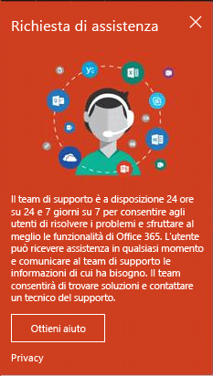
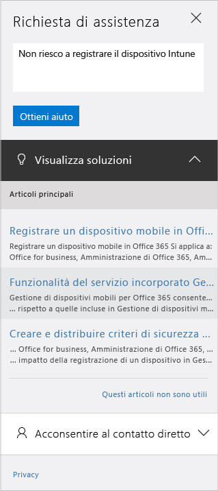

# Come ottenere supporto amministrativo per Microsoft Intune

Microsoft offre supporto globale tecnico e per la prevendita, la fatturazione e le sottoscrizioni di Microsoft Intune. Il supporto è disponibile sia online che telefonicamente per le sottoscrizioni a pagamento e di valutazione. Il supporto tecnico online è disponibile in inglese e giapponese. Il supporto telefonico e il supporto online per la fatturazione online sono disponibili anche in altre lingue.

Il supporto per Intune e per Intune usato con Configuration Manager è gratuito. Ai clienti del supporto tecnico Premier verranno addebitati costi per le risposte a domande procedurali (relative alla configurazione delle funzionalità di Intune).

## Creare una richiesta di servizio online

1.  Accedere al [Centro di amministrazione di Office 365](https://portal.office.com) con le credenziali di Intune. 
    >[!NOTE]
    >
    >I clienti Premier possono aprire un ticket di supporto Intune nella pagina [Supporto Premier](https://support.microsoft.com/en-us/premier/contacts).

2.  Scegliere il riquadro Amministrazione.
3.  A sinistra, sotto **Supporto**, scegliere **Supporto** per aprire il ticket. Verrà visualizzato quanto segue:

    

    >[!NOTE]
    >
    >  I clienti che hanno o hanno avuto un account O365 con un massimo di 100 licenze vedranno la schermata seguente e dovranno vedere [Metodo alternativo per aprire un ticket di supporto](#alternate-method-to-open-a-support-ticket).
    > 

    -   Per problemi relativi alla fatturazione, alle licenze e all'account, selezionare **Billing and product info** (Informazioni sul prodotto e sulla fatturazione).

    -   Per tutti gli altri problemi di Intune, selezionare **Gestione dei dispositivi mobili**.

    > [!NOTE]
    > Può essere necessario fare clic su **altro** nella parte inferiore dell'elenco per visualizzare tutte le categorie.

3.  Seguire le istruzioni per aprire la richiesta. 

### Metodo alternativo per aprire un ticket di supporto

Se la pagina di supporto è simile alla seguente, attenersi a questa procedura:

1. Scegliere **Richiesta di assistenza**.
2. Nella casella di testo specificare una descrizione del problema e scegliere **Guida**.

    

3. Vedere le risorse online proposte o scegliere **Let us call you** (Ti chiamiamo) per ricevere una chiamata dal Supporto tecnico Microsoft.

## Supporto telefonico
Vedere [Contact Assisted Phone Support for Microsoft Intune](contact-assisted-phone-support-for-microsoft-intune.md) (Contattare il supporto telefonico assistito per Microsoft Intune) per un elenco di numeri di telefono di supporto per paese e area geografica, con i relativi orari del supporto e le lingue disponibili.

## Tenere traccia delle richieste di servizio
1.  Accedere al [Centro di amministrazione di Office 365](https://portal.office.com) con le credenziali di Intune. 
2.  Scegliere il riquadro Amministrazione.
3.  A sinistra, sotto **Supporto**, scegliere **Richieste di assistenza** per esaminare i ticket creati. 

I tempi di risposta iniziali per le richieste di assistenza variano a seconda della gravità del problema. Per i problemi più gravi, la prima risposta per i clienti Professional viene offerta entro due ore. Per i clienti del supporto tecnico Premier i tempi di risposta variano a seconda del contratto di supporto. Si verificano casi in cui:

- Uno o più servizi non sono accessibili o non possono essere usati. 
- Le scadenze di produzione, gestione e distribuzione sono gravemente condizionate o ci sarà un grave impatto sulla produzione o sulla redditività. 
- Più utenti o servizi interessati.

Per i problemi di media gravità, la prima risposta per i clienti Professional viene offerta entro quattro ore. Per i clienti del supporto tecnico Premier i tempi di risposta variano a seconda del contratto di supporto.  Si verificano casi in cui:

- Il servizio è usabile, ma in modo compromesso. 
- La situazione ha un impatto moderato per l'azienda e può essere gestita negli orari d'ufficio. 
- Un unico utente, cliente o servizio è parzialmente interessato.

Per i problemi di altro tipo, la prima risposta per i clienti Professional viene offerta entro otto ore. Per i clienti del supporto tecnico Premier i tempi di risposta variano a seconda del contratto di supporto.  Si verificano casi in cui:

- La situazione ha un impatto minimo sull'azienda. 
- Il problema è importante, ma non ha un impatto significativo sul servizio o sulla produttività del cliente. 
- Un unico utente sta avendo delle interruzioni parziali, ma esiste una soluzione accettabile.

> [!NOTE]
> **Se si usa Microsoft System Center Configuration Manager** o **Microsoft System Center Endpoint Protection**: per il supporto tecnico con Configuration Manager o Endpoint Protection, contattare il proprio partner o visitare il [Centro soluzioni di Microsoft System Center Configuration Manager e System Center Endpoint Protection](http://www.microsoft.com/en-us/server-cloud/products/system-center-2012-r2/resources.aspx) in cui è disponibile materiale di supporto completo per risolvere i problemi in autonomia ed è possibile aprire una richiesta di supporto online o tramite telefono.
>
> Il supporto tecnico per System Center Configuration Manager o System Center Endpoint Protection richiede un pagamento; in alternativa è possibile scalarne l'importo dai contratti di licenza o di supporto tecnico Premier esistenti.

## Risoluzione autonoma

In determinati casi si può risolvere un problema autonomamente, senza aprire un ticket di supporto.

Per la risoluzione autonoma dei problemi di Intune, vedere [Suggerimenti generali per la risoluzione dei problemi di Microsoft Intune](general-troubleshooting-tips-for-microsoft-intune.md) o uno degli argomenti per la risoluzione di problemi specifici. È anche possibile cercare una soluzione o pubblicare una domanda nel [forum di Intune](https://social.technet.microsoft.com/Forums/en-US/home?forum=microsoftintuneprod). 

## Supporto per clienti con contratti multilicenza
Se le licenze Microsoft sono state acquistate con un contratto multilicenza, di seguito vengono riportate le informazioni per il supporto:

-   Per il supporto relativo a licenze e individuazione di chiavi, vedere [Volume Licensing Service Center](http://go.microsoft.com/fwlink/p/?LinkID=282016)

-   Per domande sulla fatturazione, vedere [Supporto per la gestione fatturazione e sottoscrizione](http://support.microsoft.com/oas/default.aspx?prid=15371)

-   Per informazioni generali sui contratti multilicenza, vedere [Contratti multilicenza](http://go.microsoft.com/fwlink/p/?LinkID=282015)

<!--HONumber=Nov16_HO1-->

