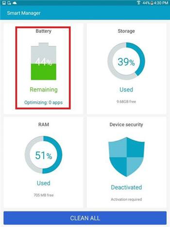
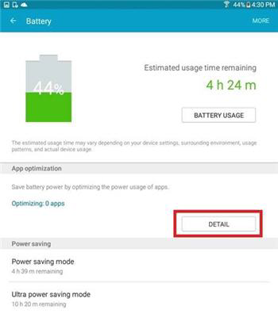
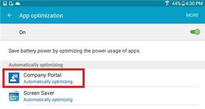
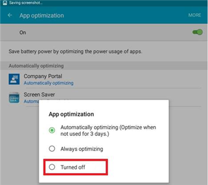
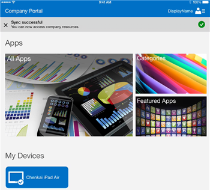
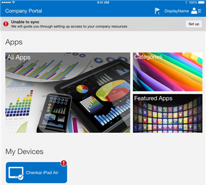
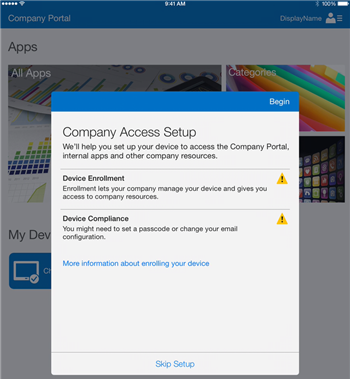

# Risolvere i problemi di registrazione dei dispositivi in Intune

[!INCLUDE[classic-portal](../includes/classic-portal.md)]

Questo argomento contiene suggerimenti per la risoluzione dei problemi di registrazione dei dispositivi. Se queste informazioni non consentono di risolvere il problema, vedere [Come ottenere supporto per Microsoft Intune](how-to-get-support-for-microsoft-intune.md) per trovare altri modi per ottenere assistenza.

## Procedure iniziali per la risoluzione dei problemi

Prima di iniziare la risoluzione dei problemi, verificare di aver configurato Intune correttamente per consentire la registrazione. Per informazioni su tali requisiti di configurazione, vedere:

-    [Prepararsi alla registrazione dei dispositivi in Microsoft Intune](/intune/deploy-use/prerequisites-for-enrollment)
-    [Configurare la gestione dei dispositivi iOS e Mac](/intune/deploy-use/set-up-ios-and-mac-management-with-microsoft-intune)
-    [Configurare la gestione di Windows Phone e Windows 10 Mobile con Microsoft Intune](/intune/deploy-use/set-up-windows-phone-management-with-microsoft-intune)
-    [Configurare la gestione dei dispositivi Windows](/intune/deploy-use/set-up-windows-device-management-with-microsoft-intune)

Gli utenti dei dispositivi gestiti possono raccogliere log di registrazione e diagnostica da sottoporre all'analisi dell'amministratore. Le istruzioni per raccogliere i log sono disponibili nell'articolo:

- [Inviare gli errori di registrazione all'amministratore IT](https://docs.microsoft.com/intune/enduser/send-enrollment-errors-to-your-it-admin-android)
- [Inviare gli errori all'amministratore IT](https://docs.microsoft.com/intune/enduser/send-errors-to-your-it-admin-ios)

## Problemi di registrazione generali
Questi problemi possono verificarsi in tutte le piattaforme di dispositivi.

### Numero massimo dispositivi raggiunto
**Problema**: durante la registrazione viene visualizzato un errore sul dispositivo, ad esempio **Portale aziendale temporaneamente non disponibile** su un dispositivo iOS, e DMPdownloader.log in Gestione configurazione contiene l'errore **Numero massimo dispositivi raggiunto**.

**Risoluzione:**

#### Verificare il numero di dispositivi registrati e consentiti.

1.  Nel portale di amministrazione di Intune verificare che all'utente non siano stati assegnati più dei 15 dispositivi massimi consentiti.

2.  Nella console di amministrazione Intune in **Amministrazione** > **Gestione dei dispositivi mobili** > **Regole di registrazione** verificare che il limite di registrazione dei dispositivi sia impostato su 15.

<!--- Mobile device users can delete devices at the following URL: [https://byodtestservice.azurewebsites.net/](https://byodtestservice.azurewebsites.net/). --->

Gli amministratori possono eliminare i dispositivi nel portale di Azure Active Directory.

#### Per eliminare i dispositivi nel portale di Azure Active Directory

1.  Accedere a [http://aka.ms/accessaad](http://aka.ms/accessaad) oppure fare clic su** Amministrazione** &gt; **Azure AD** da [https://portal.office.com](https://portal.office.com).

2.  Accedere con l'ID organizzazione usando il collegamento sul lato sinistro della pagina.

3.  Se non è già disponibile, creare una sottoscrizione di Azure scegliendo il collegamento **Register your free Azure Active Directory** (Registrare un abbonamento gratuito ad Azure Active Directory). Se si dispone di un account a pagamento, non sarà necessario usare una carta di credito o un altro tipo di pagamento.

4.  Selezionare **Active Directory** e quindi l'organizzazione.

5.  Selezionare la scheda **Utenti** .

6.  Selezionare l'utente di cui si desidera eliminare i dispositivi.

7.  Scegliere **Dispositivi**.

8.  Rimuovere i dispositivi nel modo opportuno, ad esempio quelli che non sono più in uso o quelli con definizioni errate.

> [!NOTE]

> È possibile evitare il limite di registrazione usando l'account del manager di registrazione dispositivi, come descritto in [Registrare i dispositivi di proprietà dell'azienda con il manager di registrazione dispositivi in Microsoft Intune](/intune/deploy-use/enroll-corporate-owned-devices-with-the-device-enrollment-manager-in-microsoft-intune).
>
> Un account utente che viene aggiunto all'account Manager di registrazione dispositivi non sarà in grado di completare la registrazione quando vengono applicati i criteri di accesso condizionale per l'accesso utente specifico.

### Portale aziendale temporaneamente non disponibile
**Problema:** nel dispositivo viene visualizzato l'errore **Portale aziendale temporaneamente non disponibile**.

**Risoluzione:**

1.  Rimuovere l'app Portale aziendale di Intune dal dispositivo.

2.  Sul dispositivo aprire il browser, passare a [https://portal.manage.microsoft.com](https://portal.manage.microsoft.com)e provare ad accedere con un account utente.

3.  Se l'utente non riesce ad accedere, provare a usare un'altra rete.

4.  Se il problema persiste, verificare che le credenziali dell'utente siano sincronizzate correttamente con Azure Active Directory.

5.  Se l'utente accede correttamente, un dispositivo iOS richiede in genere di installare l'app Portale aziendale di Intune ed eseguire la registrazione. In un dispositivo Android è necessario installare manualmente l'app Portale aziendale di Intune e quindi ripetere il tentativo di registrazione.

### Autorità MDM non definita
**Problema**: viene visualizzato l'errore **Autorità MDM non definita**.

**Risoluzione:**

1.  Verificare che l'autorità MDM sia impostata correttamente per il tipo di servizio Intune in uso, ovvero Intune, Office 365 o System Center Configuration Manager con Intune. Per Intune, l'autorità MDM è impostata in **Amministratore** &gt; **Gestione dei dispositivi mobili**. Per Configuration Manager con Intune, è necessario impostare l'autorità MDM quando si configura il connettore Intune, mentre in Office 365 è un'impostazione di **Dispositivi mobili**.

    > [!NOTE]
    > Dopo aver impostato l'autorità MDM, è possibile modificarla solo contattando il supporto tecnico, come descritto in [Come ottenere supporto per Microsoft Intune](how-to-get-support-for-microsoft-intune.md).

2.  Verificare che le credenziali dell'utente siano sincronizzate correttamente con Azure Active Directory, controllando che il nome dell'entità utente corrisponda alle informazioni di Active Directory nel portale di Office 365.
    Se il nome dell'entità utente non corrisponde alle informazioni di Active Directory:

    1.  Disattivare DirSync sul server locale.

    2.  Eliminare l'utente non corrispondente dall'elenco utenti del **portale per gli account di Intune** .

    3.  Attendere circa un'ora per consentire al servizio di Azure rimuovere i dati errati.

    4.  Attivare nuovamente DirSync e controllare se l'utente è ora sincronizzato correttamente.

3.  In uno scenario in cui si usa System Center Configuration Manager con Intune, verificare che l'utente disponga di un ID utente cloud valido:

    1.  Aprire SQL Management Studio.

    2.  Connettersi al database appropriato.

    3.  Aprire la cartella del database, quindi individuare e aprire la cartella **CM_DBName**, dove DBName è il nome del database del cliente.

    4.  Nella parte superiore fare clic su **Nuova query** ed eseguire le query seguenti:

        -   Per visualizzare tutti gli utenti: `select * from [CM_ DBName].[dbo].[User_DISC]`

        -   Per visualizzare utenti specifici, usare la query seguente, in cui %testuser1% rappresenta username@domain.com per l'utente che si vuole cercare: `select * from [CM_ DBName].[dbo].[User_DISC] where User_Principal_Name0 like '%testuser1%'`

        Dopo aver scritto la query, fare clic su **Esegui**.
        Dopo che sono stati restituiti i risultati, cercare l'ID clouduser.  Se non viene trovato alcun ID, l'utente non dispone di una licenza per usare Intune.

### Non è possibile creare criteri o registrare dispositivi se il nome della società contiene caratteri speciali
**Problema:** non è possibile creare criteri o registrare dispositivi.

**Risoluzione:** nell'[interfaccia di amministrazione di Office 365](https://portal.office.com/) rimuovere i caratteri speciali dal nome della società e salvare le informazioni aziendali.

### Non è possibile accedere o registrare dispositivi quando si dispone di più domini verificati
**Problema:** quando si aggiunge un secondo dominio verificato ad AD FS, gli utenti con il suffisso del nome principale (UPN) dell'utente del secondo dominio potrebbero non essere in grado di accedere ai portali o di registrare dispositivi.

**Risoluzione:** i clienti di Microsoft Office 365 che usano l'accesso Single Sign-On (SSO) tramite AD FS 2.0 e dispongono di più domini di primo livello per i suffissi UPN degli utenti all'interno dell'organizzazione (ad esempio, @contoso.com o @fabrikam.com)) devono distribuire un'istanza separata del Servizio federativo AD FS 2.0 per ogni suffisso. È ora disponibile il [rollup per AD FS 2.0](http://support.microsoft.com/kb/2607496) che interagisce con l'opzione **SupportMultipleDomain** per consentire al server AD FS di supportare questo scenario senza richiedere altri server AD FS 2.0. Per altre informazioni, vedere [questo blog](https://blogs.technet.microsoft.com/abizerh/2013/02/05/supportmultipledomain-switch-when-managing-sso-to-office-365/).

## Problemi di Android
### I dispositivi non riescono a collegarsi al servizio Intune e vengono visualizzati come "Non integro" nella console di amministrazione di Intune
**Problema:** alcuni dispositivi Samsung che eseguono versioni di Android 4.4. x e 5. x potrebbero non riuscire più a collegarsi al servizio Intune. Se i dispositivi non si collegano:

- Non possono ricevere criteri, app e comandi remoti dal servizio Intune.
- Visualizzano lo stato di gestione **Non integro** nella console di amministrazione.
- Gli utenti protetti da criteri di accesso condizionale potrebbero perdere l'accesso alle risorse aziendali.

Samsung ha confermato che il software Samsung Smart Manager, fornito in alcuni dispositivi Samsung, può disattivare il portale aziendale di Intune e i relativi componenti. Quando il portale aziendale è in stato disattivato, non può essere eseguito in background e quindi non può contattare il servizio Intune.

**Soluzione 1:**

Comunicare agli utenti di avviare manualmente l'app Portale aziendale. Dopo il riavvio dell'app il dispositivo può collegarsi al servizio Intune.

> [!IMPORTANT]
> L'apertura manuale dell'app Portale aziendale è una soluzione temporanea, perché Samsung Smart Manager potrebbe disattivare nuovamente l'app Portale aziendale.

**Soluzione 2:**

Indicare agli utenti di provare a eseguire l'aggiornamento ad Android 6.0. Il problema della disattivazione non si verifica nei dispositivi Android 6.0. Per controllare se è disponibile un aggiornamento, gli utenti possono passare a **Impostazioni** > **Info sul dispositivo** > **Scarica aggiornamenti manualmente** e quindi seguire le istruzioni nel dispositivo.

**Soluzione 3:**

Se la soluzione 2 non funziona, chiedere agli utenti di eseguire questa procedura per fare in modo che Smart Manager escluda l'app Portale aziendale:

1. Avviare l'app Smart Manager nel dispositivo.

  

2. Scegliere il riquadro **Batteria**.

  

3. In **Risparmio energetico app** o **Ottimizzazione app** selezionare **Dettaglio**.

  

4. Scegliere **Portale aziendale** nell'elenco delle app.

  

5. Scegliere **Disattiva**.

  

6. In **Risparmio energetico app** o **Ottimizzazione app** verificare che l'app Portale aziendale sia disattivata.

  

### Installazione profilo non riuscita
**Problema**: in un dispositivo Android un messaggio indica che **si è verificato un errore di installazione del profilo**.

**Risoluzione:**

1.  Verificare che all'utente sia stata assegnata una licenza appropriata per la versione del servizio Intune in uso.

2.  Verificare che il dispositivo non sia già registrato con un altro provider MDM o che non sia già installato un profilo di gestione.

3.  Verificare che Chrome per Android sia configurato come browser predefinito e che i cookie siano abilitati.

### Problemi relativi ai certificati di Android

**Problema**: gli utenti ricevono il messaggio seguente nel dispositivo: *Non è possibile accedere perché un certificato necessario non è presente nel dispositivo.*

**Soluzione 1**:

Chiedere agli utenti di seguire le istruzioni in [Manca un certificato necessario per il dispositivo](/intune/enduser/your-device-is-missing-a-required-certificate-android#your-device-is-missing-a-certificate-required-by-your-it-administrator). Se l'errore si ripete dopo che gli utenti seguono le istruzioni, provare la soluzione 2.

**Soluzione 2**:

Se gli utenti vedono ancora l'errore di certificato mancante dopo aver immesso le credenziali aziendali ed essere stati reindirizzati all'esperienza di accesso federato, potrebbe mancare un certificato intermedio nel server Active Directory Federation Services (ADFS).

L'errore di certificato si verifica perché i dispositivi Android richiedono l'inclusione dei certificati intermedi in un [messaggio hello del Server SSL](https://technet.microsoft.com/library/cc783349.aspx), ma attualmente l'installazione predefinita di un server ADFS o del server proxy ADFS invia solo il certificato SSL del servizio ADFS nella risposta hello del server SSL a un messaggio hello del client SSL.

Per risolvere il problema, importare i certificati nei certificati personali del computer sul server ADFS o proxy, come indicato di seguito:

1.    Nei server ADFS e proxy, avviare la console Gestione certificati per il computer locale facendo clic con il pulsante destro del mouse **Start** scegliendo **Esegui** e digitando **certlm.msc**.
2.    Espandere **Personale** e selezionare **Certificati**.
3.    Cercare il certificato per la comunicazione del servizio ADFS (un certificato firmato pubblicamente) e fare doppio clic per visualizzare le relative proprietà.
4.    Selezionare la scheda **Percorso certificazione** per visualizzare il o i certificati padre del certificato.
5.    Per ogni certificato padre, selezionare **Visualizza certificato**.
6.    Selezionare la scheda **Dettagli** e fare clic su **Copia su file...**.
7.    Seguire le istruzioni della procedura guidata per esportare o salvare la chiave pubblica del certificato nel percorso file desiderato.
8.    Importare i certificati padre che erano stati esportati al passaggio 3 in Computer locale\Personale\Certificati facendo clic su **Certificati**, selezionando **Tutte le attività** > **Importa** e quindi seguire la procedura guidata per importare il certificato (o i certificati).
9.    Riavviare i server ADFS.
10.    Ripetere i passaggi precedenti in tutti i server ADFS e proxy.
L'utente può ora accedere al Portale aziendale nel dispositivo Android.

**Per convalidare la corretta installazione del certificato**:

I passaggi seguenti descrivono solo uno dei numerosi metodi e strumenti che è possibile usare per convalidare la corretta installazione del certificato.

1. Andare allo [strumento Digicert gratuito](ttps://www.digicert.com/help/).
2. Immettere il nome di dominio completo del server ADFS (ad esempio, sts.contoso.com) e selezionare **CHECK SERVER**.

Se il certificato del server è installato correttamente, nei risultati vengono visualizzati tutti i segni di spunta. Se si verifica il problema sopra riportato, viene visualizzata una X rossa nelle sezioni "Certificate Name Matches" e "SSL Certificate is correctly Installed" del report.

## Problemi di iOS

### I dispositivi sono inattivi o la console di amministrazione non è in grado di comunicare con i dispositivi
**Problema:** i dispositivi iOS non si collegano al servizio Intune. È necessario che i dispositivi si colleghino regolarmente al servizio per mantenere l'accesso alle risorse aziendali protette. Se i dispositivi non si collegano:

- Non possono ricevere criteri, app e comandi remoti dal servizio Intune.
- Visualizzano lo stato di gestione **Non integro** nella console di amministrazione.
- Gli utenti protetti da criteri di accesso condizionale potrebbero perdere l'accesso alle risorse aziendali.

**Risoluzione:** comunicare le risoluzioni seguenti agli utenti finali per consentire loro di ripristinare l'accesso alle risorse aziendali.

Quando gli utenti avviano l'app Portale aziendale iOS, l'app può indicare se il dispositivo ha perso il collegamento con Intune. Se viene rilevata la mancanza di collegamento, l'app tenta automaticamente di eseguire la sincronizzazione con Intune per ristabilire il collegamento e agli utenti viene visualizzata la notifica inline **Tentativo di sincronizzazione…** . 

  

Se la sincronizzazione ha esito positivo, viene visualizzata la notifica inline **La sincronizzazione è riuscita** nell'app Portale aziendale iOS che indica che il dispositivo funziona correttamente.

  

Se la sincronizzazione non viene eseguita, viene visualizzata la notifica inline **Non è possibile eseguire la sincronizzazione** nell'app Portale aziendale iOS. 

  

Per risolvere il problema, è necessario che gli utenti selezionino il pulsante **Configura** a destra della notifica **Non è possibile eseguire la sincronizzazione**. Il pulsante Configura visualizza la schermata Configurazione dell'accesso aziendale con istruzioni per la registrazione del dispositivo. 

  

Dopo aver eseguito la registrazione, vengono ripristinati il corretto funzionamento dei dispositivi e l'accesso alle risorse aziendali.

### Installazione profilo non riuscita
**Problema**: in un dispositivo iOS un messaggio indica che **si è verificato un errore di installazione del profilo**.

### Risoluzione dell'errore di installazione del profilo

1.  Verificare che all'utente sia stata assegnata una licenza appropriata per la versione del servizio Intune in uso.

2.  Verificare che il dispositivo non sia già registrato con un altro provider MDM o che non sia già installato un profilo di gestione.

3.  Passare a [https://portal.manage.microsoft.com](https://portal.manage.microsoft.com) e provare a installare il profilo quando richiesto.

4.  Verificare che Safari per iOS sia configurato come browser predefinito e che i cookie siano abilitati.

### Il dispositivo iOS registrato non viene visualizzato nella console quando si usa System Center Configuration Manager con Intune
**Problema:** l'utente registra il dispositivo iOS, ma non viene visualizzato nella console di amministrazione di Configuration Manager. Il dispositivo non indica che è stato registrato. Cause possibili:

- Microsoft Intune Connector nel sito di Configuration Manager non comunica con il servizio Intune.
- Il componente di gestione dei dati di individuazione (ddm) o il componente Gestione stati (statmgr) non elabora i messaggi dal servizio di Intune.
- È possibile che il certificato MDM sia stato scaricato da un account e usato con un altro account.

**Risoluzione:** esaminare i file di log seguenti per individuare possibili errori:

- dmpdownloader.log
- ddm.log
- statmgr.log

Presto verranno aggiunti esempi su cosa cercare in questi file di log.

## Problemi durante l'uso di System Center Configuration Manager con Intune
### I dispositivi mobili scompaiono
**Problema:** dopo la registrazione in Configuration Manager, il dispositivo mobile viene eliminato dalla raccolta, ma conserva il profilo di gestione ed è elencato nel gateway CSS.

**Risoluzione**: questo problema può verificarsi perché è presente un processo personalizzato che rimuove i dispositivi non aggiunti a un dominio oppure perché l'utente ha ritirato il dispositivo dalla sottoscrizione. Per convalidare e verificare quale processo o account utente ha rimosso il dispositivo dalla console di Configuration Manager, attenersi alla procedura seguente.

#### Controllare in che modo è stato rimosso il dispositivo

1.  Nella console di amministrazione di Configuration Manager selezionare **Monitoraggio** &gt; **Stato del sistema** &gt; **Query messaggi di stato**.

2.  Fare clic con il pulsante destro del mouse su **Risorse dei membri raccolta eliminate manualmente** e scegliere **Mostra messaggi**.

3.  Selezionare una data e un'ora appropriate o le ultime 12 ore.

4.  Trovare il dispositivo in questione ed esaminare in che modo è stato rimosso. L'esempio seguente mostra che l'account SCCMInstall ha eliminato il dispositivo tramite un'applicazione sconosciuta.

    

5.  Verificare che in Configuration Manager non sia presente un'attività pianificata, uno script o un altro processo che potrebbe eliminare automaticamente dispositivi mobili o non appartenenti a un dominio oppure dispositivi correlati.

### Altri errori di registrazione di iOS
Nella sezione relativa agli [errori che si verificano durante la registrazione del dispositivo in Intune](/intune/enduser/using-your-iOS-or-macOS-device-with-intune) della documentazione dei dispositivi per gli utenti viene specificato un elenco di errori di registrazione di iOS.

## Problemi relativi al PC

### The machine is already enrolled (Il computer è già registrato) - Errore hr 0x8007064c
**Problema:** la registrazione ha esito negativo e genera l'errore **The machine is already enrolled** (Il computer è già registrato). Il log di registrazione visualizza l'errore **hr 0x8007064c**.

È possibile che sia dovuto al fatto che il computer è stato registrato in precedenza oppure è stata registrata l'immagine clonata di un computer. Il certificato dell'account precedente è ancora presente nel computer.

**Risoluzione:**

1. Dal menu **Start** digitare **Esegui** -> **MMC**.
1. Scegliere **File** > **Aggiungi o rimuovi snap-in**.
1. Fare doppio clic su **Certificati**, scegliere **Account del computer** > **Avanti** e selezionare **Computer locale**.
1. Fare doppio clic su **Certificati (computer locale)** e scegliere **Certificati personali**.
1. Cercare il certificato Intune rilasciato da Sc_Online_Issuing e, se presente, eliminarlo.
1. Se presente, eliminare la chiave di registro seguente: **HKEY_LOCAL_MACHINE\SOFTWARE\Microsoft\OnlineManagement regkey** e tutte le sottochiavi.
1. Provare a eseguire nuovamente la registrazione.
1. Se il PC non può essere ancora registrato, cercare ed eliminare la chiave seguente se presente: **KEY_CLASSES_ROOT\Installer\Products\6985F0077D3EEB44AB6849B5D7913E95**.
1. Provare a eseguire nuovamente la registrazione.

    > [!IMPORTANT]
    > Questa sezione, metodo o attività contiene procedure che spiegano come modificare il Registro di sistema. L'errata modifica del Registro di sistema può tuttavia causare problemi gravi. Verificare quindi di attenersi attentamente alla procedura. Per una maggiore protezione, eseguire il backup del Registro di sistema prima di modificarlo. In caso di problemi, sarà quindi possibile ripristinare il Registro di sistema.
    > Per altre informazioni su come eseguire il backup e il ripristino del Registro di sistema, leggere [Come eseguire il backup e il ripristino del Registro di sistema in Windows](https://support.microsoft.com/en-us/kb/322756)

## Codici degli errori di registrazione generali

|Codice errore|Possibile problema|Soluzione suggerita|
|--------------|--------------------|----------------------------------------|
|0x80CF0437 |L'orologio del computer client non è impostato sull'ora corretta.|Assicurarsi che l'orologio e il fuso orario nel computer client siano impostati sull'ora e sul fuso orario corretti.|
|0x80240438, 0x80CF0438, 0x80CF402C|Impossibile connettersi al servizio Intune. Verificare le impostazioni proxy del client.|Verificare che la configurazione del proxy nel computer client sia supportata da Intune e che il computer client disponga di accesso a Internet.|
|0x80240438, 0x80CF0438|Non sono configurate impostazioni proxy in Internet Explorer e nel sistema locale.|Impossibile connettersi al servizio Intune. Controllare le impostazioni proxy del client e verificare che la configurazione proxy nel computer client sia supportata da Intune. Verificare anche che il computer client disponga dell'accesso a Internet.|
|0x80043001, 0x80CF3001, 0x80043004, 0x80CF3004|Il pacchetto di registrazione non è aggiornato.|Scaricare e installare il pacchetto del software client più recente dall'area di lavoro Amministrazione.|
|0x80043002, 0x80CF3002|L'account è in modalità di manutenzione.|Quando l'account è in modalità di manutenzione, non è possibile registrare nuovi computer client. Per visualizzare le impostazioni dell'account, accedere al proprio account.|
|0x80043003, 0x80CF3003|L'account è stato eliminato.|Verificare che l'account e la sottoscrizione a Intune siano ancora attivi. Per visualizzare le impostazioni dell'account, accedere al proprio account.|
|0x80043005, 0x80CF3005|Il computer client è stato rimosso.|Attendere alcune ore, rimuovere le versioni precedenti del software client dal computer, quindi riprovare a installare il software client.|
|0x80043006, 0x80CF3006|È stato raggiunto il numero massimo di postazioni consentito per l'account.|L'organizzazione deve acquistare ulteriori postazioni prima che sia possibile registrare più computer client nel servizio.|
|0x80043007, 0x80CF3007|Impossibile trovare il file del certificato nella stessa cartella del programma di installazione.|Estrarre tutti i file prima di avviare l'installazione. Non rinominare o spostare eventuali file estratti: tutti i file devono trovarsi nella stessa cartella altrimenti l'installazione non riuscirà.|
|0x8024D015, 0x00240005, 0x80070BC2, 0x80070BC9, 0x80CFD015|È impossibile installare il software perché un riavvio del computer client è in sospeso.|Riavviare il computer, quindi riprovare a installare il software client.|
|0x80070032|Uno o più prerequisiti per l'installazione del software client non sono stati individuati nel computer client.|Assicurarsi che tutti gli aggiornamenti necessari siano installati nel computer client, quindi riprovare a installare il software client.|
|0x80043008, 0x80CF3008|Impossibile avviare il servizio Microsoft Online Management Updates.|Contattare il supporto tecnico di Microsoft, come descritto in [Come ottenere supporto per Microsoft Intune](how-to-get-support-for-microsoft-intune.md).|
|0x80043009, 0x80CF3009|Il computer client è già registrato al servizio.|È necessario ritirare il computer client prima di potersi registrare nuovamente al servizio.|
|0x8004300B, 0x80CF300B|Impossibile eseguire l'installazione del software client perché la versione di Windows in esecuzione nel client non è supportata.|Intune non supporta la versione di Windows in esecuzione nel computer client.|
|0xAB2|Windows Installer non è in grado di accedere al runtime VBScript per un'azione personalizzata.|L'errore è causato da un'azione personalizzata basata sulle librerie a collegamento dinamico (DLL). Per la risoluzione dei problemi relativi alle DLL potrebbe essere necessario usare gli strumenti descritti in [Supporto tecnico Microsoft KB198038: Strumenti utili per pacchetto e problemi di distribuzione](https://support.microsoft.com/en-us/kb/198038).|
|0x80cf0440|La connessione all'endpoint del servizio è stata terminata.|L'account di valutazione o a pagamento è sospeso. Creare un nuovo account di prova o a pagamento ed eseguire nuovamente la registrazione.|

### Passaggi successivi
Se queste informazioni per la risoluzione dei problemi non sono utili, contattare il supporto Microsoft come descritto in [Come ottenere supporto per Microsoft Intune](how-to-get-support-for-microsoft-intune.md).

<!--HONumber=Jan17_HO4-->

